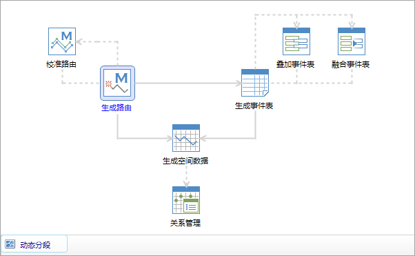
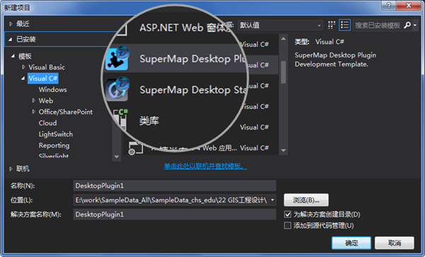
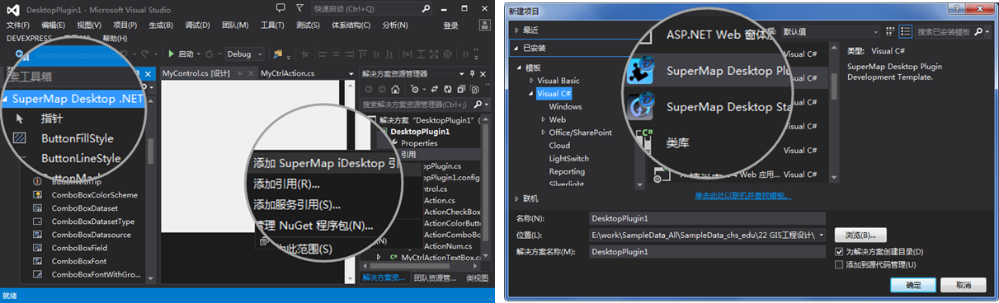

### GIS 功能齐全

提供了丰富的GIS
功能，包括多种格式的数据管理，矢量、栅格数据处理，地图、海图数据编辑，空间分析，二三维地图制图，数据云端共享，扩展开发等功能，可满足用户的不同需求。

### 二三维一体化

二三维数据、显示、查询和分析一体化，实现用户的二维数据在三维场景中的应用。可在场景中对二维数据制作专题图、快速建模、属性查询等操作，同时，也支持对三维数据进行浏览、编辑、分析等操作。

 |   
---|---  
  
### 功能易用

沿用Office
2010的Ribbon界面风格，将功能按类别将各功能放在不同的选项卡面板中，方便用户查找。同时，流程化动态分段和水文分析的操作方式，降低了学习成本和使用门槛，减少了由于操作流程不对导致结果错误的概率。

 |   
---|---  
Ribbon 风格界面 | 操作流程化  
  
### 扩展开发

提供多种VS项目模板和示范程序，用户可以更快速地开发入门；同时，在IDE中集成了Desktop工具箱、Desktop快速引用，用户可以开发新插件，从而满足用户对界面和功能的定制要求。

 |   
---|---  
  
### 云共享

提供了发布地图和发布 iServer 服务的功能。可将地图一键发布到 SuperMap 在线商店中，用户可通过 iMapReader
直接读取浏览地图数据资源，实现了二三维地图的云端共享。提供的 iServer
发布功能，可以工作空间形式发布本地或者是远程iServer服务，并支持不同类型的服务形式，如：REST服务、OGC服务等类型。同时，支持在线安装和在线更新方式安装或更新程序。

 |   
---|---  
  
### 海图编辑

已涉足海洋测绘领域的GIS应用，实现了对海图数据的存储、显示和编辑。海图模块支持IHO S-57、IHO S-52 和 IHO S-58
国际标准，以及提供了海图数据转换、显示、查询、编辑和数据验核等功能。海图编辑功能可对已有的海图数据进行修改，也可生产一幅新的海图数据。同时，支持海图数据和陆地数据的整合，真正实现海陆一体化。

  
---  
海陆一体化  
  

