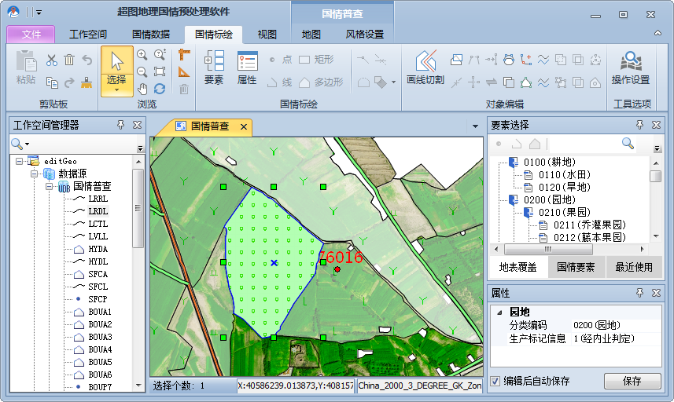
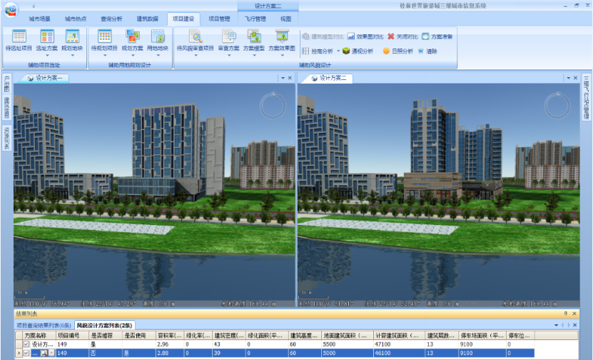
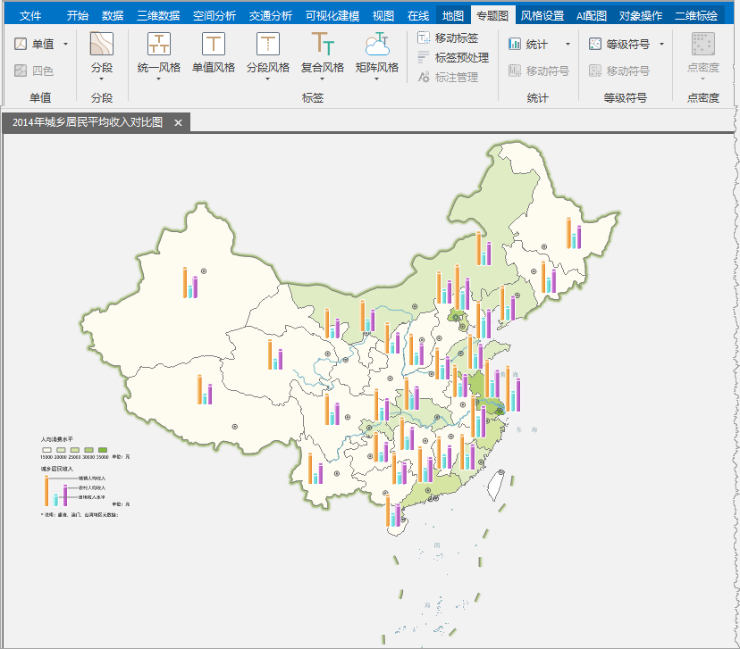

###  可以做什么：

提供了丰富的 GIS 功能，可满足常规GIS数据处理、数据分析、制图和项目应用等需求；同时支持插件扩展和二次开发，用户可根据需要扩展开发新功能。用户通过
完成以下工作

  * 制作、输出打印地图；
  * 编辑、处理地理数据；
  * 城市规划；
  * 数字城市三维建模；
  * 公共设施管理；
  * 国土资源、地理信息管理；
  * 国防、军事应用；
  * 应急救灾响应；
  * 地下管道管理等。

**SuperMap iDesktop 的的应用实例主要有以下几个：**

  * **地理国情普查预处理软件**

的二次开发功能方便用户基于行业需求，开发定制更适用的功能和插件，如地理国情普查预处软件（gcStation）。该插件基于
进行二次开发，实现了影像数据分图幅数字化，便于数据分工处理和整合；实现了按地表覆盖和国情要素类别进行国情标绘，并用不同的符号显示各要素，便于区分和识别要素类型；提供了多种自动绘制的功能，提高了数字化的工作效率；可以编辑修改要素对象和属性信息，方便更新检查数据和核对要素属性信息；同时可以分图幅将数据绘制成果输出，便于数据汇总。

  

  * **城市三维建模**

提供了丰富的三维渲染与操作功能，可用于管理城市三维信息，如桂林市界旅游城市三维城市系统。该系统结合了
提供的三维应用功能，并开发了相应的项目建设与对比分析功能，实现了城市三维场景的快速建模与贴图渲染；实现了地下管线的管理功能，可查看地下管线的分布，及查询、统计管线；提供了城市建设规划设计方案对比功能，可对比各方案在三维场景中的效果进行选择；同时可添加水面、喷泉、烟花等粒子，开启太阳关照、阴影效果，增强场景的真实感。

  

  * **国内外配图应用**

提供了丰富的地图渲染和配图功能，可制作多种类型专题图，如单值专题图、分段专题图、标签专题图、统计专题图、符号专题图等。同时，结合
提供的数据编辑和数据处理功能，可优化地图配置的效果。用户可配置市政图、土地利用图、城市规划图、经济或人口等统计图、旅游景点图等。

  

  

