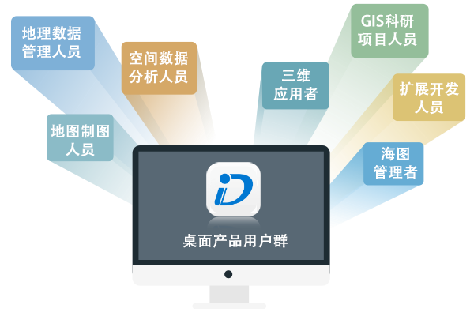

从传统意义上而言，GIS 桌面更多的侧重于地图制作。而今随着 GIS 应用越来越广泛，以及新 IT 技术的发展，
桌面产品用户中出现了很多面向三维应用的用户，以及相对较为专业，从事知识挖掘和辅助角色的用户。另外，随着 功能逐渐丰富，技术日益成熟，选择用 GIS
桌面产品进行项目开发的用户也在逐渐增多。

是一款综合性的专业 GIS 应用程序，支持二三维制图、数据处理、数据分析、扩展开发以及数据共享等丰富的 GIS 功能。 是专业人员用来管理 GIS
项目、地图、三维、模型等的应用平台，从 GIS 应用的角度出发，主要用户以下几个类型：

  
---  
* **地图制图人员**

提供的专题图制作、布局排版打印、符号资源库、自动化制图及丰富的数据处理等功能，为地图制图者制作精美地图提供了强有力的支撑。

* **地理数据管理人员**

提供了多种类型数据的导入导出、数据集创建、数据编辑、投影设置、数据配准、矢量和栅格数据处理等数据管理的基本功能，地理数据管理人员可通过创建绘制新的地理数据，或处理、编辑已有的数据，进行地理数据管理。

* **空间数据分析人员**

提供了丰富的空间分析功能，如：缓冲区分析、叠加分析、表面分析、插值分析、栅格统计、距离栅格、动态分段、水文分析等，可对栅格或矢量数据进行分析，方便用户基于空间数据的地理对象位置和形态，提取和和挖掘数据的空间信息。

* **三维应用者**

提供了三维数据创建、显示浏览、三维飞行、数据建模、三维空间分析、三维网络分析等功能，为三维应用提供的强有力的支撑。同时，
还提供了多种粒子特效，如：火焰、爆炸、喷泉、烟雾、水流、烟花、落叶等抽象视觉效果，增强了三维的真实感。

* **GIS 科研项目人员**

已经在国土行业、军事国防、数字城市、城市规划、地理国情、水利行业、公共设施领域等传统行业中得到应用，主要应用于这些行业的项目中，进行数据分析和数据处理等操作，得出项目研究成果。

* **扩展开发人员**

除了传统领域应用 GIS 技术外，许多新的领域也引进 GIS 这种新兴技术手段，如保险行业、金融行业、物流行业、烟草行业等，用户可以使用
扩展开发，来开发需要的新功能，更好地辅助研究应用。

* **海图管理者**

提供了海图数据导入导出、浏览和海图编辑等功能，用户可通过生产一幅新的海图数据，或修改已有海图数据两种方式生产海图数据。同时，支持海图数据和陆地数据的整合与发布，实现了海陆一体化，方便用户对海图数据进行管理。

  
  
---

