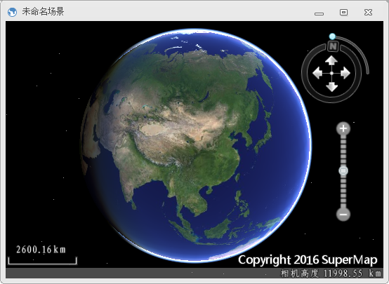

---
id: Step1_NewScene
title: 第一步：新建三维场景  
---  
  1. 启动 应用程序。
  2. “ **开始** ”选项卡 -> “ **浏览** ”组 -> “ **场景** ”下拉按钮中选择" **新建球面场景窗口** "，即可创建一个如下图中所示的未命名场景。
  
 

###  相关主题

 [第二步：添加模型到场景中](Step2_AddModel)

