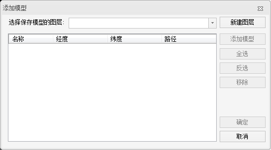
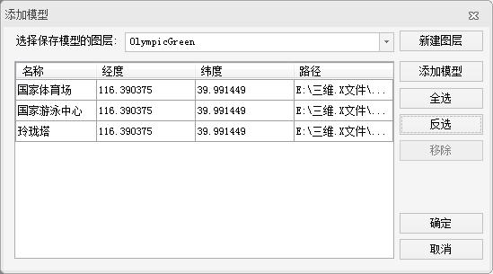
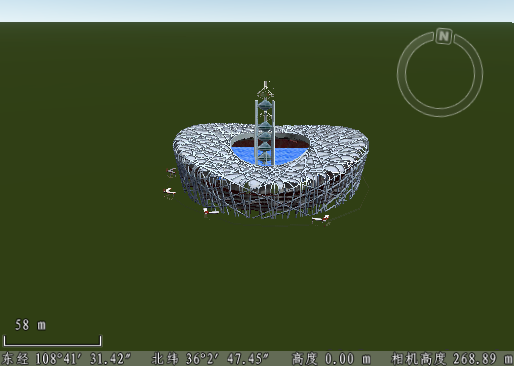

---
id: Step2_AddModel
title: 第二步：添加模型到场景中  
---  
1. “ **场景** ”选项卡-->" **数据** "分组中，在“ **添加模型** ”下拉按钮中选择“ **添加模型** ”，弹出如下图所示的对话框。
  

2. 添加保存模型的图层。在三维场景中，单个模型并不能直接添加到场景中，需要选择已有的或者新建一个KML图层作为载体，将模型添加在kml图层上，再添加到场景中。在本例中，需要先新建一个KML图层。如上图中所示，点击“ **新建图层** ”创建一个名为“ **OlympicGreen** ”的图层。
3. 添加模型。KML图层创建完成之后，点击“ **添加模型** ”，弹出“打开三维模型文件”对话框，选择“ **国家体育场.x** ”模型文件，添加到KML图层中。KML图层中支持添加多个模型文件，支持的模型文件类型有：*.3ds，*.mesh，*.obj，*.x，*.dae，*.osg，*.osgb。
  

4. 修改模型位置。如上图中所示，模型添加到列表中时，默认的名称为*.X 的文件名，默认的经度、纬度值为当前场景中心点的经纬度坐标值。如果已知当前添加的模型的位置，可以将鼠标移动到“经度”、“纬度”的列中，单击鼠标左键或者按 F2 键，使之处于可编辑状态，进行经纬度的修改。如果不清楚模型的精确经纬度信息，建议 准备一幅模型所在区域的影像图，叠加在模型图层下面，将模型加载到场景中后，以影像图为参考，设置KML图层可编辑，选中并移动模型到准确的位置。本例中添加的国家体育场、国家游泳馆、玲珑塔三个模型文件，就是通过与影像叠加的方式，各自调整到正确的位置。如下图所示。 

### 注意事项

模型图层（*.kml），适用于模型数量较少（<100个），密度低的场景，且模型的位置可以不断变化；模型图层只能用于本地浏览，不能用于模型的网络发布。

### 相关主题

 [第三步：保存图层](Step3_SaveLayer)
