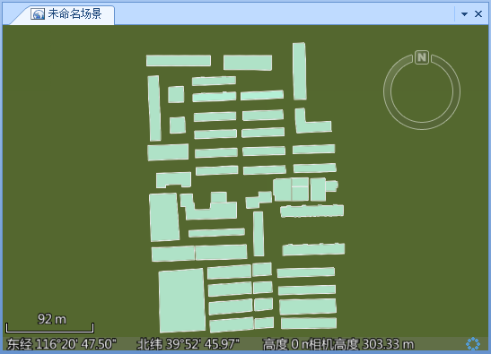

---
id: Step1_NewScene&LoadData
title: 第一步：新建一个场景窗口并加载数据  
---  
  1. 启动  应用程序。
  2. 打开某处楼群的二维面数据集（Buildings）所在的数据源（Modeling.udb，Modeling.udd）。 

数据所在的位置为："安装路径:\\SampleData\3D\Modeling"。

  3. 新建一个场景窗口，操作为：单击功能区>“ **开始** ”选项卡>“ **浏览** ”组>“ **场景** ”下拉按钮的下拉按钮部分，在弹出的下拉菜单中选择“新建场景窗口”按钮；或者在工作空间管理器中，右键点击场景结合结点，在弹出的右键菜单中选择“新建场景”项。
  4. 将二维面数据集 Buildings 添加到当前场景中。 

在工作空间管理器中，选中 Modeling 数据源下的面矢量数据集
Buildings，右键点击鼠标，在弹出的右键菜单中选择“添加到当前场景”或者直接将选中的数据集拖放到当前场景中。

  5. 添加面矢量数据集后，图层管理器中增加了一个图层，位于“普通图层”结点下，双击该图层结点，使场景飞行到数据集所处的地理范围，同时，进行浏览操作，调整到合适的视角。
  

###  相关主题

 [第二步：快速建模](Step2_MakeingModel)
