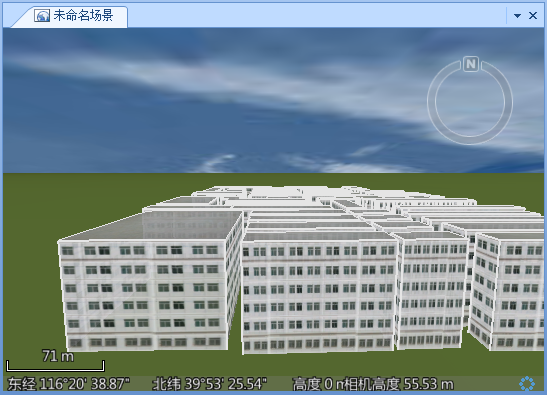

---
id: Step2_MakeingModel
title: 第二步：快速建模  
---  
基于二维面数据集进行三维快速建模，实质是通过对面矢量图层进行扩展属性设置，从而对面图层中的面对象进行垂直拉伸，同时进行顶面和侧面贴图，从而实现批量快速的建模，具体操作如下。

1. 在图层管理器中，选中 Buildings 面图层，使其为当前图层。
2. 在“ **风格设置** ”选项卡中的“ **拉伸设置** ”组，选择和设置高度模式为“相对地面”。 

只有高度模式为非贴地模式，才能对二维数据进行拉伸建模。

3. 在“ **风格设置** ”选项卡中的“ **拉伸设置** ”组中的“ **拉伸高度** ”下拉箭头内设置面对象被拉伸的高度，单位为：米，这里输入数值 35。 

另外，“拉伸高度”组合框下拉列表中列出了该面数据集所包含的所有数值型字段，可以使用某个字段的数值作为相应面对象的拉伸高度。

4. 单击“ **拉伸设置** ”组中的“ **贴图设置** ”按钮，在弹出的“ **三维贴图管理** ”面板中可以设置面对象被拉伸为体对象后的顶面贴图和侧面贴图：   

      * 单击“ **顶面贴图** ”组中“ **贴图来源** ”右侧的组合框下拉按钮，弹出的下拉菜单中列举了 Buildings 面数据集所包含的所有文本型字段的名称，如果数据集中某个字段存储了各个对象顶面贴图所使用的图片全路径信息，这里可以通过指定该字段为顶面贴图字段，从而使各个对象使用自己的贴图。
      * 本实例中，我们使用统一的图片作为顶面贴图，因此，在弹出的下拉菜单中选择“TopTexture”项。
      * TopTexture 字段存储了顶面贴图所使用的图片文件（TopTexture.jpg），选中并打开。
      * “侧面贴图”的设置方式与“顶面贴图”，这里同样采用统一的图片作为侧面贴图，即，在“ **侧面贴图** ”组合框的下拉列表中选择“SideTexture”项。在 "SideTexture"字段中存储了侧面贴图的图片文件（SideTexture.jpg）。  

5. “三维贴图管理”面板中，“侧面贴图”和“顶面贴图”的“ **横向重复** ”、“ **纵向重复** ”均使用默认数值1，“ **重复模式** ”均使用默认的“重复次数”模式。
6. 另外，进入到功能区的“ **风格设置** ”选项卡中，在“ **填充风格** ”组中，修改该面图层的风格：设置“ **填充颜色** ”为白色（255，255，255）；选择和设置“ **填充模式** ”为“填充”。
7. 设置完成后，浏览数据，调整到合适的观察视角，如下图所示。
  

###  相关主题

 [第三步：保存场景](Step3_SaveScene)

