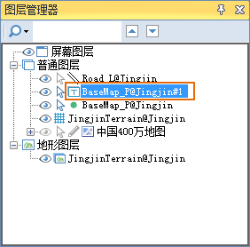

---
id: Application2Step4
title: 第四步：设置三维图层风格  
---  
设置三维场景中的点矢量图层、线矢量图层的风格，同时，对点矢量图层制作三维专题图。

设置点图层风格

  1. 在图层管理器中，选中 BaseMap_P 点图层，使其为当前图层；
  2. 进入功能区上的“ **风格设置** ”选项卡，用来设置三维图层的风格；
  
---  
  3. 在“ **点风格** ”组中，点击颜色按钮，用来设置点图层中点符号的颜色，这里设置为：RGB（192,0,0）;
  4. “ **点风格** ”组中颜色按钮右侧的组合框，用来设置点符号的大小，可以输入数值，也可以选择提供的参考值；
  5. 设置的结果如下图所示。
  

设置线图层风格

  1. 在图层管理器中，选中 Road_L 线图层，使其为当前图层；
  2. 进入功能区上的“ **风格设置** ”选项卡，用来设置三维图层的风格；
  

  3. 在“ **线风格** ”组中，点击颜色按钮，用来设置线图层中的线颜色，这里设置为：RGB（246,197,103）;
  4. “ **线风格** ”组中，设置线宽度为8，可以输入数值，也可以选择提供的参考值；
  5. 设置的结果如下图所示。  

  

制作三维标签专题图

可以对添加到场景中的矢量数据集制作三维专题图，下面以当前场景中的 BaseMap_P 点图层为基础，对其制作标签专题图。

  1. 在图层管理器中，选中 BaseMap_P 点图层，使其为当前图层；
  2. 进入功能区上的“ **专题图** ”选项卡，用来制作各类三维专题图；
  
 
  3. 点击标签组中的“ **新建** ”按钮，即可使用默认的设置快速制作出标签专题图，此时，图层管理器的“普通图层”结点下将增加一个子结点，对应刚刚制作的标签专题图图层；
  

  4. 另外，通过双击图层管理器中的三维标签专题图图层，弹出“三维标签专题图”窗口，可以修改默认专题图的设置，更符合用户需求；
  

  5. 专题图的效果如下图所示。
  
