电子地图以地理信息为基础，整合旅游、娱乐、餐饮和公交等增值信息，逐渐深入大众生活的方方面面。“天地图”作为我国区域内数据资源最全面、现势性最好的地理信息网站，旨在向公众提供权威、全面、统一的地理信息服务，如今已成为电子政务的重要组成部分。本部分就天地图1-10级制作方法进行说明。

###  数据说明

  1. 数据来源

国家测绘局公共版1：100万DLG数据；本方法也是基于这个数据；

  2. 数据内容

数据包含行政要素、道路、水系与植被等，具体如下：  

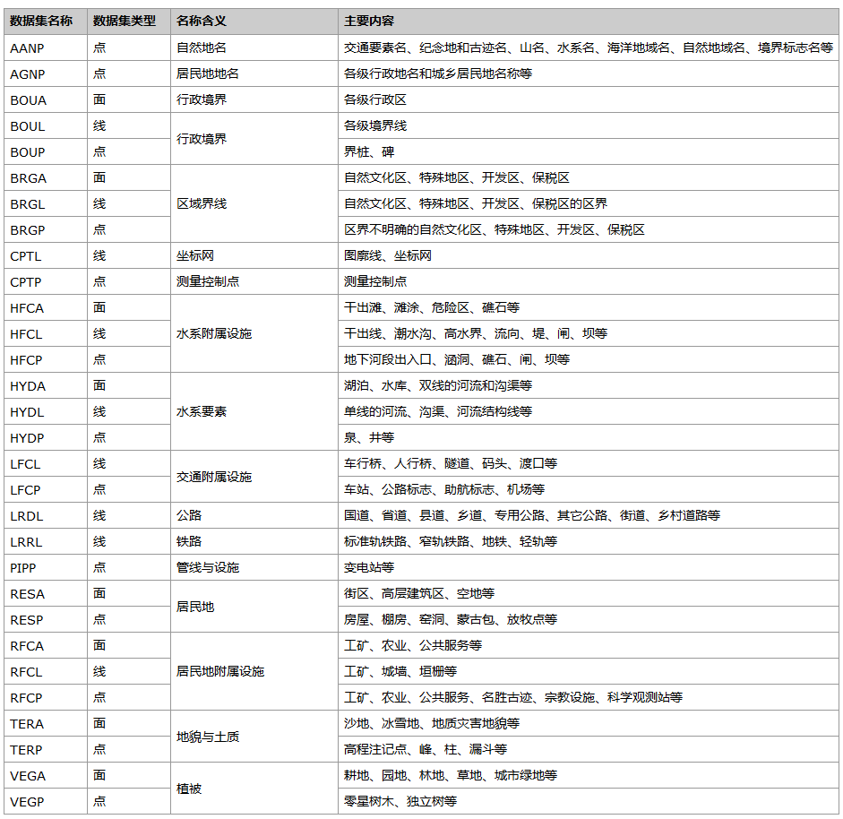    

  3. 其它说明

（1） 比例尺：1:100万数据比例尺

（2） 地图投影：地理坐标系D_2000

（3） 分幅方法：矩形拼接分幅，经差6°纬差4°

###  数据处理

  1. 行政面处理

行政区划面在数据集BOUA中，以分幅的方式来进行存储。制图时，只需要中国的整个面域部分，而不用区分各省与市，所以只需要将中国的面域融合为一个面，并且去除国外部分即可。

（1） 去除国外部分：打开BOUA数据集的属性表，对PAC码按照升序排列，然后删除六位PAC编码以外的数据项，即删除中国以外的区域。

（2）
面融合：由于分幅之后，相同PAC码的对象被分幅线切开了，需要合并到一起。使用“数据”选项卡中“数据处理”分组下的“融合”工具，以PAC编码为融合字段对中国区域的面进行融合，以消除分幅的影响。

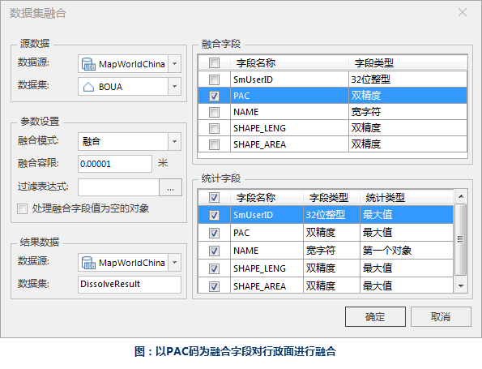  

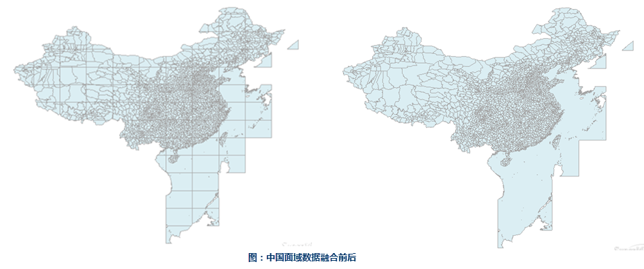 
  
（3） 删除海域：由于对中国海域部分不做特殊标记，所以删除海域部分的面，并将所有剩余面合并为一个整体的面数据。

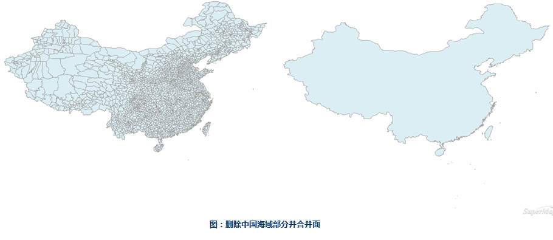  

  2. 水系面处理

水系面对应的数据集为HYDA，以GB码来区分不同的水系类型。制图需要表达的水系要素包括：河流、主要湖泊与较大的水库，逐一提取。

（1）
主要河流提取：主要河流也就是长江与黄河，使用“空间分析”选项卡中“查询”分组下的“SQL查询”功能，将长江与黄河查询出来另存为新的数据集，SQL语句为“HYDA.NAME
= "长江" OR HYDA.NAME =
"黄河"”。查询出来的河流面有因为分幅而分段的情况，需要使用“数据”选项卡中“数据处理”分组下的“融合”工具对查询出来的河流面以NAME字段为融合字段进行融合。

（2）湖泊与水库提取：与主要河流提取方法一致。

  3. 各级境界线处理

各级境界线存储在数据集BOUL中，制图时需要将国界、省界与海岸线分别挑出来赋予不同的风格来显示。线数据以GB码来标识，所以不同类型的境界线区分需要使用GB码作为识别码。

（1）
提取国界线：国界线包含已定界与未定界，参考数据制作标准可知，已定界对应的GB码为620201，未定界对应的GB码为620202，可以使用属性表中的“筛选”功能，筛选出BOUL数据集中GB码为620201与620202的线对象。

筛选出的国界线由于分幅被切开，不是完整的一条，已定界和未定界都存在分段的情况，因此需要使用“数据”选项卡中“数据处理”分组下的“融合”工具对筛选后的国界线以GB码为融合字段进行融合。

  

  
（2） 提取海岸线：根据数据制作标准可知，海岸线对应的GB码为250200，采用与提取国界线同样的方法提取海岸线。

（3）
提取省界：省界中已定界对应的GB码为630201，未定界对应的GB码为630202，此处没有区分已定界与未定界，统一使用630200的GB码，提取方法与国界线一致。

  4. 公路数据处理

公路数据在数据集LRDL中，制作地图时，不同等级的公路需要选用不同的符号来进行表达，所以公路数据首先要进行分层处理，然后再融合。需要注意的是，这里的公路只表达已建成的公路，不对建设中公路进行表达。

（1）
国道：数据制作标准中已建成国道对应的GB码为420101，使用属性表中的“筛选”功能将GB码为420101的线对象筛选出来，然后另存为“国道”数据集。具体操作方法与国界线的处理一致，这里不再赘述。将国道筛选出来之后，使用“融合”工具以GB码为标识码进行融合。

（2） 使用与（1）同样的方法查找出省道、线道、快速路与主干道。

  5. 铁路数据处理

铁路数据对应的数据集为LRRL，单线标准轨和复线标准轨的GB码分别为410101与410102，使用
“筛选”功能将GB码为410101、410102的线对象筛选出来，然后另存为“铁路”数据集，具体操作方法同国界线。铁路筛选出来之后，同样需要进行融合。

  6. 各级行政点提取

各级行政点数据存在数据集AGNP中，不同级别行政区对应的CLASS编码不同，除了首都北京需要单独使用SQL查询另存出来单独赋予风格表示外，其余行政地名都可以用筛选的方式查找出来。

###  数据整理

数据分别处理后的结果如下表：

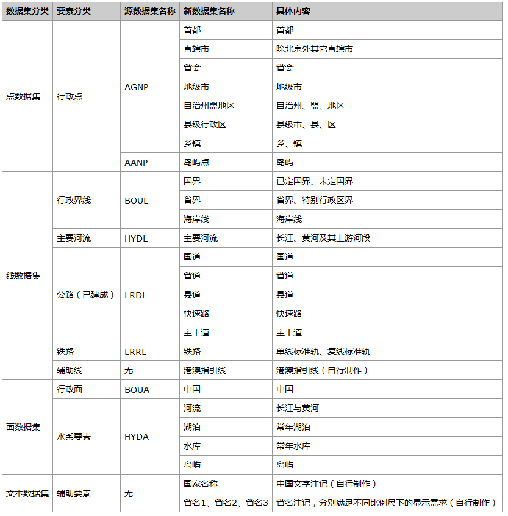    

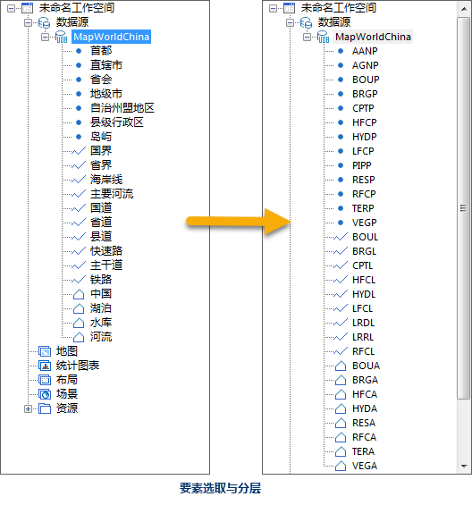  

###  地图制作

  1. 设置坐标系

天地图中国使用地理坐标系D_2000，参考椭球体China_2000。

  2. 设置比例尺

地图采用的比例尺共有九级，也就是《CH Z 9011-2011地理信息公共服务平台 电子地图数据规范》中地图瓦片比例尺的3-11级，如下：

比例尺等级 | 比例尺  
---|---  
L1 | 1:73957338.8636414  
L2 | 1:36978669.4318207  
L3 | 1:18489334.7159103  
L4 | 1:9244667.35795517  
L5 | 1:4622333.67897759  
L6 | 1:2311166.83948879  
L7 | 1:1155583.4197444  
L8 | 1:577791.709872198  
L9 | 1:288,895.854936099  
  3. 制作电子地图

不同比例尺下显示下需要显示的要素如下表：

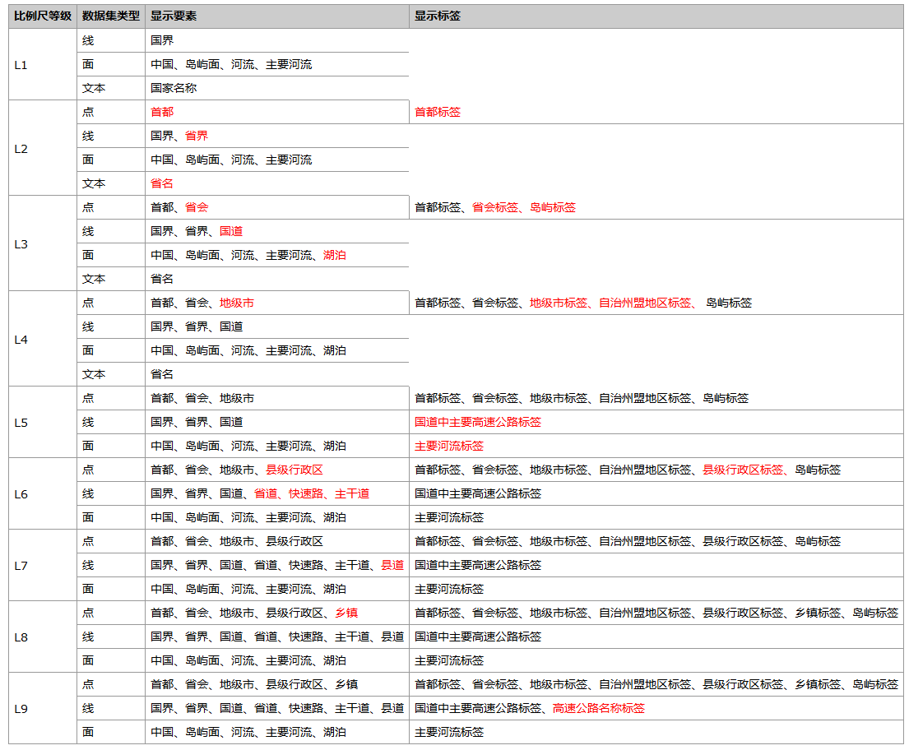   
  
* 红色字体为当前比例尺下与上一级更小的比例尺相比新增的图层要素；

###  制图精编

  1. 线型反走样与文本反走样

在“地图”选项卡中的“基本”分组下，提供了“线型反走样”与“文本反走样”的选项。

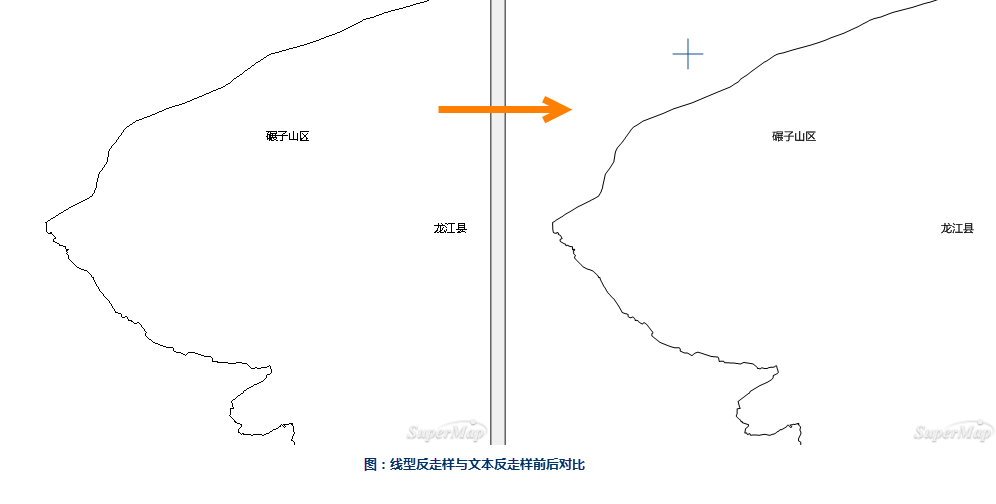  

  2. 道路交叉口处理

“图层属性”选项卡中提供了“十字路口优化”选项。

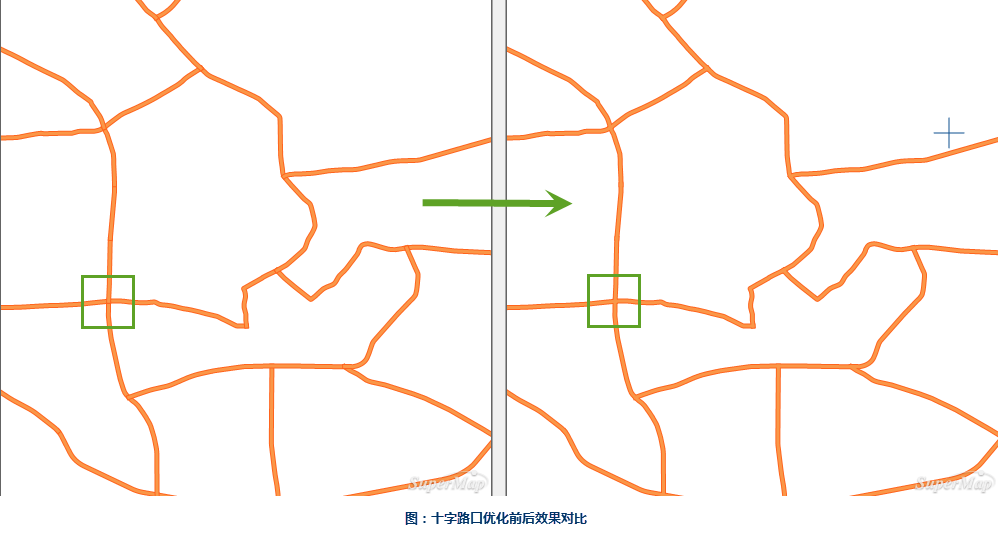  
---  
 
  3. 超长标签处理

在标签专题图的“专题图属性”选项卡中“高级”分组下，可以设置标签的超长处理方式为“换行显示”，设置合适的单行文本字数，使得标签超过一定的长度时换行显示。如果需要标签按照语意关系来换行，还可以使用“指定换行字符”的功能，例如：大通回族土族自治县，想要在“回族”与“土族”之间换行，就可以在两者之间加“/”，即“大通回族/土族自治县”，然后指定换行字符为“/”，就可以实现在“回族”与“土族”之间换行。

  4. 使用专题图模板简化制图过程

专题图的模板可以右键输出保存到指定目录下，再次使用同样的风格时，直接加载进来即可，不需要再重复设置一次参数。

  5. 其它说明

（1） 地图中需要频繁使用图层的“可见比例尺范围”来控制每个比例尺下要素的显示效果。

（2） SuperMap iDesktop资源库中提供了天地图风格的符号，如各级道路等，可以直接拿来使用。下图分别是
天地图风格中国电子地图局部以及地图细节
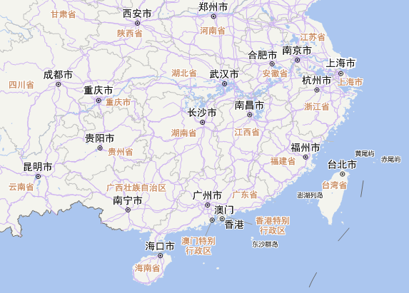  

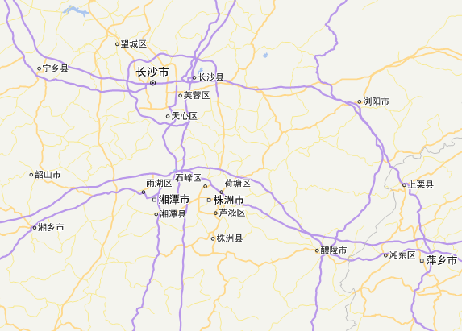  

