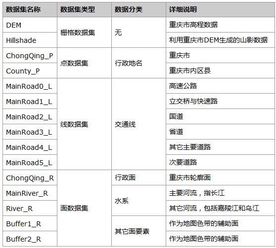
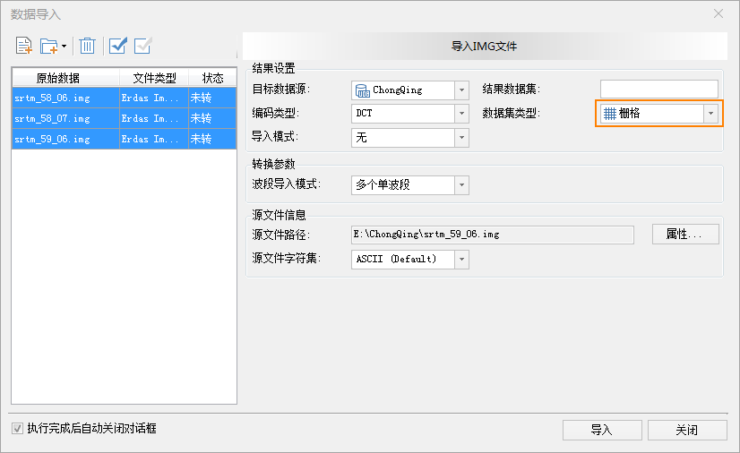
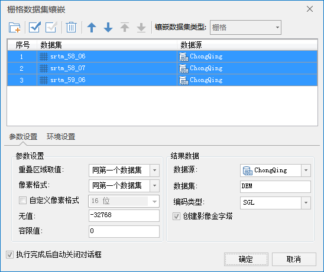
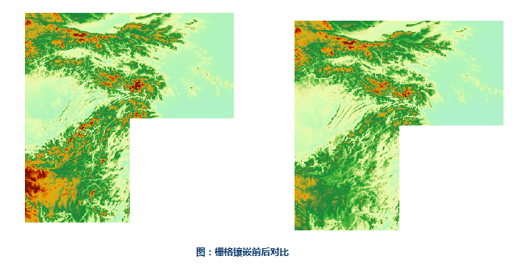
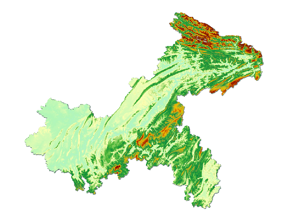
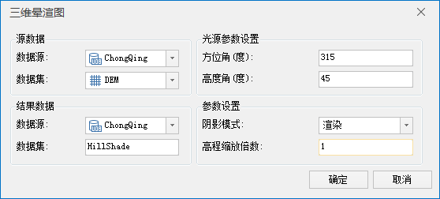
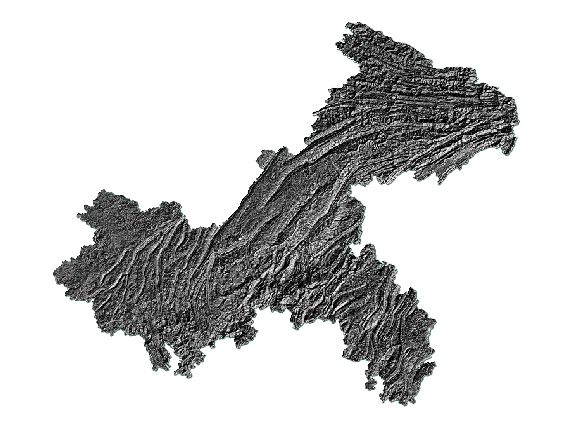
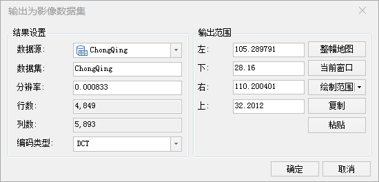
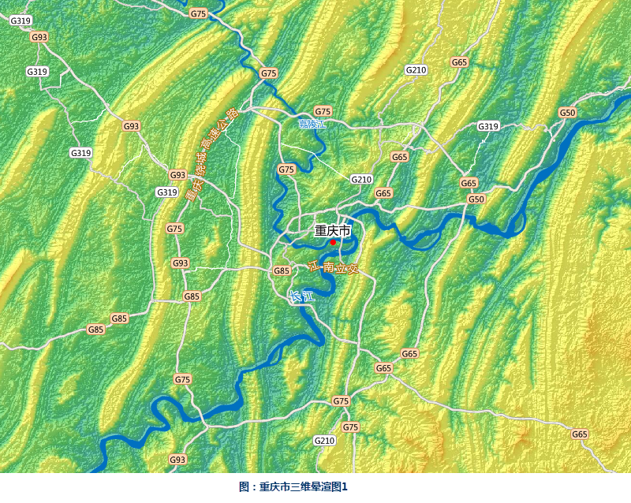
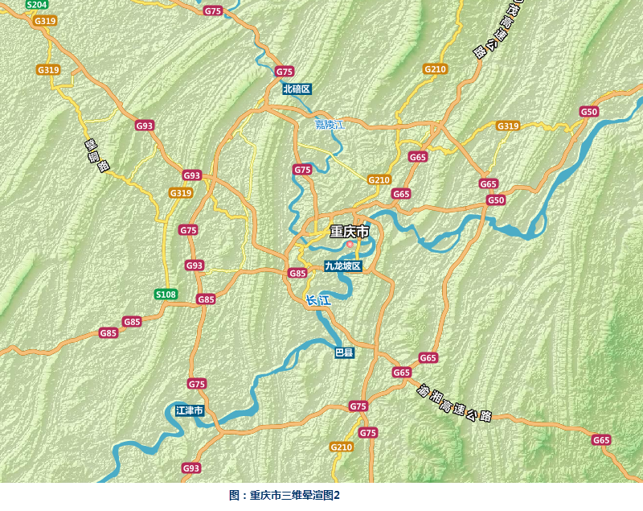

### 数据说明

重庆市三维晕渲图是具有立体效果的晕渲图，可以直观地反映区域内的地形高低起伏，同时描述地形与水系、道路等要素分布的关联。

### 数据详细介绍

重庆市DEM数据来源于“地理空间数据云”网站（网址为http://www.gscloud.cn/）中的SRTM DEM
90m分辨率原始高程数据，矢量数据为国家测绘地理信息局制作的公共版中国1：100万比例尺数据。

数据源中的数据内容详细说明如下表。

    
  
### 数据处理

  1. 数据导入

新建文件型数据库，将“地理空间数据云”网站上下载到的DEM分块数据以栅格数据集的形式导入,下图为导入DEM数据 。

  

  2. 数据处理

(1)DEM拼接

由于下载到的重庆市DEM数据分为三块，所以首先要进行DEM数据的拼接，使用“数据”选项卡中的“数据处理”→“栅格镶嵌”工具来进行DEM数据的拼接。

  

   

(2)DEM裁剪

导入重庆市矢量图形数据，使用“地图”选项卡中的“地图裁剪”→“选中对象区域裁剪”工具裁剪出重庆市DEM数据。

  

### 制图流程

  1. 山影数据生成

使用“分析”选项卡中的“表面分析”→“三维晕渲图”工具生成重庆市Hillshade山影数据。

  

  2. 配置颜色

为生成的山影栅格数据设置颜色表，一般选择从黑到白的颜色方案。

  

  3. DEM与Hillshade叠加

为了使晕渲图具有立体效果并且色彩丰富，将DEM数据叠加在Hillshade上边，并对DEM数据设置一定的透明度，还可以调整DEM与Hillshade的透明度、亮度以及对比度，直到呈现满意效果。由于数据量较大，为了保证地图浏览的流畅度，可以将DEM与Hillshade叠加后的地图生成影像数据集，设置与DEM一致的分辨率，这样可以在不影响表现效果的前提下使地图的浏览更加流畅。

  

  4. 添加其它要素

添加包括河流、道路、行政区划在内的要素，并设置不同要素图层的显示比例尺，使得晕渲图在不同的比例尺下显示不同丰富程度的内容。

### 成图展示

  

  

### 注意

在生成Hillshade山影数据时可以设置不同的参数生成不同的山体阴影效果。

  1. 太阳方位角的值域为顺时针0―360，高度角的值域为0―90，方位角和高度角的默认值分别为315和45，是冬天下午时分太阳的位置，如果想要夏天正午的效果，可以将方位角和高度角分别设为225和90。
  2. 高程缩放倍数即垂直比例因子，决定山体阴影山脊线的精细程度，值越大，山脊线越突出，默认值为1。

