### 数据说明

2011年平均降水量分布图反映了该年全国各地区的降水量分布差异，效果图1采用了与中国气象数据网一致的色带，整体风格比较明亮，效果图2则采用了相对柔和的颜色方案。

### 数据详细介绍

原始数据包括含气象监测站点经纬度的站点说明数据和含平均降水量监测结果的站点监测结果数据，均为Excel格式，下载自中国气象数据网（网址为http://data.cma.cn/site/index），其余数据为国家测绘地理信息局制作的公共版中国1：100万比例尺数据。

数据源中的数据内容详细说明如下表。

    

### 数据处理

  1. 数据导入

新建文件型数据库，将中国气象数据网上下载到的站点说明数据与监测结果数据以属性表的形式导入数据库中，注意勾选“首行为字段信息”。

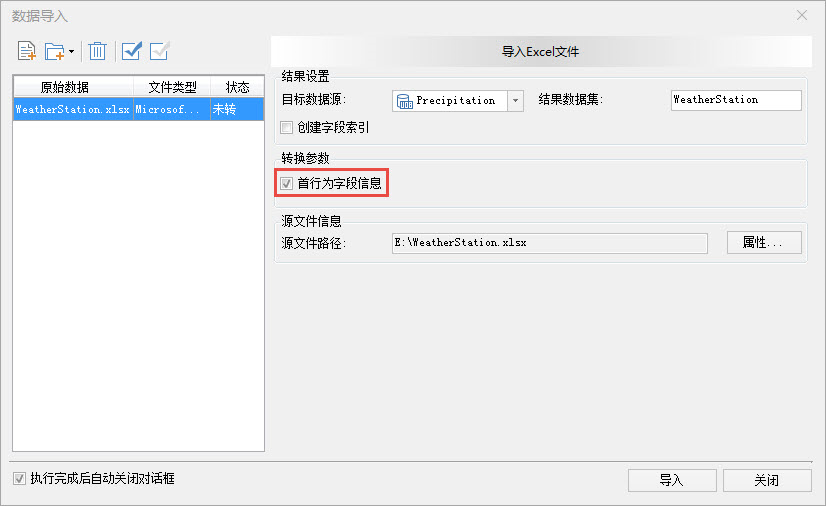  

  2. 数据处理

(1)将站点说明数据转换为点数据。由于下载到的原始数据是Excel表格的形式，以属性表的格式导入数据库之后，需要转换为点数据。使用“数据”选项卡中的“工具”→“类型转换”→“属性数据转点数据”来转换，设置X坐标为经度，Y坐标为纬度。

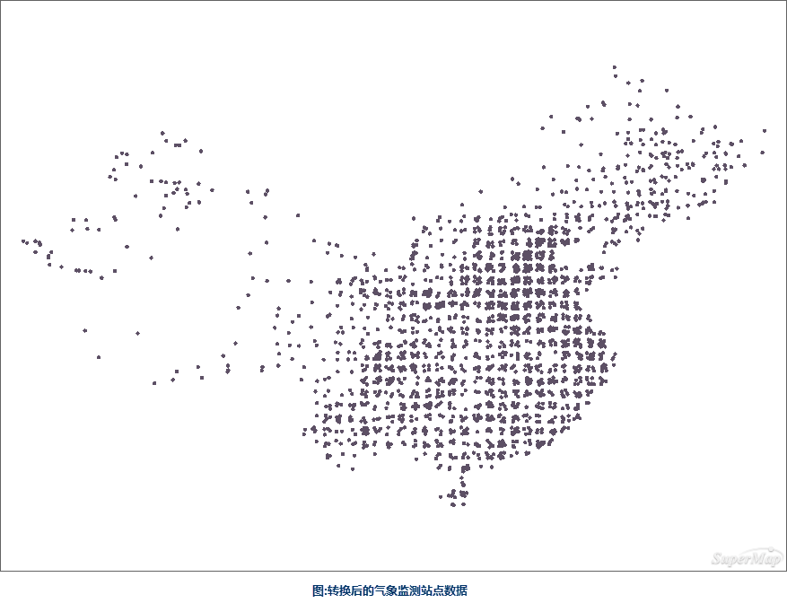  

  
(2)追加属性数据。将监测结果数据中的平均降水量数据以属性列追加的形式更新到监测站点属性表中，采用的是“数据”→“数据处理”→“追加列”的功能。

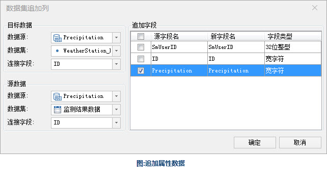  

  
(3)插值分析。由于气象站点的监测数据属于样本监测，所以需要利用插值的方法生成栅格，来得到无监测站点地区的近似数值，采用“分析”选项卡中的“栅格分析”→“插值分析”的功能。由于栅格分析的结果是矩形，提取出来的等值面也是矩形轮廓，需要裁剪。

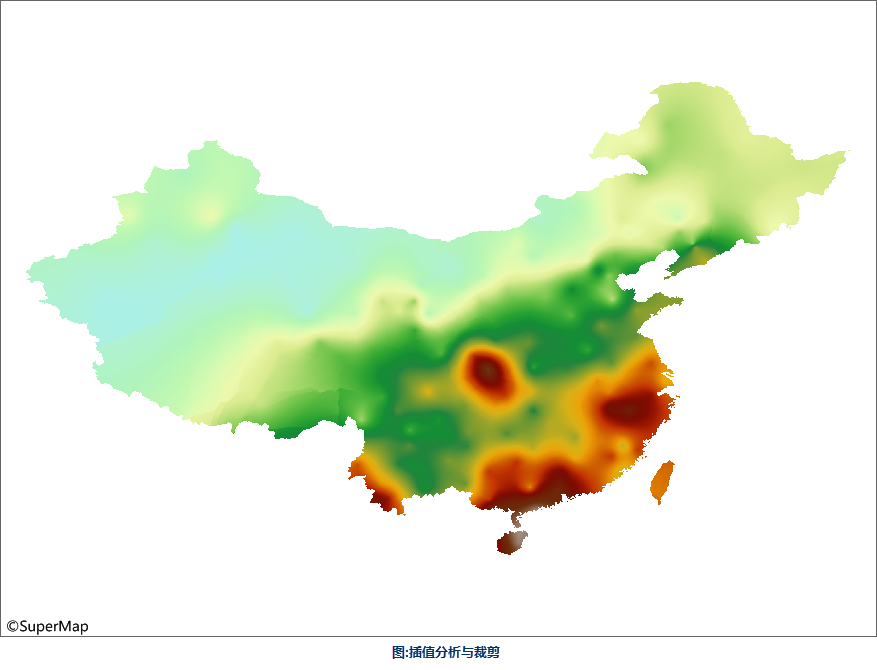  

(4)提取等降水面。利用（3）中插值生成的栅格提取区域内的等降水面，采用“分析”选项卡中的“栅格分析”→“表面分析”→“提取所有等值面”工具，将等值距设置为1000（这里的等值距可以根据使用目的灵活设置）。在栅格分析的结果数据分辨率较高的情况下，等值面的边线可能会有较多棱角，为了制图效果，可以设置合适的光滑系数来对边线进行光滑处理。

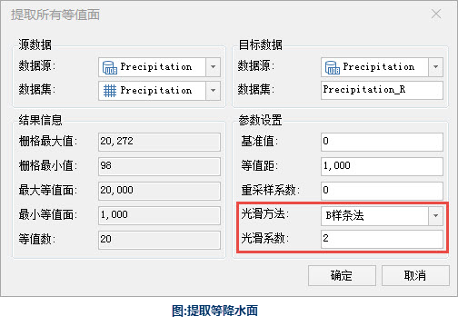  

  
(5)提取等降水线。采用“分析”选项卡中的“栅格分析”→“表面分析”→“提取所有等值线”的功能来提取与等降水面对应的等降水线。同时，为了使等降水线边缘与等降水面完全吻合，需要与生成等降水面使用同样的参数。

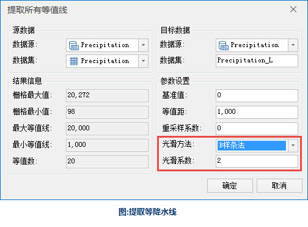  
  
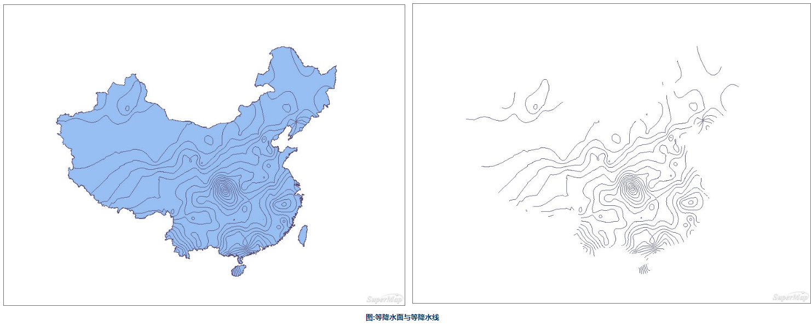

### 制图流程

  1. 配置行政要素

添加世界范围的国家面，由于其它部分为水域，所以需要将地图的背景色设置为浅蓝色。

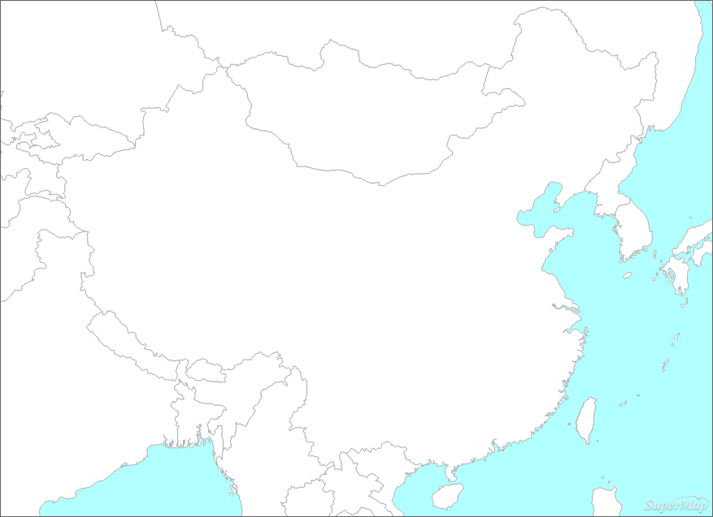  

  2. 制作中国国界的色带

通过制作多重单向缓冲区，并为缓冲区设置同色系不同饱和度的颜色来为地图制作色带，使用“分析”选项卡中的“矢量分析”→“缓冲区”功能来生成缓冲区，经多次调整缓冲区半径，中国范围的地图使用15000m和30000米的缓冲区效果最佳。

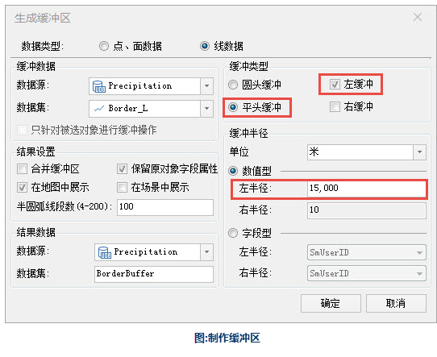  
 
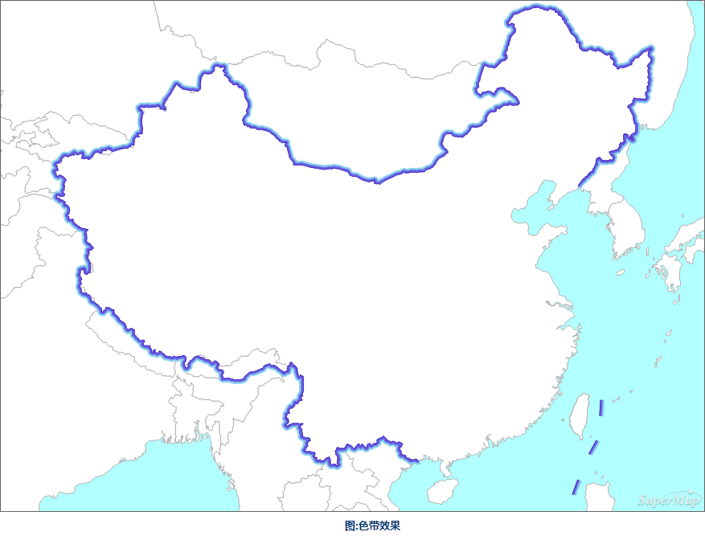  

  3. 制作降水量专题图

对等降水面以年平均降水量为表达式制作单值专题图，并为专题图选取合适的颜色方案。

  4. 添加等降水线

为了使图面要素更为全面和丰富，使读者能清晰分辨某地区所在的降水面，添加等降水线并为其制作标签专题图。

  5. 添加辅助要素

添加图名。

  6. 制作地图网格

由于降水量的分布与地区所处的地理位置息息相关，所以本图需要添加经纬网，使用“地图”选项卡中的“制图”→“地图网格”工具来生成经纬网。

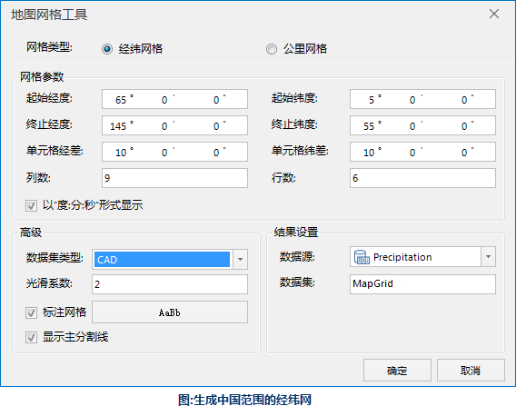  

  7. 设置地图全幅范围

地图配置好后，全幅显示会显示的是世界范围的区域，但在本图中，世界各国只是辅助表达内容，重点在于中国的范围。在“地图属性”选项卡中“范围”下边可以勾选“自定义全幅范围”，将中国的部分显示为全幅的范围。

### 成图展示

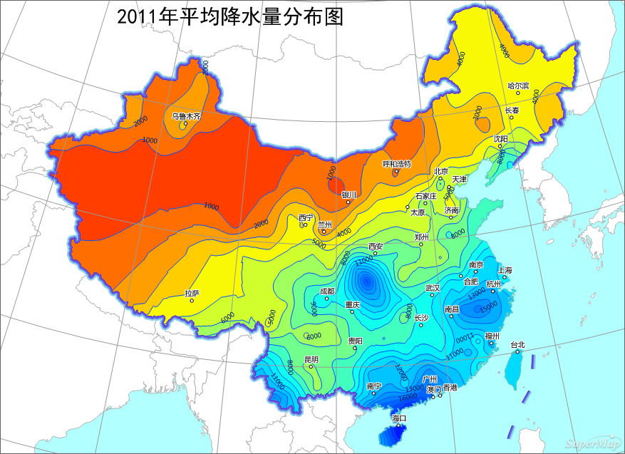  

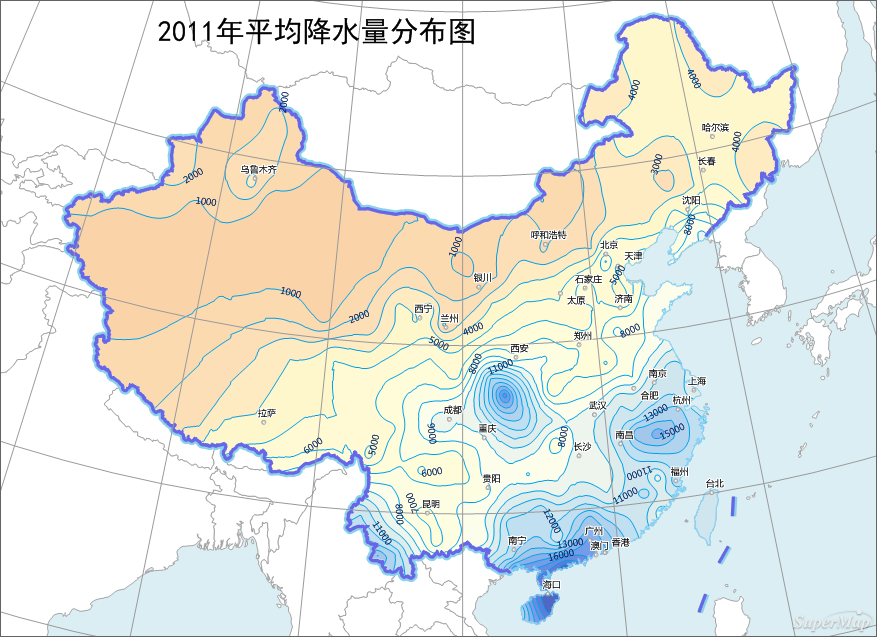  

