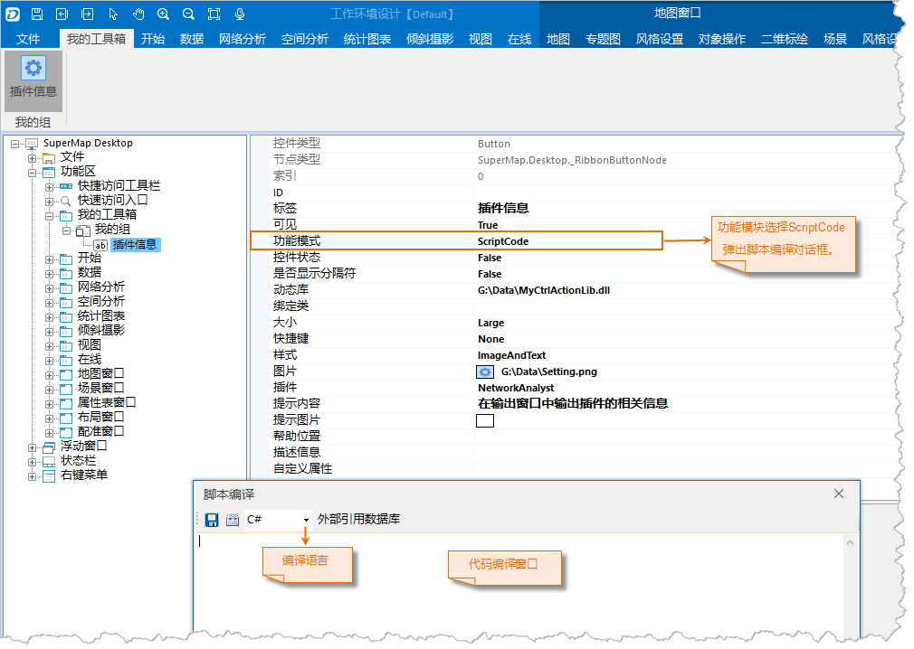
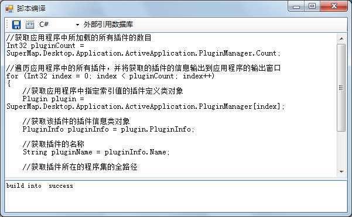

  1. 设置“功能模式”的值为"ScriptCode"，弹出“脚本编译”窗口，如下图所示。
  
---  
ScriptCode  
  2. 选择脚本语言为"C#"，并且将下列代码复制到“代码编辑窗口”。

```
    //获取应用程序中所加载的所有插件的数目
    Int32 pluginCount = SuperMap.Desktop.Application.ActiveApplication.PluginManager.Count;
    
    //遍历应用程序中的所有插件，并将获取的插件的信息输出到应用程序的输出窗口
    for (Int32 index = 0; index < pluginCount; index++)
    {
        //获取应用程序中指定索引值的插件定义类对象
    
        Plugin plugin = SuperMap.Desktop.Application.ActiveApplication.PluginManager[index];
    	
        //获取该插件的插件信息类对象
    
        PluginInfo pluginInfo = plugin.PluginInfo;
    	
        //获取插件的名称
    
        String pluginName = pluginInfo.Name;
    
        //获取插件所在的程序集的全路径
    
        String pluginAssemble = pluginInfo.AssemblyName;
    
        //将获取的插件名称和所在的程序集信息输出到应用程序的输出窗口
    
        SuperMap.Desktop.Application.ActiveApplication.Output.Output("插件名称：" + pluginName + "\r\n" + "所在的程序集：" + pluginAssemble,InfoLevel.Information);
    }
```
    

  3. 单击“脚本编译”按钮进行编译，编译成功后，单击“脚本保存”按钮进行保存，如下图所示。

保存后，关闭“脚本编译”窗口。

  
---  
脚本编译保存  
  4. 设置完成后，单击“确定”按钮，保存相关设置信息。


