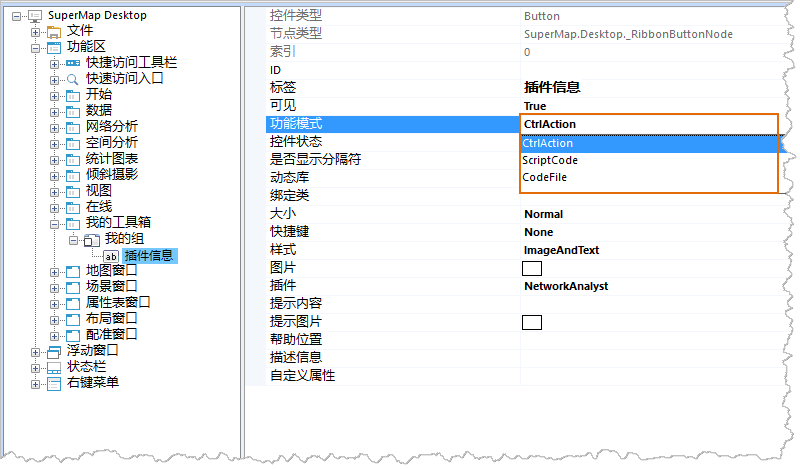

### 目的：

  * 编写代码实现应用程序的插件遍历，并将插件信息在输出窗口中输出；
  * 将上述功能与按钮关联配置起来。

### 实现：

单击“插件信息”按钮属性表的“功能模式”项的属性值，弹出下拉列表"CtrlAction"、"ScriptCode"、"CodeFile"，如下图所示。

  
---  
选择二次开发方式  
  
下面分别说明这三种方式的代码实现及配置方式。

[方法一：CodeFile](CodeFile)

[方法二：ScriptCode](ScriptCode)

[方法三：CtrlAction](CtrlAction)

