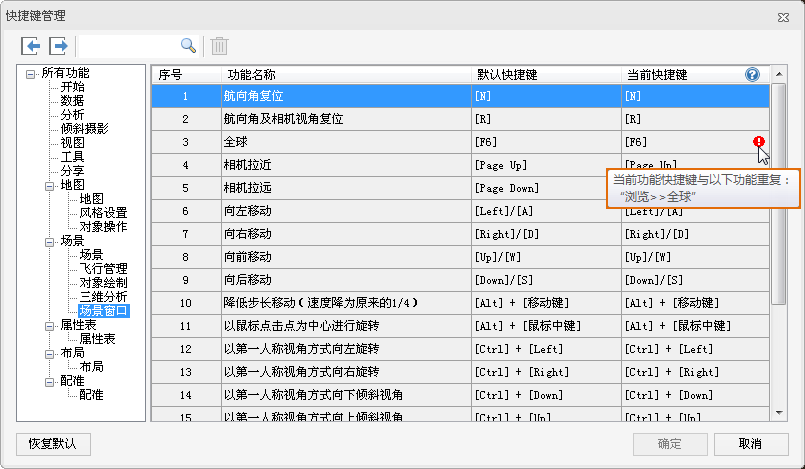

应用程序提供了大量可用的键盘快捷键，在不使用鼠标的情况下也可使用快捷键完成一些基本操作。可通过快捷键管理功能，可直接修改功能的快捷键。

### 使用说明

    1. 在“视图”选项卡的“自定义界面”组中，单击“快捷键管理”按钮，即可弹出“快捷键管理”对话框，如下图所示：    

    2. 对话框左侧树结点中，以选项卡为单位进行罗列，在树结点处选中某一个选项卡结点，右侧列表中会对应显示该选项卡中的各个功能的默认快捷键和当前快捷键。
    3. 在功能列表中选中需要修改的功能，并单击“当前快捷键”对应的单元格，通过键盘即可将键盘中按下的按键设置为选中功能的快捷键。
    4. 对话框的工具栏中，提供了功能快捷键的导入、导出、删除和功能搜索等功能，具体操作如下所述： 
      * **导入** ：单击工具栏中的“导入”按钮，在弹出的“选择快捷键配置文件”对话框中选择一个*.xml文件，并单击“打开”按钮，即可将选中的*.xml文件导入。
      * **导出** ：单击工具栏中的“导出”按钮，在弹出的“保存快捷键配置文件”对话框中，设置*.xml文件的保存路径及名称，单击“保存”按钮，即可将应用程序中的所有功能对应的快捷键保存到配置文件中。
      * **搜索** ：在文本框中输入关键字，按下键盘中的“Enter”键，可根据关键字搜索选中树结点选项卡中的功能。
      * **删除** ：用于删除功能列表中选中的一个或多个功能的当前快捷键。
    5. 单击对话框中的“恢复默认”按钮，可将各个功能的快捷键恢复为默认。
    6. 设置好功能的快捷键后，单击对话框中的“确定”按钮，即可设置生效。

###  相关内容

 [快捷键一览表](DeskproShortcutKey.htm)

### 注意事项

    1. 若“当前快捷键”列表中出现红色感叹号，则说明该快捷键与其他功能快捷键重复，将鼠标移至红色感叹号图标处，即可查看到快捷键一致的功能。
    2. 快捷键的设置方式为按键设置，直接在键盘中同时按下需设置的快捷键按键即可设置成功。

