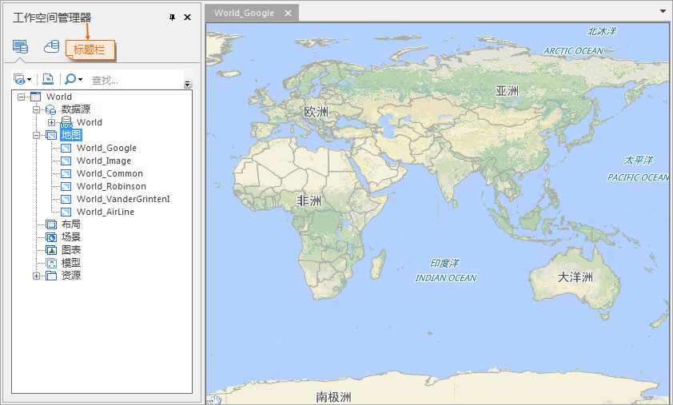
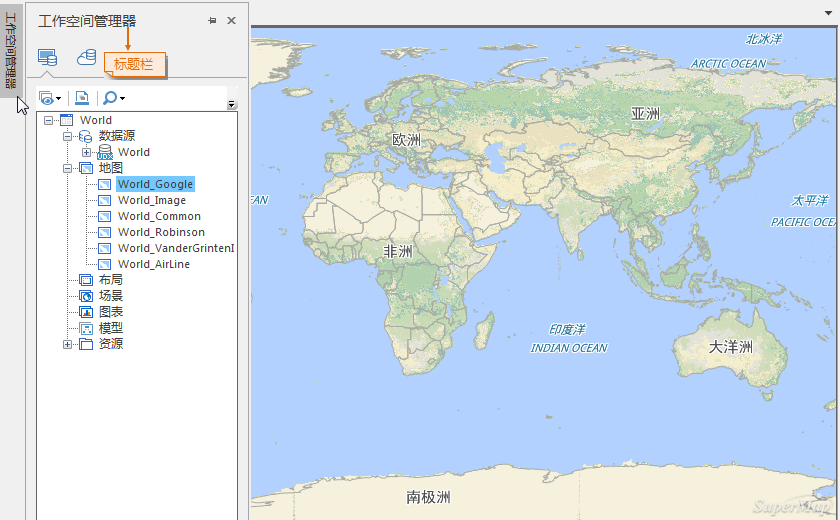

### 浮动窗口

应用程序中的浮动窗口有工作空间管理器、图层管理器和输出窗口，浮动窗口既可以作为单一窗口浮动显示在任何位置，可以浮动显示在应用程序主窗口以外的任何区域。地图窗口、三维窗口、布局窗口和属性表窗口是应用程序主窗口的子窗体，因此，不能将其移动到应用程序主窗口以外的区域，而浮动窗口可以。浮动窗口还可以停靠在应用程序中的某个位置。下面详细介绍浮动窗口的状态及其排列组合方式：

  * 停靠状态（Dock） 

浮动窗口为停靠状态，即固定显示在应用程序的某个位置，下图所示为工作空间管理器浮动窗口的处于停靠状态时的样子，浮动窗口在不同的状态下其标题栏有所差异，此时，如果点击标题栏中的
 按钮，则浮动窗口将变为自动隐藏状态。

标题栏中的  按钮为关闭该浮动窗口的关闭按钮。

  
---  
图：工作空间管理器浮动窗口的停靠状态（默认状态）  
  
  * 浮动状态（Float） 

如果浮动窗口处于非自动隐藏状态时，可以通过鼠标点击并拖动浮动窗口的标题栏部分来移动该浮动窗口，在移动浮动窗口的过程中，会出现方向键，如下图所示，以工作空间管理器浮动窗口的移动为例，如此时，将浮动窗口移动并拖放到任意一个方向键上时，浮动窗口就会停靠在其指示的位置，如果不将浮动窗口移动并拖放到方向键上，而是移动并拖放到其他位置处，那么浮动窗口就处于浮动状态。处于浮动状态的浮动窗口的标题栏中只有一个用于关闭该浮动窗口的关闭按钮
 。

浮动窗口可以浮动到应用程序界面以外的位置。

  
---  
图：浮动窗口移动过程中  
  
---  
图：处于浮动状态的浮动窗口  
  
  * 自动隐藏状态（AutoHide） 

处于自动隐藏状态的浮动窗口可以将浮动窗口自动隐藏起来，同时在浮动窗口之前停靠的位置处出现相应的按钮，称为显示浮动窗口按钮，如下图所示的用于显示处于自动隐藏状态的工作空间管理器浮动窗口的“工作空间管理器”按钮，当鼠标移动到该按钮上面时将弹出工作空间管理器浮动窗口，而当鼠标离开该浮动窗口和显示该浮动窗口按钮时，工作空间管理器浮动窗口又会隐藏起来。如果点击处于自动隐藏状态的浮动窗口标题栏中的
按钮时，就可以使该浮动窗口固定在其当前显示的位置，从而从自动隐藏状态变为停靠状态。

标题栏中的  按钮为关闭该浮动窗口的关闭按钮。

  
---  
图：工作空间管理器浮动窗口的自动隐藏状态  
  
### 浮动窗口的排列形式

可以通过移动浮动窗口使浮动窗口排列为不同的形式，如水平排列、垂直排列，但是有一种比较特殊的排列放置需要着重强调，就是浮动窗口可以以选项卡的形式实现几个浮动窗口“嵌入”到一个浮动窗口中进行显示，每一个浮动窗口称为该浮动窗口的一个选项卡页，如下图所示，是将输出窗口以选项卡形式“嵌入”到工作空间管理浮动窗口中进行显示的结果，每个浮动窗口包括工作空间管理器浮动窗口都变成了浮动窗口中的选项卡页，如下图中底部所指示的部分，点击选项卡页，即可呈现其对应的浮动窗口，同时标题栏会显示相应的浮动窗口的名称。

将浮动窗口作为选项卡页“嵌入”到其它浮动窗口的方法是：点击拖动要作为选项卡“嵌入”到其他浮动窗口的浮动窗口的标题栏，然后将其拖到目标浮动窗口的标题栏区域释放鼠标即可，如果要作为选项卡“嵌入”到其他浮动窗口和目标浮动窗口本身已经是具有选项卡页形式浮动窗口时，那么进行拖放后，两个窗口中的选项卡页形式不变，即拖放后目标浮动窗口中选项卡页的数目为两个浮动窗口中的选项卡页数目之和。

如果将“嵌入”到其他浮动窗口中的浮动窗口分离出来，只需点击该浮动窗口对应的选项卡并将其拖出其“嵌入”到的浮动窗口即可。

**注意：**
这里所描述的“嵌入”只是为了更为形象的展示浮动窗口的选项卡排序模式，“嵌入”后的浮动窗口之间仍然是各个对立的浮动窗口，事实上并没有真正的嵌入操作。

