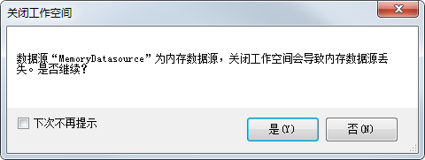

“ **选项** ”的“ **常用** ”选项卡提供了对常用设置进行更改的功能，包括启动设置和操作选项两部分内容。

### 启动设置

设置启动时是否显示启动画面。若要显示启动画面，选中该项即可。用户也可以自己选择其它图片作为启动画面。点击浏览按钮，选择要显示的启动图片即可。

用户下次启动应用程序时，即可看见启动画面更换后的效果。

若不勾选该复选框，则启动应用程序时不会显示启动画面。

### 操作选项

用户可以对以下的操作选项进行设置：

  * **自动新建窗口浏览数据集数据**

选中该项，表示用户双击某一数据集时，应用程序会自动新建一个窗口显示该数据。

不选中该项，用户双击该数据集时，应用程序会将该数据集显示在当前窗口中，而不会新建一个窗口显示。

设置更改完成后，点击“确定”按钮。用户下次操作时，即可看到更改后的效果。

  * **自动关闭没有图层的地图窗口**

选中该项，表示应用程序会自动关闭没有图层的地图窗口。如果用户对某一地图窗口进行操作，移除了所有图层，则该地图窗口马上会自动关闭。

不选中该项，表示应用程序不会自动关闭没有图层的地图窗口，没有图层的地图窗口将被保留。用户可以对该地图窗口继续进行操作

设置更改完成后，点击“确定”按钮。用户下次操作时，即可看到更改后的效果。

  * **窗口关闭时提示保存**

选中该项，表示应用程序在关闭窗口时会弹出提示保存的对话框。待用户处理好保存工作后，才会关闭该窗口。

不选中该项，表示应用程序在关闭窗口时不会提示用户保存该窗口的修改内容，直接关闭该窗口。

设置更改完成后，点击“确定”按钮。用户下次关闭窗口时，即可看到更改后的效果。

  * **工作空间关闭时提示保存**

选中该项，表示关闭当前修改的工作空间时，会弹出对话框提示用户保存修改内容。待修改内容保存完成后，才会关闭该工作空间。

不选中该项，表示关闭当前修改的工作空间时，不会弹出对话框提示用户保存修改内容，直接关闭工作空间。

设置更改完成后，点击“确定”按钮。用户下次关闭工作空间时，即可看到更改后的效果。

  * **工作空间关闭时提示有内存数据源**

选中该项，如果当前工作空间中存在内存数据源，会弹出如下图所示的对话框，提示用户是否继续关闭工作空间。

不选中该项，则直接关闭工作空间。

设置更改完成后，点击“确定”按钮。用户下次关闭工作空间时，即可看到更改后的效果。

  
---  
图：关闭包含内存数据源的工作空间提示信息  
  * **有输出提示时自动弹出输出窗口**

选中该项，表示在输出窗口关闭时，有输出提示时，操作结果需要在屏幕显示，比如距离或者面积的量算结果，则应用程序会自动弹出输出窗口。

不选中该项，表示输出窗口关闭时，在有输出提示时，应用程序不会自动弹出输出窗口。这样用户可能看不到输出提示结果，因此建议该项使用默认值，即设置为有输出提示时自动弹出输出窗口。

设置更改完成后，点击“确定”按钮。用户下次进行有输出提示的操作时，即可看到更改后的效果。

  * **开启用户体验计划**

选中该项，表示用户的计算机会在联网的情况下，自动向
SuperMap发送用户使用产品的相关信息，包括桌面平台功能执行情况、产品版本等信息，不会收集用户在SuperMap桌面GIS平台所操作的数据和成果。这些反馈信息将帮助桌面研发团队迅速了解您遇到的问题并改善客户最常用的功能。

不选中该项，表示用户在使用SuperMap桌面GIS时的执行情况、产品版本等信息，计算机不会自动向 SuperMap发送。

  * **开启检查更新**

选中该项，表示用户计算机在联网的情况下，会自动检测是否有新的版本，如果检测到新版本，在产品的右下角会弹出升级提示信息。

不选中该项，则桌面产品不会自动检查更新，有新版本时，用户需手动下载更新。

  * **显示导航条**

显示导航条复选框用来控制地图窗口是否显示导航条。

选中该项，表示打开地图数据时，窗口中会自动显示导航条。导航条包括位于上方的圆盘和位于下方的滑块两部分。其中，圆盘控制地图的平移方式，包括向上平移、向下平移、向左平移和向右平移四种；滑块控制地图的分辨率大小，拖动滑块即可实现地图的放大与缩小操作。

不选中该项，表示地图数据窗口不显示导航条，需在此处勾选“显示导航条”复选框，窗口中才会出现导航条。

  * **新建场景自动加载框架数据**

应用程序提供的框架数据是一个包括全球的 KML 数据、全球地形数据、全球影像数据的三维场景模板。

选中该项，表示新建三维场景时，应用程序会自动加载框架数据。在新建的三维场景中，用户不用加载任何数据就可以浏览全球的三维场景。也可以在这个框架数据的基础上增加新的三维数据。

不选中该项，表示新建三维场景时，应用程序不会自动加载框架数据。新建的三维场景是一个只有全球影像的三维场景，需要载入其它数据才能进行下一步操作。

设置更改完成后，点击“确定”按钮。用户新建一个三维场景操作时，即可看到更改后的效果。

  * **显示工具提示**

显示工具提示用来在屏幕显示工具栏的提示信息。

选中该项，表示用户鼠标指向某个按钮时，会在屏幕显示该按钮的提示信息。如不想显示提示信息，单击取消选择即可。

  * **起始页显示特性**

选中该项，则用户在打开桌面时，会在起始页中看到版本新特性的推送。如不想显示特性信息，则可不选中该项。

### 相关链接

 [保存](AutoSave.html)

 [环境](Environment.htm)

