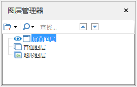
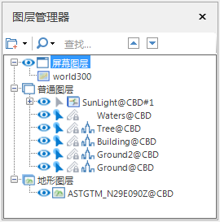

当前活动的窗口为场景窗口时，图层管理器用来管理场景窗口中场景的所有图层，图层管理器中将场景中的图层可以分为三大类来管理：屏幕图层、普通图层（三维图层）和地形图层。

### 场景中的图层介绍

  1. **屏幕图层**

屏幕图层是一个特殊的图层，屏幕图层中用来放置一些图片对象，并且屏幕图层中的对象并不是依据对象的坐标信息将其放到场景中的地球上，
而是根据指定的屏幕坐标放置在屏幕上（场景窗口表面）的某个位置，因此，屏幕图层上的对象不随场景中球体的旋转、倾斜、放大、缩小等操作而变化，
屏幕图层上的对象是相对于场景窗口静止的，这样，可以通过屏幕图层，放置诸如 Logo、说明性的文字等需要静止显示在场景窗口中的内容。

一个场景只包含一个屏幕图层，屏幕图层中可以添加多个图片对象。

  2. **地形图层**

向场景中添加的地形数据都作为地形图层来管理，添加到场景中作为地形图层的地形数据为地形缓存文件数据，即*.SCT 格式的文件。

  3. **普通图层（三维图层）**

普通图层，也可以称为三维图层，二维世界中的数据（矢量数据集、栅格数据集、影像数据集）、影像缓存数据、模型数据、KML/KMZ
数据添加到场景中，都将作为三维图层来管理。

为了在后续描述中清楚地区分各种数据所对应的三维图层，即三维图层具体是对应那种数据，下面进行简单的称谓上的约定，从而具体化三维图层的含义：

    * 数据集类型的三维图层：将二维世界中的数据集添加到场景后所产生的三维图层，这里统称为数据集类型的三维图层。
    * 矢量图层：将二维世界中的矢量数据集添加到场景后所产生的三维图层，这里统称为矢量图层。按照矢量数据集的类型，相应地有点图层、线图层、面图层等。
    * 影像图层：将二维世界中的影像数据集添加到场景后所产生的三维图层，这里统称为影像图层。
    * 栅格图层：将二维世界中的栅格数据集添加到场景后所产生的三维图层，这里统称为栅格图层。
    * 模型缓存图层：将模型缓存文件（*.scv）加载到场景后所对应的三维图层，这里称为模型缓存图层。
    * 影像缓存图层：将影像数据，即影像缓存文件 （*.SCI3D 或 *.SIT）加载到场景后所对应的三维图层，这里称为影像缓存图层。
    * KML 图层：将 KML 数据，即 *.KML 或 *.KMZ 格式的文件加载到场景后所对应的三维图层，这里称为 KML 图层。

### 图层管理器内容介绍

当打开一个新的场景窗口时且场景窗口中的场景中未叠加任何数据，此时，图层管理器中的显示状态如下图所示，只有三个并列的根结点，分别是：屏幕图层结点、普通图层结点、和地形图层结点。图层管理器将添加到场景中数据所对应的图层分成这三大类来管理，每一类图层将显示在相应的根结点的下一级，并且每个图层对应一个根结点的子结点。有关添加到场景中的数据具体对应哪一类图层，上文已经进行了详细地介绍，请参见。

  
---  
图：一个新的场景（未添加数据）对应的图层管理器状态  
  
下图为向场景中添加了各类数据后，图层管理器中的显示状态。

  * 屏幕图层根结点下显示的每一个子结点，对应添加到场景中的屏幕图层上的每一个图片对象。
  * 普通图层根结点下显示的每一个子结点，对应添加到场景中的每一个三维图层。
  * 地形图层根结点下显示的每一个子结点，对应添加到场景中的每一个地形图层。

  
---  
图：添加了各种数据后的场景所对应的图层管理器状态  
  
图层管理器提供了丰富的右键菜单功能，每一级结点都有右键菜单，方便用户处理与该结点内容相关的功能操作。

