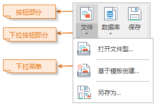
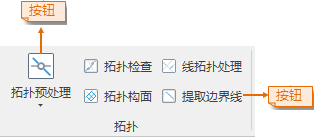
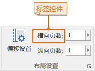
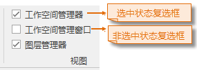
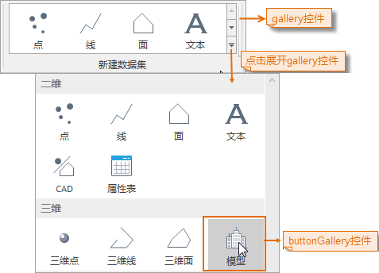

功能区上所承载的各类控件为 Ribbon 控件，Ribbon 风格界面的功能区上只能放置 Ribbon 控件，并且 Ribbon
控件只能放置在功能区上，下面详细介绍应用程序中所使用的所有 Ribbon 控件。

### 下拉按钮控件（ButtonDropDown）

如下图所示为一个下拉按钮控件，下拉按钮分为两个部分：一是按钮部分，点击该部分可以直接执行相应的功能，二是下拉按钮部分，点击该部分将弹出下拉菜单，通过选择下拉菜单中的项
来进一步实现相应的功能。下拉按钮的按钮部分显示下拉按钮的图标，下拉按钮的下拉按钮部分显示了下拉按钮的显示名称。

  

  
### 按钮控件（Button）

如下图所示为应用程序中的按钮控件，按钮上的显示内容分为两个部分，按钮上的图片为按钮的显示图标，而按钮上的文字内容为
按钮的显示名称。通过点击按钮即可实现与该按钮绑定的功能。

  

  
### 文本框控件（TextBox）

如下图所示为文本框控件，文本框分为可编辑的文本框和不可编辑的文本框，可编辑的文本框允许用户在其中输入内容，用来与应用程序进行交互，而不可编辑的文本框主要用来显示相关信息。

  

### 标签控件（Label）

如下图所示为标签控件，标签控件主要用来显示界面上的说明和描述信息。

  

  
### 复选框控件（CheckBox）

如下图所示为复选框控件，复选框控件上的文字内容为复选框控件的显示名称，用户通过选中和不选中复选框控件来与应用程序进行交互，应用程序通过判断复选框是否被选中来进行相应的操作的处理。

  

### ButtonGallery 控件（ButtonGallery）

ButtonGallery 控件只能放置在功能区中名为 Gallery
的容器控件中，如下图所示，ButtonGallery控件上的显示内容分为两个部分，控件上的图片为显示图标，而控件上的文字内容为控件的显示名称。ButtonGallery
控件类似于按钮控件，通过点击 ButtonGallery 控件即可实现与该控件绑定的功能。

  
 
  
### 组合框控件（ComboBox）

如下图所示为一个组合框控件，组合框控件由一个文本框和一个下拉列表组成，下拉列表中包含一系列子项，通常情况下，用户可以在文本框部分输入内容，也可以在下拉列表中选择某个项，应用程序会根据组合框中文本框里显示的内容来处理相应的操作。（图中下拉列表中黄色高亮显示的项为鼠标移动到该项上面时的状态）

  

### 颜色按钮控件（ColorButton）

如下图所示为颜色按钮控件，颜色按钮上显示的颜色为颜色按钮当前的颜色，即用户选择的颜色，点击颜色按钮右侧下拉按钮可以弹出颜色面板，用户可以从中选择需要的颜色，如果颜色列表中的颜色块不足以满足用户的需要，可以点击颜色面板最下方的“颜色库”按钮，通过弹出的颜色对话框可获得更多的颜色，用户选择颜色后，颜色按钮当前的颜色会变化为用户选择的颜色，应用程序获取的颜色按钮的颜色即为颜色按钮当前的颜色。

  

  
### 数字显示框控件（IntegerUpDown）

如下图所示为一个数字显示框控件，数字显示框控件有两种显示风格：水平风格和垂直风格。水平风格的数字显示框控件，用户既可以在数字显示框中输入数值，也可以点击数字显示框右侧的箭头，使用弹出的滑块来调整数值；垂直风格的数字显示框控件，用户既可以在数字显示框中输入数值，也可以点击数字显示框中的微调按钮，来调整数值。

用户通过调整和输入数字显示框中的数值实现与程序的交互操作，当数字显示框中的数值发生变化后，将执行相应的操作。

  
