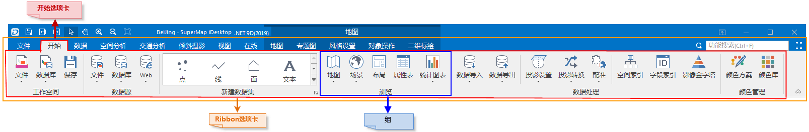

应用程序界面风格采用 Ribbon 模式，即 Microsoft Office 2016
风格的界面，这种界面风格取代了利用菜单和工具条组织各个功能项和命令的传统模式， 而是将各种具有一定功能的 Ribbon 控件放置在 Ribbon
功能区上，直观地呈现在用户面前，便于功能的使用与查找。

为了便于后续描述各个功能和命令所在的位置，下面简单介绍这种 Ribbon 风格界面对于功能和命令的组织形式。

在 Ribbon 风格界面中，各个功能和命令都相应的与一个 Ribbon 控件进行绑定，Ribbon
控件是指能够放置在功能区上的控件，例如按钮、下拉按钮、文本框、 复选框等等。Ribbon
功能区则是承载这些控件的区域，如下图，红色矩形框所示的区域即为应用程序的功能区，所有控 件都组织在这个区域。

为了便于功能的分类，Ribbon 功能区还提供了其他组织形式，包括选项卡和组。Ribbon
功能区的每一个选项卡围绕功能针对的特定对象或方案来组织控件，选项卡中的组又将控件进行细化，将功能类似的控件放置到一个组中。

  
---  
图：功能区组织结构  
  
 **图示说明：**

  * 图中橘黄色矩形框所示的区域为功能区（Ribbon），所有的功能和命令都组织在这个区域。
  * 图中红色线框所示的区域为一个当前选中的选项卡页，即“开始”选项卡，功能区此时所显示的绑定一定功能的控件即为组织在该选项卡中的控件。
  * 功能区最顶部所显示的名称，如“开始”、“数据”、“视图”等，为相应的选项卡的名称，通过点击选项卡的名称，即可进入相应的选项卡页。
  * 图中右侧蓝色矩形框所示的组织为组，组的最底部所显示的名称为该组的名称，组的名称同时体现了包含在该组中的控件所绑定的功能，例如“数据源”组所包含的功能 为与数据源有关操作相关的功能。
  * 有些组会绑定对话框，当某个组绑定了对话框时，该组的最右下角会出现一个特殊的小按钮，称为弹出组对话框按钮，如图中的“工作空间”组的最右下角按钮，点击 该按钮会弹出对话框，用以辅助相关功能的设置。

