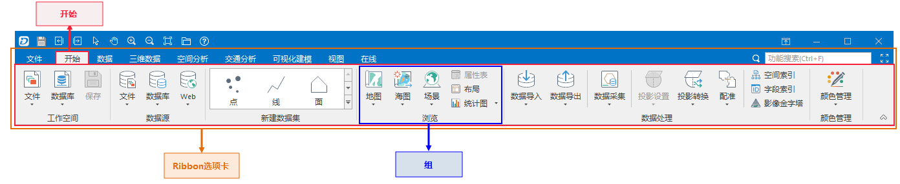

启动后，将显示如下图所示的主窗口界面。本产品的界面采用 Microsoft Office 2016 的风格界面，即 Ribbon 风格界面，这种界面风格取代了利用菜单和工具条组织各个功能项和命令的传统模式。

应用程序的主窗口界面主要包括以下几部分：

  * “文件”按钮：“文件”按钮位于应用程序主窗口的最左端，点击“文件”按钮将弹出文件菜单，文件菜单中组织了一些常用的功能，主要是针对工作环境（工作空间）和主程序的管理，文件菜单中还包括了最近打开的数据源和工作空间列表，方便数据的打开和使用。
  * 功能区（Ribbon）：功能区是 Ribbon 风格界面的核心体现，功能区承载了具有一定功能的控件，如按钮、文本框、复选框、下拉按钮、颜色按钮等，这种功能组织方式更为直观、清晰，便于用户对功能的查找和使用。
  * 快捷访问栏：界面左上角组织了用户常用的功能按钮，包含保存、常用的地图浏览工具，快速打开应用程序的本地目录及打开桌面帮助文档等操作按钮。快捷打开桌面所在路径，方便用户快速定位桌面辅助资源所在位置，比如示范数据、示例代码、帮助文档等。
  * 工作空间管理器：工作空间管理器是一个浮动窗口，它提供了一个可视化管理工作空间的场所，工作空间管理器按照工作空间本身的数据组织结构来管理应用程序中的工作空间，包括工作空间中的数据，即采用了树状管理层次。
  * 图层管理器：图层管理器是一个浮动窗口，用来管理地图窗口中的图层和场景窗口中的图层。
  * 输出窗口：输出窗口是一个浮动窗口，用来显示应用程序在执行过程中以及用户在执行功能操作过程中所输出的相关信息。
  * 工作区域：工作区域用来显示应用程序的子窗口（地图窗口、布局窗口、场景窗口、属性表窗口等）和其他浮动窗口等的区域。
  * 地图窗口状态栏：地图窗口状态栏是地图视图底部的状态栏，用来显示地图实时缩放的比例尺、坐标值（X、Y值和经纬度值）、当前地图的坐标系名称以及地图窗口的中心点坐标。比例尺、坐标值、坐标系名称以及中心点均支持复制、粘贴的编辑操作。

### 功能区介绍

功能区（Ribbon）取代了利用菜单和工具条组织各个功能项和命令的传统模式，其优势在于：

  * 功能分布更清晰、直观：通过选项卡（tab 页）和组（group 组）的组织结构，对功能控件进行层次化组织管理；
  * 操作更方便：大部分的功能控件都摆在用户眼前，用户不必再通过点击层层菜单来寻找某个功能或命令，只需激活功能所在的“选项卡”，即可直接操作相应的功能，提高工作效率。

  
  
  * 图中橘黄色矩形框所示的区域为功能区，即功能控件放置的区域。功能区所放置的各个控件统称为 Ribbon 控件，功能区上只能放置 Ribbon 控件。
  * 功能区最顶部所显示的名称，如“开始”、“数据”、“视图”等，为相应的选项卡的名称，通过点击选项卡的名称，即可进入相应的选项卡页，上图所示的“开始”选项卡为当前被选中的选项卡，此时，功能区上所呈现的控件为组织在“开始”选项卡中的功能控件。 
  * 图中右侧橘黄色矩形框所示的组织为组（group 组），组的最底部所显示的名称为该组的名称，组的名称同时体现了包含在该组中的控件所绑定的功能，例如“数据源”组所包含的功能为与数据源有关操作相关的功能。
  * 有些组（group 组）会绑定对话框，当某个组绑定了对话框时，该组的最右下角会出现一个特殊的小按钮， 称为弹出组对话框按钮，如图中的“工作空间”组的最右下角按钮，点击该按钮会弹出对话框，用以辅助相关功能的设置。

在后续的描述以及其他文档的描述中，在说明功能控件的位置时，都以类似于功能区“开始”选项卡的“工作空间” 组中，“打开”下拉按钮的方式来描述。

应用程序的用户界面主要由以下几部分构成：

 [文件按钮及文件菜单](../StartMenu/StartMenu)

 [Ribbon 功能区](RibbonIntroduct)

 [上下文选项卡](ContextTabsIntroduct)

 [Ribbon 控件](RibbonControlsIntroduct)

 [应用程序中的子窗口](ChildWindows)

 [浮动窗口](FloatWindows)

 [工作空间管理器](WorkspaceManager)

 [图层管理器](LayerManagerIntroduct)

 [输出窗口](OutputWindows)

 [流程管理窗口介绍](proceduremanage)

