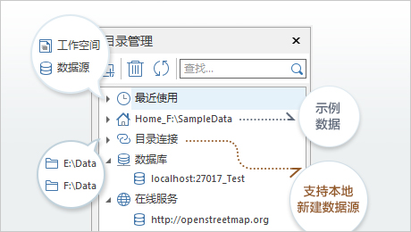
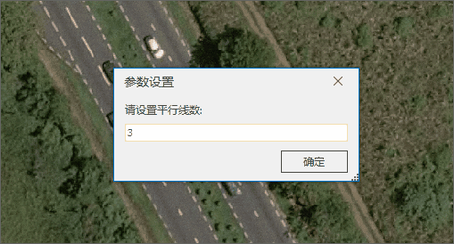
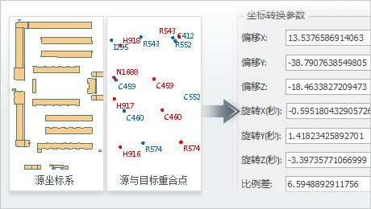
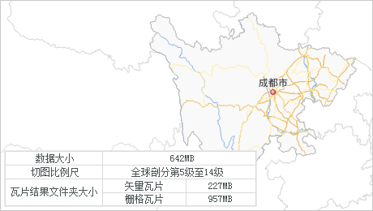
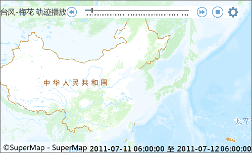
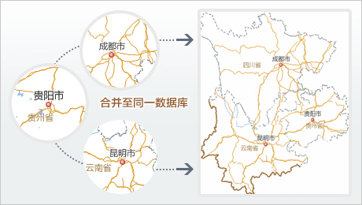

SuperMap iDesktop .NET 9D(2019) 桌面产品在上一版本基础上，新增并优化数据管理、数据处理、地图制图、交通分析、统计图表、属性操作、三维等模块的相关功能。其中，数据管理模块新增本地目录管理，支持
PostGIS 数据库引擎、DM(达梦)数据库引擎和 UDBX
文件引擎，并优化坐标系管理等功能；数据处理模块中，新增转换模型参数计算、计算面积、按面积分割等功能，并优化了对象编辑、数据配准、SQL
查询等相关功能；地图制图模块中，新增 MongoDB
瓦片管理、地图查找与定位功能，支持以所见即所得的方式在浮动面板上设置点、线、面以及CAD对象风格，同时支持生成矢量瓦片并发布为 iServer
服务等功能；交通分析模块中，新增公交换乘分析、查询路线、查询站点功能；属性操作模块中，新增属性表刷新功能，并优化属性表定位及更新列等功能；并对空间分析、网络分析、统计图表等模块进行了功能优化；同时，应用程序的稳定性和易用性得到了进一步的提升。

**SuperMap iDesktop .NET 9D(2019) 包含以下新增功能和优化之处：**

**数据管理**

  * 优化坐标系管理功能，在坐标系信息中增加了 EPSG Code，可通过[ EPSG Code 搜索和新建坐标系。](../Features/DataProcessing/Projection/NewGEPSGCoordSys.htm)
  * 新增支持 PostGIS 数据库引擎、[DM(达梦)数据库引擎](../Features/DataProcessing/DataManagement/EngineType.htm)和 UDBX 文件引擎，且 PostGIS 数据引擎中的矢量数据集支持简化显示，减少了数据传输时间和地图渲染绘制时间。
  * 支持[保存和打开 PostGIS 工作空间](../Features/DataProcessing/DataManagement/OpenWorkspace.htm)。 
  * [工作空间属性](../Features/DataProcessing/DataManagement/WS_Property.htm)支持显示统计信息，可统计当前工作空间中数据源、地图、布局、场景的个数。
  * 支持以快捷键 Ctrl+C 和 Ctrl+V 的方式，对[数据集进行复制、粘贴](../Features/DataProcessing/DataManagement/CopyDataset.htm)，使数据源之间数据集的迁移更便捷简单。
  * 支持[ ArcGIS 个人地理数据库](../Features/DataProcessing/DataConversion/GeoFormates.htm#6)格式数据导入，即 *.mdb 格式文件。
  * 优化[导入 GJB 数据](../Features/DataProcessing/DataConversion/ImportGJB.htm)功能，支持自动识别子文件夹数据并默认以追加方式导入数据。
  * 新增[本地目录管理](../Features/DataProcessing/DataManagement/CatalogManagement.htm)，便于用户快速定位和使用常用目录中的数据。 
    * 支持管理最近使用的工作空间和数据源历史记录。
    * 支持关联和移除本地目录。
    * 支持选中连接文件夹新建 UDB 数据源。
    * 支持打开数据库型数据源，并保留历史记录。
    * 支持打开 Web 型数据源，并保留历史记录。
    * 支持过滤显示目标文件夹中 iDesktop 支持的文件类型，可快速直接打开浏览数据文件或导入到当前工作空间数据源中。
  

图：本地目录管理

  * 优化[创建影像金字塔功能](../Features/DataProcessing/DataManagement/DTr_CreatePyromid.htm)，对栅格数据集批量创建金字塔时支持临近值的计算方式。
  * 支持 [UDB 数据源(*.udb)与 UDBX 数据源(*.udbx) 相互转换](../Features/DataProcessing/DataManagement/UDBUpdate.htm)。

**数据处理**

* 新增支持导入[ GDAL Virtual 数据(*.vrt)和 OpenStreetMap 数据(*.osm)](../Features/DataProcessing/DataConversion/GeoFormates.htm)。
* 优化[ SQL 查询](../Features/Query/SQLQueryDia.htm)，可保留上一次的查询记录，用户可在历史查询条件的基础上，继续修改查询条件，进行多次查询，同时支持输入排序字段。
* 优化[平行线绘制](../Features/DataProcessing/Objects/CreateObjects/DrawParalleLlines.htm)功能，支持动态调整绘制宽度以及步长，便于用户在绘制过程中随时调整平行线宽度。
* 新增支持[多平行线绘制](../Features/DataProcessing/Objects/CreateObjects/DrawParalleLlines.htm#6)功能，支持设置待绘制平行线数目、各平行线的宽度等，满足不同应用场景下绘制平行线的需求。
|   
  

* 支持将一个或者多个矢量数据集，[导出为中国标准矢量交换格式(VCT 3.0)数据文件](../Features/DataProcessing/DataConversion/ExportVCT.htm)。
* 优化[编辑节点自动协调](../Features/DataProcessing/Objects/EditObjects/VertexEdit.htm)功能，对相邻两个线或面对象的节点进行调整时，会同时对两个对象生效，并且始终保持拓扑关系。
* 绘制线对象时，支持[反向绘制](../Features/Layout/DrawingObjects/Line.htm#1)功能，可随时调整绘制方向，提高较长线对象的绘制效率。
* 在对象编辑中，优化[对象缩放算法](../Features/DataProcessing/Objects/EditObjects/offset.htm)，提高缩放结果的正确性和合理性。
* 优化[绘制设置](../Features/DataProcessing/Objects/CreateObjects/DrawingSetting.htm)，支持设置批量编辑最大记录数。
* [属性刷](../Features/DataProcessing/Objects/EditObjects/PropertyBrush.htm#1)新增支持根据数据集保留字段设置历史，减少用户使用属性刷时频繁设置字段。
* 支持将[网络数据集转为线数据](../Features/DataProcessing/ConvertDataType/ConvertNetworkEdge.htm)后，保留系统字段 SmFNode、SmTNode、SmEdgeID。
* 优化[复制数据集功能](../Features/DataProcessing/DataManagement/CopyDataset.htm)，支持复制数据时保持 SmID 不变。
* 新增[批量追加行功能](../Features/DataProcessing/Vector/BatchAddRows.htm)，支持将源数据源中的多个数据集记录（行）追加到目标数据源对应的数据集中，方便用户快速整合不同区域的数据。
* 优化[数据配准](../Features/DataProcessing/Registration/Registration.htm)操作方式，支持添加地图作为配准和参考图层数据，并支持添加多个数据集到配准图层中进行批量配准，同时支持设置配准和参考图层的图层风格，使配准操作更高效易用。
* 新增[计算点集的凹多边形功能](../Features/DataProcessing/Vector/CalculateConcaveHull.htm)，通过指定凹多边形最小内角角度，计算指定点集合或点数据集的凹多边形。
* 新增[计算面积功能](../Features/DataProcessing/Vector/CalculateArea.htm)，可对指定的面对象或矢量面数据集计算面积，若为经纬度数据，则计算面对象的投影面积，同时支持平方米、平方千米、亩、公顷等十余种单位的面积换算。
* 新增[按面积分割功能](../Features/DataProcessing/Objects/EditObjects/CutByArea.htm)，通过指定分割方向将被分割面对象按面积以指定块数分割或等比例分割。
* [属性更新](../Features/DataProcessing/Vector/Attributeupdate.htm)功能中，支持跨字段类型存储更新结果，减少用户对更新结果的二次处理。
* 新增[转换模型参数计算功能](../Features/DataProcessing/Projection/Coordinatetransformation.htm)，可通过已知重合点，计算七参数的参数值，用户可利用该参数值进行数据成果坐标系的转换。
   

* [数据集投影转换](../Features/DataProcessing/Projection/ConvertPrjCoordSysSingle.htm)中，新增支持3种投影转换方法：三维七参数转换(China_3D_7P)、二维七参数转换(China_2D_7P)、二维四参数转换(China_2D_4P)。
* 新增遥感测绘插件(PIEOrtho)，通过该插件可以快速批量化地完成卫星影像生产流程中的连接点/控制点自动提取，平差解算，DEM、DSM、DOM 生成以及质量检查与几何精纠正等处理，实现海量遥感数据的一键式全自动化批量处理。

**地图制图**

* 在制作单值、范围分段专题图时，支持将[修改后的颜色方案保存至颜色方案管理库](../Features/Mapping/UniqueValueMap/PropertiesDia.htm#1)中，便于在其他配图工作中再次使用。
* 图层管理器工具栏中，支持设置[图层节点是否可拖拽](../Features/Visualization/LayerManagement/LayerControl.htm)，用户可固定图层管理器中图层顺序，防止图层过多时拖拽导致的误操作。
* 新增[地图查找与定位功能](../Features/Visualization/MapSetting/MapSearch.htm)，支持查找某个特定属性值分布在当前地图的哪些图层中，并实现快速定位。
* 优化[图层风格的设置方式](../Features/Visualization/LayerStyle/LayerStyleTab.htm)，在风格面板上以所见即所得的方式设置点、线、面风格，及时预览图层风格效果，提高配图效率。
* 优化多对象拆分裁剪功能，[支持将多个对象分别裁剪的结果保存至同一个数据集中](../Features/DataProcessing/ClippingMap/RecanlgeClip.htm#1)。
* 优化[图层对象显示顺序](../Features/Visualization/VisualSetting/Vectorgroup.htm#1)，支持设置多字段显示排序，同时地图及工作空间会记录保存设置的显示顺序，避免用户重复设置提升了配图效率。
* 支持单任务和多任务方式将矢量地图生成 MapBox MVT 规范的[矢量瓦片](../Features/MapTiles/VectorTiles.htm)，矢量瓦片体积小，可高度压缩，占用的存储空间小，便于发送到 Web 平台和移动端。
|   

* 优化[矢量瓦片的本地预览方式](../Features/MapTiles/VectorTiles.htm#4)，支持以打开文件型数据源的方式打开 sci 文件，直接在应用程序中查看矢量瓦片。
* 支持[单独生成矢量瓦片风格](../Features/MapTiles/VectorTiles.htm#5)，用户可通过只修改瓦片的风格来改变矢量瓦片地图的显示效果，无需重新创建矢量瓦片。
* 优化[地图瓦片](../Features/MapTiles/MapTiles.htm)生成步骤，采用向导式操作，更易于用户理解和使用。
* 支持将[地图输出为 PDF 文件](../Features/Visualization/Basic/WinMap_OutputPic.htm)。
* 新增[创建平面立体地图功能](../Features/Visualization/MapSetting/3DBuilding.htm)，通过设置字段拉伸高度，生成建筑物顶面数据和侧面数据，使得在二维空间中呈现出立体效果的地图。
* 新增[时态数据功能](../Features/Visualization/TemporalData/LayerPlay.htm)，将地图中的时态数据按照某种时间序列在地图中播放显示，可以方便查看数据随时间推移而呈现出的模式或变化趋势。
   
     

* 新增[ MongoDB 瓦片管理功能](../Features/MapTiles/MongoDBTilesManger.htm)
  * 通过可视化界面，查看不同瓦片数据的比例尺、坐标系、瓦片类型、瓦片范围等瓦片信息。
  * 支持将多个不同 MongoDB 数据库中的瓦片数据合并至已有版本的瓦片数据中，或合并至新的 MongoDB 数据库中。以合并的方式整合不同数据，避免了用户重复切图，提升了工作效率。 
  * 当选择合并的瓦片图片类型为 PNG 且背景透明时，支持将不同的版本相同区域进行融合处理。高效处理了数据合并接边的问题。
  
     

* 优化[多版本瓦片播放](../Features/MapTiles/AddMongoDBTiles.htm#1)，支持设置参与播放的版本，并设置播放顺序。
* 支持将[地图瓦片发布为 iServer 服务](../Features/MapTiles/PublishTiles.htm)，可将矢量瓦片和栅格瓦片发布为 iServer 服务，支持在桌面及 iServer 端进行加载、浏览，便于资源共享。
* 在栅格数据集图层属性中，增加[坡度图和坡向图两类栅格函数的渲染设置](../Features/Visualization/VisualSetting/Rastergroup.htm)，可快速预览栅格图层的不同显示效果。
* 在统计专题图设置中[支持全局最大值](../Features/Mapping/GraphMap/AdvancedDia.htm)的制图设置，用来控制专题图中统计图符号按照全局或分区统计显示。
* 优化影像图层属性设置，支持直方图匹配拉伸方式增强影像显示效果，同时支持导入/导出直方图文件来定义直方图。

**交通分析**

* 新增[公交换乘分析功能](../Features/Network/TrafficAnalysis/TransferAnalysis.htm)，通过高效、准确和灵活的查找算法，为用户提供最优的公交换乘方案。
* 新增[查询路线功能](../Features/Network/TrafficAnalysis/FindLinesByStop.htm)，可查询经过指定站点的线路。
* 新增[查询站点功能](../Features/Network/TrafficAnalysis/FindStopsByLineStop.htm)，通过指定具体线路查询该条线路上的所有站点，获得站点的详细信息。

**空间分析**

* 支持对镶嵌数据集进行[栅格查询](../Features/Analyst/Raster/SurfaceAnalyst/FindRasterVaule.htm)。

**网络分析**

* 优化[路网编译功能](../Features/Network/NavigationAnalysis/CompileNavigationData.htm)，支持将不同数据源下的多个不同区域的数据分层编译并合并打包为一份数据，方便用户可以在不进行区域数据合并处理的情况下直接编译生成整体路网数据。

**统计图表**

* 优化和简化了[统计图表参数界面](../Features/DataMining/Diagrams/CreateDiagram.htm)，使制作图表操作更简洁易用。

**布局**

* 优化[根据布局模板创建布局的操作方式](../Features/Layout/Basic/Layouts_New.htm)： 
  * 支持预览和检索布局模板，并支持指定地图对象快速制作布局。
  * 优化对[布局模板的管理](../Features/Layout/Template/LayoutTemplate.htm)，包括编辑已有布局模板，导入/导出模板，以及对模板进行分组管理、修改布局模板信息等操作。
  * [新增多种不同类型的布局模板](../Features/Layout/Template/LayoutTemplate.htm)，可基于模板新建布局，以满足用户在不同场景下的需求。
* 优化[布局对象风格的设置](../Features/Layout/SettingStyle/SettingStyle.htm)方式，在风格面板上以所见即所得的方式设置点、线、面等对象风格，及时预览对象风格，提高制作布局的效率。
* 支持对[地图布局中心点进行复制和粘贴](../Features/Layout/DrawingMapElements/Map.htm#1)。
* 布局属性中，新增[支持设置文本反走样、线型反走样](../Features/Layout/SettiongLayoutWin/LayoutText.htm)，提升布局对象的显示效果。
* 布局操作中，新增[支持设置捕捉功能](../Features/Layout/DrawingObjects/DrawingObjects.htm)，提高了编辑的精度和效率。
* 支持将[布局输出为 PDF 文件](../Features/Layout/Export/ExportAsPicbutton.htm)。

**属性操作**

* 新增[属性表刷新功能](../Features/DataProcessing/EditTabular/Editgroup.htm)，刷新后可查看属性表最新的内容。
* 新增[显示十六进制值](../Features/DataProcessing/EditTabular/DisplayHexadecimal.htm)功能，使属性表中选中的整型列显示为十六进制，可帮助用户在编辑颜色值时直接输入十六进制颜色值。
* 优化[属性表定位](../Features/DataProcessing/EditTabular/GoToButton.htm)，将对话框修改为非模态窗口，便于用户在属性表中直接选中行来设置定位的参数。
* 优化[更新列功能](../Features/DataProcessing/EditTabular/UpdateButton.htm)，支持将文本字段类型更新为日期型字段。
* 优化[属性表筛选性能](../Features/DataProcessing/EditTabular/FilterButton.htm)，减少数据量比较大时用户的等待时间。

**在线分享**

* 优化个人中心上传数据的相关操作，使操作更易用。

**三维**

* **对象操作**
  * 新增“三维缓冲区”功能，支持三维点、线、面、体构建缓冲为三维面或三维体对象。
  * 新增模型数据集操作功能，包括模型裁剪、镶嵌、挖洞。
  * 新增“模型Z坐标归零”功能，支持模型相对坐标Z归零和模型定位点坐标Z归零，坐标归零结果均不改变模型的绝对位置。
  * 优化模型数据集的旋转和平移，支持平面、球面数据。
  * 优化“模型合并”功能，支持子对象合并。
  * 新增“日照分析”，分析过程不依赖三维场景，可设置周边遮挡物所在的数据集，分析结果有两种：一是被分析建筑物表面的三维点集，日照率存在属性表中；二是输出模型数据集，日照率存在模型的W位上。
  * 优化倾斜摄影模型数据、TIN 地形裁剪、镶嵌、挖洞功能，支持操作结果实时预览，镶嵌功能新增护坡宽度参数设置。
  * 新增在倾斜摄影模型上“修建道路”功能，绘制或者导入三维道路面，设置护坡宽度等参数，开启预览，调整三维面，可实时看到修建后的效果。
  * 支持投影坐标系点数据集构建地质体。
* **三维分析**
  * 优化通视分析，支持返回障碍物模型ID，并在场景中高亮显示。
  * 优化可视域分析，支持返回障碍物模型ID，并在场景中高亮显示。
  * 优化天际线分析，返回影响天际线模型的ID，并在场景中高亮显示，支持设置分析半径。
  * 优化剖面分析，支持导出点数据集，用于统计分析；返回与剖面线相交的模型ID，并在场景中高亮显示。
  * 新增生成立面图功能，实现在三维场景中将指定场景中的对象生成立面图，支持生成对应的矢量面数据。
  * 新增在三维场景下的填挖方分析，绘制三维面计算对应的填挖方量。
  * 优化生成2.5维功能，实现在生成2.5维地图时同步生成对应的矢量面数据。
  * 新增开敞度分析，支持返回开敞区域和遮挡区域的三维体对象。
* **三维数据**
  * 新增模型数据集基于同名控制点进行坐标配准。
  * 新增模型数据集四参数坐标转换功能，支持地方坐标系转换到大地坐标系，设置四个转换参数（x偏移、y偏移、旋转角、缩放系数）和目标坐标系。
  * 优化数据集投影转换，提供是否转换模型所有顶点选项。
  * 优化体元栅格生成缓存，支持在同一个模型文件上叠加多个体元栅格，实现多业务表达。
  * 点云支持坐标转换，生成 List 文件可设置源坐标系、目标坐标系、坐标转换参数。
  * “三维数据”新增“构建 TIM”功能。
  * “体元栅格”新增 TIM 插值为体元栅格。
  * 体元栅格提供两种构建方式：一种通过多个栅格数据集构建，一种通过三维点数据集构建。
  * 新增提取三维数据，支持在地形（TIN）数据上获取高程信息，将二维点、线、面转换为三维点、线、面数据。
  * 优化模型打散功能，把模型对象中的每个“子对象”另存为模型对象。
* **数据处理**
  * 支持 SKP、DWG、Geo3DML 数据格式的导入。
  * 支持导出为 DAE 模型格式。
  * 新增三维插值功能，实现对三维线对象、三维面的边线插入点数据。
* **倾斜摄影**
  * 新增提取三维数据，支持在倾斜摄影模型上将二维点、线、面提取为三维点、线、面数据。
  * 倾斜摄影菜单新增 OSGB 转 DAE 格式转换功能。
  * 优化合并根节点，支持多线程处理，用户可自定义线程数。
  * 新增数据分享功能，支持将本地倾斜摄影数据上传至 iServer 端和 SuperMap Online。
  * 倾斜摄影模型数据生成配置文件过程中，支持坐标转换。
  * S3M格式的三维切片缓存数据，支持保存到 MongDB。
* **图层属性**
  * 新增线对象支持多种动态线型特效，面对象支持多种动态面填充特效。(点拉伸线也支持设置线型特效)
  * 支持对选中对象显示包围盒。
  * 模型数据集图层和三维切片缓存图层新增是否接收光照选项，实现对单个图层是否接收光照的设置。
  * 模型数据集图层，支持根据特征值分层设色。
  * 模型数据集图层，绘制模式新增“草图模式”。
  * 新增体元栅格数据集图层，支持设置分辨率，支持设置特征值范围过滤显示。
  * 线图层属性支持渲染模式(双面/顺时针/逆时针，主要针对线符号，比如道路)。
* **场景**
  * 优化生成场景缓存，提供重复贴图打组选项，提供生成三维瓦片是否生成法线选项，提供 TIN 地形瓦片压缩选项，支持镶嵌数据集生成sci3d影像瓦片。
  * 支持投影坐标系的 DEM 生成平面场景的 TIN 地形，支持选择球面/平面场景类型。
  * 新增平面裁剪功能。
  * 新增四边形裁剪功能，支持设置裁剪长度、宽度、高度，支持设置绕着 XYZ 三个方向旋转。
  * 优化立方盒子裁剪，支持Z轴方向旋转。
  * 三视口提供两种布局，水平三视口、左一右二两种布局。
  * 优化三维标签专题图制作，文字标签支持多种显示方式：屏幕对齐、贴地旋转、自由旋转。
  * 优化KML对象风格设置，支持替换模型的纹理，改变模型贴图，实时显示改变后的效果。
  * 优化多边形查询，支持查询点、线、面、三维点、三维线、三维面。
  * 新增场景滑块控件位置调整功能，支持自定义控件在场景屏幕中的位置（XY像素）。
  * 新增与Revit软件协同设计功能。

**示例数据**

* 新增地震系列专题地图。
* 新增台湾省气象专题地图。
* 新增湖南省旅游专题地图。
* 优化热力图和格网图。

**许可管理**

* 优化[许可模块划分](../Illumination/LicenseIntro2.htm)，拆分为基础版、标准版、专业版及高级版四种许可类型，级别能力依次增强，后一级别包含前一级别或前几级别中的功能。

**易用性**

* 支持[快捷打开桌面所在路径](../Features/UIIntroduct/UIIntroduct.htm#1)，方便用户快速定位桌面辅助资源所在位置，比如示范数据、示例代码、帮助文档等。
* 支持以操作系统[非管理员身份启动桌面](../Illumination/StartupWithNonAdmin.htm)，可兼容管理员和普通用户。
* 在[起始页](../GettingStarted/GettingStarted.htm)中新增了重点新特性的推送，使用户更直接、更便捷的了解产品新功能。
* 解决选择对象数过多时，对象属性面板卡顿问题，提升用户操作体验。
* 新增快捷编辑工具条，将绘制线对象、绘制面对象、对象编辑的常用操作放置在工具条中，便于用户在编辑过程中快捷的切换绘制方式。
* 优化[捕捉](../Features/DataProcessing/Objects/Snapping/Snapping.htm)设置方式，将捕捉设置放置在工具条和菜单栏中，使用户在作业过程中能动态设置捕捉项。
* 优化容限默认值，将容限默认值调整为1毫米。
* 优化屏幕上文本 DPI 显示百分比大于100%时，桌面界面的显示效果，提升用户体验。
