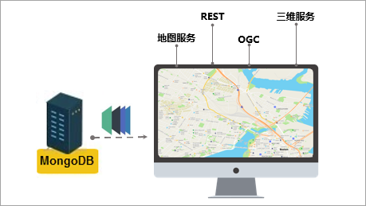

SuperMap iDesktop .NET 9D(2019) SP1 桌面产品在上一版本基础上，新增空间统计分析模块功能，并优化和丰富了数据管理、数据处理、地图制图、属性操作、三维等模块的相关功能。其中，数据管理模块新增适用于中国范围的投影坐标系，优化属性字段管理、Excel
文件导入等功能；数据处理模块中，新增统计栅格值，优化多对象压盖选择交互、转换模型参数计算及栅格分析环境设置等相关功能；地图制图模块中，新增一键发布
MongoDB 瓦片为 iServer
服务，支持对线面图层抽稀显示、在生成地图瓦片和添加数据集至地图中浏览时增加对空间索引的检查等功能；并对属性操作相关功能进行了优化；同时提供了空间统计分析功能，可分析和预测与空间或时空现象相关的统计值。

**SuperMap iDesktop .NET 9D(2019) SP1包含以下新增功能和优化之处：**

**数据管理**

  * 优化[打开数据库数据源](../Features/DataProcessing/DataManagement/OpenDatasource.htm#1)，支持自动保存连接过的数据库地址，用户后续登录时可选择历史记录实现快速登录。
  * 新增适用于中国范围的 Albers 预定义投影坐标系，适用于亚洲范围的 North_Lambert、South_Lambert 预定义投影坐标系。 
  * 优化[矢量数据集属性字段管理功能](../Features/DataProcessing/DataManagement/DTgroupDiaVector.htm#222)，支持修改字段名称、字段类型、缺省值及是否必填等参数，同时支持插入字段并调整字段顺序，用户可快速方便地根据实际需求调整字段结构。
  * 优化影像创建金字塔功能，支持添加本地影像文件来创建金字塔。
  * 优化[导入 Microsoft Excel (*.xlsx) 文件功能](../Features/DataProcessing/DataConversion/ImportExcel.htm)，具体优化如下： 
    * 支持导入时对数据进行预览。
    * 支持设置坐标字段，直接导入为空间数据，无需再对属性数据二次处理为空间数据。
    * 解决导入的数据空列太多时，造成的程序卡顿问题，提升用户操作体验。
  
    

**数据处理**

  * 投影转换方法中，新增[支持 PROJ4 转换方法](../Features/DataProcessing/Projection/PrjConvertMethods.htm)，该方法是基于PROJ4第三方投影转换工具，从而支持更多的投影转换操作，满足更多海外用户的数据投影转换需求，该投影转换方法只支持有对应EPSG Code的投影之间的转换。
  * 优化[栅格分析环境参数的设置方式](../Features/Analyst/Raster/AnalystEnvironment.htm)，支持在设置分析参数的同时设置环境参数，并可将其设置为全局栅格分析参数。
  * 优化[转换模型参数计算功能](../Features/DataProcessing/Projection/TransformationParaStep.htm)，支持地理坐标与投影坐标之间的转换参数，同时支持指定参与计算参数的重合点。
  * 优化符号化制图功能，提供数据采集入口进行向导式的符号化制图。引导用户根据指定的模板创建数据，并指定地图及其绘制关联的要素模板，实现高效、便捷的数据采集。
  * 优化[多对象压盖选择](../Features/Visualization/BrowseMap/Select.htm)的交互操作，当选择多个相互压盖的对象时，可通过右键的选择对象功能，查看选择对象的列表，在列表查看对象所属图层并确定编辑对象。
  * 优化[属性刷功能](../Features/DataProcessing/Objects/EditObjects/PropertyBrush.htm)，在使用属性刷操作时可自动捕捉对象，提高处理效率。
  * 支持[统计栅格数据集的栅格值](../Features/DataProcessing/DataManagement/StatisticGridValue.htm)，统计结果输出为属性表，便于用户查看栅格值的单值分布情况。
  * 优化矢量数据显示，支持设置过滤重叠小对象，在指定容限区域内对于小于设定尺寸的所有小对象只绘制一个对象。降低大量小对象在小比例尺显示耗时，以提升浏览性能。

**地图制图**

  * 新增[支持复制图层管理器中的图层分组](../Features/Visualization/LayerManagement/LayerGroup.htm)。
  * 优化[标签单值风格专题图设置](../Features/Mapping/LabelMap/UniqueLabelMapDia.htm)，支持通过设置字段来控制标签的旋转角度。
  * 优化[文本对象设置方式](../Features/Visualization/Interaction/TextPropertyDia.htm#222)，支持设置为左斜体。
  * 支持[对线、面图层进行抽稀显示](../Features/Visualization/VisualSetting/Vectorgroup.htm)，通过设置阈值将设定容限像素内的节点进行抽稀，以提高地图显示性能。 
  * 优化发布 iServer 服务相关功能： 
    * 新增[一键发布 MongoDB 瓦片为 iServer 服务](../Features/MapTiles/PublishMongoDBTile.htm)，支持的服务类型有：地图服务、REST服务、OGC 服务、三维服务及其他服务。
    * 优化[发布本地瓦片(原始与紧凑型瓦片)功能](../Features/MapTiles/PublishTiles.htm)，新增支持发布为 OGC 服务、ArcGIS REST 地图服务、Google REST 地图服务以及 Baidu REST 地图服务。
    * 优化[发布工作空间功能](../Features/Publish/PublishiserverProcess.htm)，新增支持发布为 WFS2.0.0 服务， ArcGIS REST 地图服务、Google REST 地图服务以及 Baidu REST 地图服务等其他服务类型。

  

  * 优化[地图输出为图片的交互操作](../Features/Visualization/Basic/WinMap_OutputPic.htm)，若地图输出为图片占用内存大于指定限额时（64位操作系统限额为1.6GB，32位操作系统限额为200M），会提示用户将地图输出为 PDF。
  * 支持[通过拖拽地图到已打开地图窗口的方式](../Features/Visualization/Basic/Map_Open.htm)，将多个地图方便快速地合并到同一个地图中。
  * 优化[统计专题图功能](../Features/Mapping/GraphMap/GraphMapGroup.htm)，将不同类型的统计图表类型以 Gallery 形式展现，方便用户更直观的选择。
  * 考虑到空间索引对矢量数据查询性能的影响，当数据对象数大于2000且无空间索引时将提示用户创建空间索引： 
    * 在[生成地图瓦片](../Features/MapTiles/MapTilesSingle.htm)前，新增对数据集索引的检查，以提升地图瓦片的生成速率。
    * 在[添加矢量数据集到地图时](../Features/Visualization/LayerManagement/AddData.htm)，检查数据集索引，以加快数据集量大时在地图中的显示速度。
  * [加载地图模板](../Features/Visualization/MapTemplate/Maps_LoadTemplate.htm)时，支持批量选择地图模板文件(*.xml)，方便快速地根据模板批量创建地图。

**空间统计分析**

  * 新增[空间统计分析功能](../Features/Analyst/SpatialStatisticalAnalysis/SpatialStatisticalAnalysisSummary.html)，分析和预测与空间或时空现象相关的统计值，包括度量地理分析、模型分析、聚类分布、空间关系建模。
  * 支持[度量地理分析功能](../Features/Analyst/SpatialStatisticalAnalysis/MeasureGeographicDistributions.html)，提供了中心要素、平均中心、中位数中心、方向分布、线性方向平均值、标准距离等功能，用于分析要素的分布特征。 
    * 提供[中心要素功能](../Features/Analyst/SpatialStatisticalAnalysis/CentralFeature.html)，可分析出输入要素类中，处于最中央位置的要素，结果为输入要素的对象。
    * 提供[平均中心功能](../Features/Analyst/SpatialStatisticalAnalysis/MeanCenter.html)，用于分析一组要素的地理中心，结果数据为新生成的点。
    * 提供[中位数中心功能](../Features/Analyst/SpatialStatisticalAnalysis/MeanCenterResult.html)，分析使数据集中对象之间的总距离达到最小的位置点。
    * 提供[方向分布功能](../Features/Analyst/SpatialStatisticalAnalysis/MeasureDirection.html)，可创建标准差椭圆来汇总地理要素的空间特征，即中心趋势、离散程度和方向趋势。

  

  * 提供[线性方向平均值功能](../Features/Analyst/SpatialStatisticalAnalysis/MeasureLinearDirectional.html)，分析一组线对象的平均方向、长度和地理中心。
  * 提供[标准距离功能](../Features/Analyst/SpatialStatisticalAnalysis/MeasureStandardDistance.html)，可以测量对象要素在几何平均中心周围的集中或分散的程度。

  
 
  * 支持[分析模式功能](../Features/Analyst/SpatialStatisticalAnalysis/AnalyzingPatterns.html)，可用于评估对象形成的是聚类空间模式、离散空间模式还是随机空间模式，支持的功能有：空间自相关、高低值聚类、增量空间自相关、平均最近邻。 
    * 支持[空间自相关分析](../Features/Analyst/SpatialStatisticalAnalysis/SpatialAutocorrelation.html)，根据属性值和空间关系，评估所表达的模式是聚类模式、离散模式还是随机模式。
    * 支持[高低值聚类分析](../Features/Analyst/SpatialStatisticalAnalysis/HighLowClustering.html)，统计量度量高值或低值的聚类程度。
    * 支持[增量空间自相关分析](../Features/Analyst/SpatialStatisticalAnalysis/IncrementalSpatialAutocorrelation.html)，有助于为具有相同参数的方法（如热点分析或聚类和异常值分析） 选择合适的距离阈值或距离范围。
    * 支持[平均最近邻分析](../Features/Analyst/SpatialStatisticalAnalysis/AverageNearestNeighbor.html)，根据每个对象及与其最近邻对象之间的平均距离，计算其最近邻指数，计算数据的具体聚集程度。
  * 支持[聚类分布功能](../Features/Analyst/SpatialStatisticalAnalysis/Clusters.html)，可用于识别具有统计显著性的热点、冷点或空间异常值，提供的功能有聚类和异常值分析、热点分析、优化热点分析。 
    * 支持[聚类和异常值分析](../Features/Analyst/SpatialStatisticalAnalysis/ClusterOutlierAnalyst.html)，用于统计具有显著性的热点、冷点和空间异常值。
    * 支持[热点分析](../Features/Analyst/SpatialStatisticalAnalysis/HotSpotAnalyst.html)，可识别具有显著性的热点和冷点。
    * 支持[优化热点分析功能](../Features/Analyst/SpatialStatisticalAnalysis/OptimizedHotSpotAnalyst.html)，统计并创建具有统计显著性的热点和冷点地图，通过评估输入要素类的特征来生成可优化结果。

  

  * 支持[空间关系建模功能](../Features/Analyst/SpatialStatisticalAnalysis/GeographicWeightedRegression.html)，可利用回归分析来建立数据关系模型，也可以构建空间权重矩阵，提供了地理加权回归分析功能，用于建模空间变化关系的线性回归的局部形式。
  * 支持[收集事件功能](../Features/Analyst/SpatialStatisticalAnalysis/SpatialStatisticalAnalysisSummary.html)，用户可通过收集事件工具来去除输入要素中的重合要素，并统计重合要素个数，同时将此统计值作为权重值应用于后续分析中。
  * 支持[生成空间权重矩阵文件](../Features/Analyst/SpatialStatisticalAnalysis/GeneratingWeightMatrix.html)，根据指定的数据构建一个空间权重矩阵 (.swm) 文件，以表示数据集中各要素间的空间关系。

**三维**

  * **三维地理设计**
    * 新增移除重复三角面功能，支持移除指定图层选中或全部模型对象重复或无效三角面。
    * 新增三角网拓扑校正功能，支持将指定图层，选中或全部模型对象的三角面，校正为统一的方向并移除重复或无效三角面
    * 新增模型切分功能，支持设置切分数量，将选中或全部模型对象切分为多个对象。
    * 三维多边形支持提取顶部纹理。
  * **三维数据**
    * 新增删除重复子对象功能，支持指定模型数据集删除重复子对象，针对数据集中子对象完全一样，但名称不一样的情况。
    * 体元栅格新增提取属性功能，根据三维点、线、面及模型数据集，提取对应体元栅格属性。
  * **场景**
    * 场景裁剪支持指定对象裁剪，实现对精模缓存的指定对象进行裁剪。

**属性操作**

  * 优化隐藏行后的属性表性能，使用户在进行大数据量浏览时操作更加流畅。
  * 属性表状态栏上，新增水平和竖直布局的快捷入口，使用户能够更便捷的设置地图与属性表的显示布局。

**易用性**

  * 优化起始页特性显示设置，用户可在文件选项中关闭起始页上的特性内容。
  * 优化桌面标题显示方式，用户可在文件选项中设置当前桌面标题中是否显示当前工作空间的名称。
  * 优化图层风格面板上加载符号库的速度，使操作更加流畅，提升用户体验。
  * 在桌面选项中，新增支持设置数据集名和表名保持一致。
  * 优化书签操作，在地图状态栏中增加书签管理的入口，使用户能够更便捷的使用和管理书签。
  * 关联浏览属性数据时，支持设置属性表水平布局，则关联浏览属性数据与地图水平布局显示，反之为默认垂直布局显示。
  * 新增国际资源化工具，一种可以将 SuperMap iDesktop .NET 界面语言翻译成不同国家语言的辅助翻译工具。通过快速提取产品界面资源，辅助用户将其翻译为其他语言，从而得到不同语言的产品包。用户可以很方便地进行翻译、更新、界面资源迁移升级等操作。

