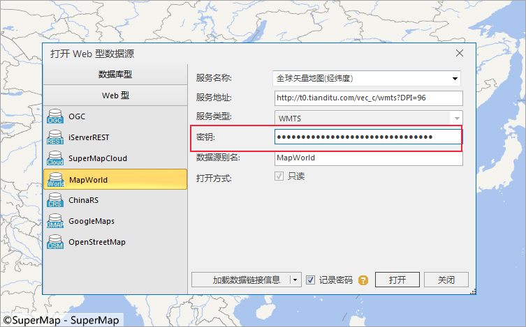
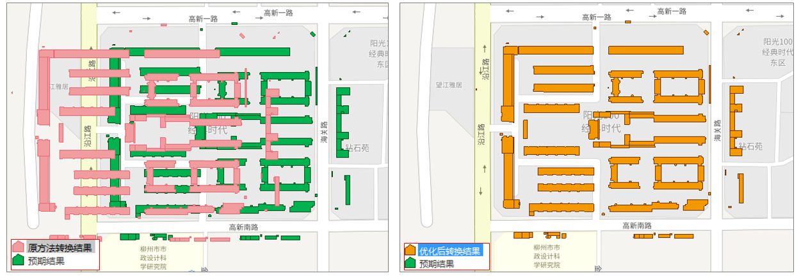

**SuperMap iDesktop .NET 9D(2019) SP2 桌面产品在上一版本基础上，包含以下新增功能和优化之处：**

**数据管理**

  * [打开天地图服务](../Features/DataProcessing/DataManagement/OpenDatasource.htm#2)，支持用户输入服务密钥。

  

  * [打开 OGC 服务](../Features/DataProcessing/DataManagement/OpenDatasource.htm#2)，支持打开[TMS 类型](../Features/TechDocument/WebDatasets/AboutWebDataset.htm#01)的服务。
  * [导入 Personal GeoDatabase (*.mdb) 文件](../Features/DataProcessing/DataConversion/GeoFormates.htm#6)，支持导入空数据集；并支持导入*.mdb 纯属性表。
  * 优化[ ESRI GeoDatabase Vector(*.gdb)、Personal GeoDatabase (*.mdb) 注记数据集导入功能](../Features/DataProcessing/DataConversion/GeoFormates.htm#7)，注记数据集将不再导入为面数据集，而是导入为带坐标的文本数据集，不过，文本数据集为空内容，但保留了属性信息。
  * 支持导出矢量数据集为 Personal GeoDatabase (*.mdb) 数据。
  * [ 导入 Microsoft Excel (*.xlsx) 文件功能](../Features/DataProcessing/DataConversion/ImportExcel.htm)，支持自动识别和匹配字段类型，提高用户导入数据的效率。

**数据处理**

  * 优化转换模型参数计算功能中[ China_2D_4P(4-para)（二维四参数转换模型）转换算法](../Features/DataProcessing/Projection/TransformationModel.htm)，提高了参数计算的精度。

  

  * 优化镶嵌数据集相关功能，[ 支持多任务生成概视图](../Features/DataProcessing/DataManagement/MosaicDatasetManage.htm#5)，并修复了镶嵌数据集显示黑线的问题。

**二三维标绘**

  * 二维标绘面板支持标号搜索功能。
  * 新增二维缺省属性。
  * 新增二维避让区域的添加、删除功能。
  * 新增注记随图功能。
  * 优化图元注记绘制与编辑。

