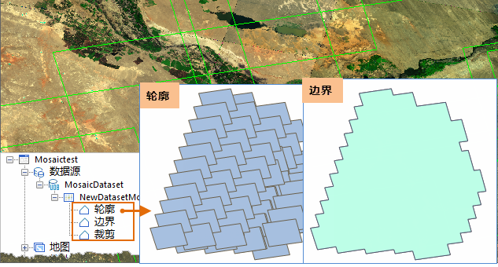
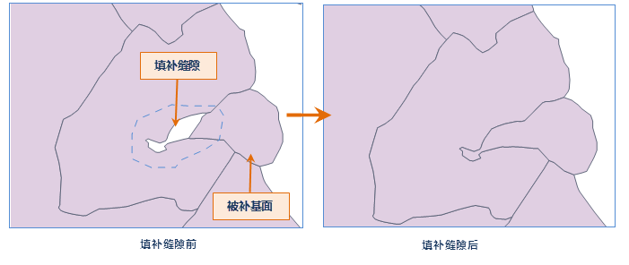
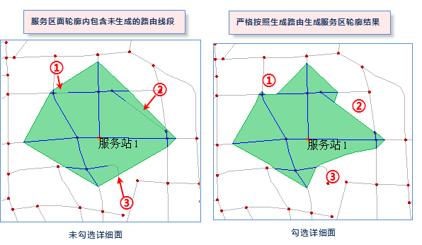
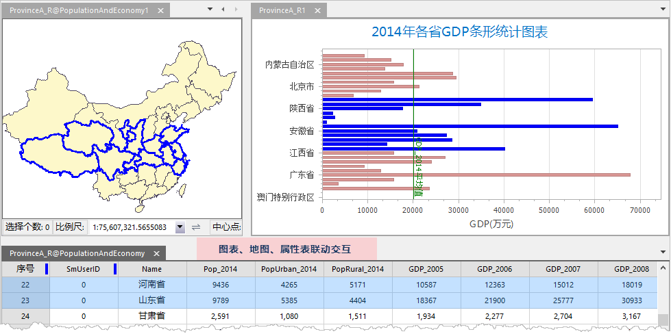
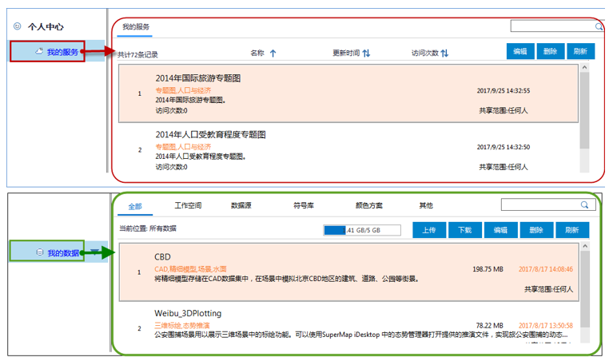

SuperMap iDesktop 9D Service Pack 1 桌面产品在上一版本基础上，新增并优化数据管理、数据处理、地图制图、交通分析、统计图表、在线分享等模块的相关功能。其中，数据管理模块新增支持 SinoDB 数据库引擎，新增和优化镶嵌数据集的相关功能等；数据处理模块中，新增填补缝隙功能并支持文本数据集的融合；地图制图新增批量生成图幅图框、并支持生成矢量瓦片缓存；同时对颜色方案进行了新增和优化；交通分析模块中，新增路由对象的编辑功能，并提供提取M值和查询M值功能；统计图表模块中新增圆环图、条形图及面积图3种类型，并提供统计图表模板，同时优化图表的交互方式，使图表功能更丰富易用；在线分享模块中新增个人中心管理个人账户中“我的服务”和“我的数据”资源，且支持对接实时数据查询路况，同时支持基于SuperMap
Online在线服务进行路径导航分析等。

**SuperMap iDesktop 9D SP1 包含以下新增功能和优化之处：**

### 数据管理

  * 新增支持 [SinoDB 数据库引擎 ](../Features/DataProcessing/DataManagement/EngineType.htm)，便于利用 SinoDB 数据库对海量空间数据的管理。
  * 支持新建和打开 MongoDB 数据库型数据源，支持管理 MongoDB 数据库中的点、线、面等空间数据集，在存储数据集时，可采用 SuperMap 和 Geojson 两种存储方式。
  * 支持保存和打开 MySQL、PostgreSQL、DM、MongoDB 的工作空间。
  * 在 [启用地图动态投影 ](../Features/Visualization/MapSetting/DynamicProjection.htm)时，支持设置投影的转换参数，使不同投影坐标系下的数据能够更准确的相互叠加显示。
  * 优化[重新指定数据集 ](../Features/Visualization/LayerManagement/RespecifyAssociatedData.htm)功能，支持批量重新指定当前地图关联的数据源或数据集。方便用户在不同工作空间导入同一地图模板时，可重新指定多个不同数据源下的数据集。
  * 优化[重命名数据源](../Features/DataProcessing/DataManagement/DS_Rename.htm)和[数据集](../Features/DataProcessing/DataManagement/DTv_Rename.htm)的操作结果，重命名后自动修改关联地图中的图层关联的数据集，减少用户手动修改地图的工作量。
  * 在[导入 GJB 数据 ](../Features/DataProcessing/DataConversion/ImportGJB.htm)时，支持设置文本大小的配置文件，用户可以预先设置好字号大小和字体类型的转换关系，可减少对导入后数据集中文本风格的进一步调整和编辑。
  * 优化[导出 VCT 数据](../Features/DataProcessing/DataConversion/ExportVCT.htm)功能，支持将多个数据集导出到一个VCT文件。
  * 新增并优化镶嵌数据集的相关功能，使镶嵌数据集功能更全面易用，具体如下：
    * 在工作空间管理器镶嵌数据集节点上[增加轮廓和边界数据集](../Features/DataProcessing/DataManagement/CreateMosaicDataset.htm#13)，可直接点击单独查看轮廓、边界范围及数据集属性。
    * 支持通过[读取裁剪文件（*.shp）](../Features/DataProcessing/DataManagement/CreateMosaicDataset.htm#14)，以此作为裁剪范围处理影像数据因投影转换导致的变形的无值区域。
    * 优化[重建镶嵌数据集范围](../Features/DataProcessing/DataManagement/MosaicDatasetManage.htm#8)，支持重建轮廓、重建边界和重建裁剪范围。
  

### 数据处理

  * 新增[填补缝隙](../Features/DataProcessing/Objects/EditObjects/FillGap.htm)功能，方便用户通过拓展当前面对象来填补该对象与周围面对象之间的缝隙。
  

  * 在[数据集融合](../Features/DataProcessing/Vector/Datafuse.htm)功能中，新增支持对文本数据集的融合。
  * 优化[枚举字段 ](../Features/DataProcessing/DataManagement/DTgroupDiaVector.htm)的显示，支持设置显示值域的描述信息。便于帮助用户通过描述信息来识别字段值的实际含义。

### 地图制图

  * 支持[栅格分段专题图 ](../Features/Mapping/GridRangesMap/GridRangesMapGroupDia.htm)特殊值的风格及透明设置，优化了栅格分段专题图的显示效果。
  * 支持对地图[批量生成图幅图框 ](../Features/Visualization/MapSetting/BatchStandardMargin.htm)，批量生成某个范围内的大比例尺下的一系列图幅图框数据。目前支持1:500、1:1000、1:2000三个大比例尺。
  * [生成地图缓存](../Features/Optimization/Cache/2DCache.htm)时，支持生成矢量瓦片格式的地图缓存。矢量瓦片占用服务器资源较少，传输更方便且显示更灵活。
  * [新增多个颜色方案](../Features/Visualization/LayerStyle/ColorRampManager.htm)，并逐个优化了已有颜色方案，使颜色方案更加丰富，具体如下：
    * 新增适用于单值专题图、统计专题图、标签单值专题图与标签分段专题图的[颜色方案共16个](../Features/Visualization/LayerStyle/ColorRampManager.htm)，均由8个以上关键色组成。
    * 优化地图中[颜色的随机方式](../Features/Visualization/LayerStyle/ColorRampManager.htm)，地图中将只出现颜色方案中的关键色，使得设色效果变得更加可控，真正达到“所见即所得”。
    * 优化[颜色方案分组](../Features/Visualization/LayerStyle/ColorRampManager.htm)，将“使用点、线、标签”分组拆分为“适用标签单值专题图”与“适用标签分段专题图”，以适应不同的使用场景。

### 交通分析

  * 新增[路由对象的编辑](../Features/DynamicSeg/CreateRoute.htm#5)，支持画线分割、画面分割、选对象分割、打断、精确打断、光滑、重采样、合并、连接线等。
  * 新增[提取路由M值](../Features/DynamicSeg/ExtractRouteM.htm)功能，根据间距提取路由数据的刻度值，可用于在地图中对路由数据进行M值的刻度标识，便于用户了解每段路由的路由值。
  * 新增[查询路由M值](../Features/DynamicSeg/InquireRouteM.htm)功能，可查询指定路由图层中，鼠标所在位置的路由M值，便于用户了解路由数据具体路段处的 M 值。
  * 在示范数据SampleData\ExerciseData\LinearReferencing，新增示例数据，展示了如何在地图中显示出路由刻度。

### 网络分析

  * 在进行服务区分析时，支持[生成详细面](../Features/Network/7-1ServiceArea.htm)。以使用户得到更加准确的分析结果。
  

### 统计图表

  * 提供[统计图表模板](../Features/DataMining/Diagrams/DiagramTemplate.htm)，用户可以按照程序提供的模板直接制作统计图表。
  * 支持将图表风格[导出为模板](../Features/DataMining/Diagrams/DiagramTemplate.htm)，以供反复使用；也可将自己制作的统计图表作为模板保存到统计图表模板库中，以备再次使用。
  * 丰富了统计图表类型，新增[圆环图、面积图和条形图](../Features/DataMining/Diagrams/Diagrams1.htm#222)3种类型。
  * [散点图](../Features/DataMining/Diagrams/Diagrams1.htm#222)支持通过线性回归的统计方式向图表中添加最佳拟合线，通过使用回归分析来估计因变量和自变量之间关系的强度和方向。
  * 支持通过设置SQL过滤表达式或通过在地图窗口选中兴趣对象作为过滤方式，仅对[过滤后的对象制作统计图表](../Features/DataMining/Diagrams/DiagramInteraction.htm)。
  * 优化[图表、地图及属性表之间的联动交互方式](../Features/DataMining/Diagrams/DiagramInteraction.htm)，支持Shift选中多个统计结果，同时将高亮显示地图和属性表中的相同对象，实现三者的动态联动交互。
  

### 在线分享

  * 支持在“个人中心”中直接管理“[我的服务](../Features/Online/OnlineMyData.htm#1)”，包括对已发布的地图服务进行查看、删除及对地图服务的名称、分类、标签、详细描述以及查看权限进行编辑修改等操作。
  * 优化对“我的数据”的管理，支持在“个人中心”中直接管理“[我的数据](../Features/Online/OnlineMyData.htm#2)”，可直接修改数据的共享范围、描述信息等属性。
  
 
  * 支持在桌面端查看腾讯提供的[实时路况数据](../Features/Online/onlineservice.htm#1)，快速实时的查看路况信息。
  * 支持基于SuperMap Online 地图服务进行[公交换乘查询](../Features/Online/QueryRoute.htm)。
  * 新增[路径导航分析](../Features/Online/QueryRoute.htm)功能：
    * 支持基于SuperMap Online 地图服务进行路径导航分析。
    * 支持路径导航分析中，设置途经点进行分析。
    * 支持分享分析结果给其他iDesktop桌面使用。

### 三维

  * **模型操作**
    * 新增[构建拉伸闭合体](../Features/SceneOperation/3DObjectOperation/CreateStraightSkeketon.html)功能，实现对面数据、模型数据构建实体模型。
    * 优化线性拉伸、构建坡屋顶、放样、构建房屋功能，支持投影坐标系。
    * 新增[模型平移](../Features/SceneOperation/3DObjectOperation/ModelMove.html)功能，实现对指定模型或大范围内模型的位置进行平移操作，平移操作可撤销。
    * 新增[模型旋转](../Features/SceneOperation/3DObjectOperation/ModelRotate.html)功能，实现对指定模型或大范围内模型进行旋转操作，支持批量旋转。
    * 新增[模型批量平移](../Features/SceneOperation/3DObjectOperation/BatchModelMove.html)功能，实现对场景内所有模型进行平移操作。
  * **倾斜摄影操作**
    * 优化裁剪功能，支持裁剪结果另存。
    * 新增[挖洞](../Features/SceneOperation/OSGB/OSGBModelHollow.html)功能，当场景中存在倾斜摄影模型时，可通过绘制矩形、多边形或者选中的面对象对被裁剪倾斜摄影模型进行挖洞。
    * 新增[模型单体化](../Features/SceneOperation/OSGB/OsgbDiscret.htm)功能，实现对倾斜摄影模型的高亮选择和属性查询。
  * **三维分析**
    * 优化[日照分析](../Features/SceneOperation/RealspaceSpatialAnalyst/SunshineAnalyst.htm)功能，取消分析前开启模型数据的图层阴影。
    * 优化天际线分析功能，支持设置观察者半径，从而使360度天际线分析导出圆形二维线。
    * 优化[生成2.5维](../Features/SceneOperation/RealspaceSpatialAnalyst/Generate25DMap.html)功能，支持生成2.5维矢量面。
  * **倾斜摄影**
    * 新增[拉伸闭合体](../Features/SceneOperation/OSGB/osgbStrClosure.html)功能，提取指定范围内倾斜摄影模型的最值，根据最值构建拉伸闭合体。
    * 新增[提取点数据](../Features/SceneOperation/OSGB/AchievePoint.html)功能，提取倾斜摄影模型上指定点的高程值，可实现将二维点转换为三维点。
    * 新增创建空间索引、删除空间索引功能，可提高数据检索速度，优化裁剪、镶嵌等模型编辑性能。
    * 三维切片缓存图层高度模型提供贴对象模式。
    * 优化倾斜摄影模型生成配置文件功能，支持参照系统设置。
    * 优化模型压平功能，支持将压平产生的临时数据由CAD数据集转为三维面数据集。
    * 对象选择风格提供替换模式
  * **三维数据**
    * 新增[TIN地形生成混合大文件](../Features/SceneOperation/TINTerrainOperation/TINGenerateBigfile.html)功能，提升了TIN地形加载浏览效率。
    * 新增[TIN地形提取点数据](../Features/SceneOperation/TINTerrainOperation/TINAchieveData.html)功能，提取TIN地形模型上指定点的高程值，可实现将二维点转换为三维点。
    * 新增[模型打散](../Features/SceneOperation/DataProcessing/BrokeModel.html)功能，将一个整体模型分解为多个单独的、可操作的模型，且保证模型尺寸不变。
    * 优化点云生成缓存功能，支持设置特征值。
  * **场景属性**
    * 新增接收阴影、显示高度多选项。
  * **图层属性**
    * 三维切片缓存、模型提供三种渲染模式：双面、顺时针、逆时针。
    * TIN地形属性提供两种填充模式：填充、轮廓。
    * 三维切片缓存属性中删除“选中对象可见性设置”。
    * 模型数据集提供高度、对比度、色调、饱和度、伽玛颜色属性设置。
  * **空间分析**
    * 新增[三维空间查询](../Features/SceneOperation/SpatialQuery3DDia.htm)，支持对点、模型对象的空间查询。
  * **场景**
    * 新增[多边形三维查询](../Features/SceneOperation/SceneIneteraction/ClipByPolygon.htm)，在场景中绘制多边形，并指定多边形的底部高度与拉伸高度，实现模型对象的框选。
    * 删除添加静态模型和添加轨迹模型的“添加模型”入口。
  * **模型缓存**
    * 新增[模型缓存对象操作](../Features/Optimization/Cache/ModelCacheObjectOperation.htm)，可隐藏、仅显示选中对象或簇，支持显示所有隐藏对象。

### 易用性

  * 优化切换Ribbon选项卡的速度，提升用户操作体验。
  * 解决了在某些情况下，桌面最小化到操作系统任务栏上后，还原至最大化界面窗口有卡顿问题，提升了用户操作体验的流畅性。

