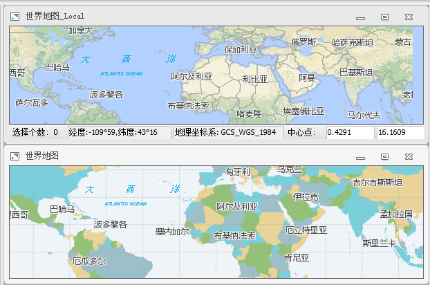
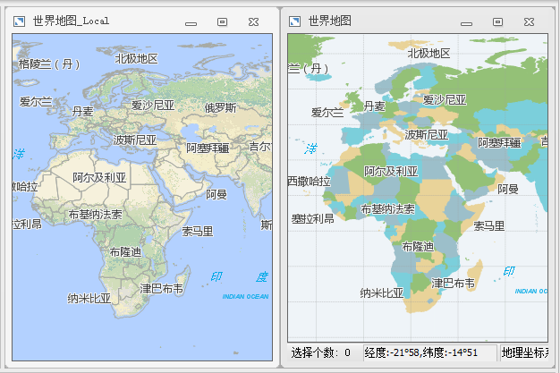
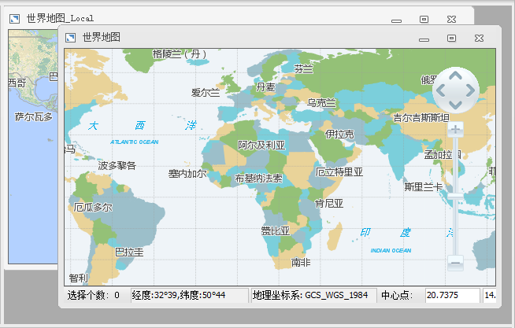

当应用程序的[窗口模式](WindowsModel.htm)为叠加模式时，应用程序提供了三种窗口排列方式：水平平铺、垂直平铺和层叠窗口。
  
---  
图：水平平铺  
  
---  
图：垂直平铺  
  
---  
图：层叠窗口  
  
### 使用说明

当应用程序的[窗口模式](WindowsModel.htm)为叠加模式时，在“ **视图** ”选项卡上的“ **窗口** ”组中，“ **水平平铺**
”、“ **垂直平铺** ”、“ **层叠窗口** ”按钮才为可用状态。

单击其中一种叠加窗口中的排列方式，即可切换为选中的窗口排列方式。

###  相关主题

 [关于窗口模式](WindowsModel_Basic.htm)

 [切换窗口模式](WindowsModel.htm)

