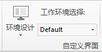

---
id: WorkenvironmentGroup
title: 管理工作环境  
---  
应用程序的工作环境信息存放在产品目录下的 WorkEnvironment
文件夹下，该文件夹下的每一个子文件夹就是一个工作环境，每一个工作环境子文件夹中包含了该工作环境的所有配置文件。当应用程序启动时，加载的是默认的工作环境，即产品目录下的
WorkEnvironment 文件夹下名称为 Default 子文件夹对应的工作环境。

用户可通过“ **视图** ”选项卡上的“ **自定义界面** ”组中的功能控件，定制、切换或还原当前的工作环境。  

  

### 打开工作环境设计窗口

在“ **视图** ”选项卡上的“ **自定义界面** ”组中，单击“ **环境设计** ”下拉按钮，选择“ **工作环境设计**
”，可打开工作环境设计窗口，在该窗口中可对当前的工作环境进行定制和扩展。

有关工作环境设计窗口中的具体操作，请参见 [工作环境设计](../../UserCustom/UserCustom.htm)。

### 切换当前工作环境

在“ **视图** ”选项卡上的“ **自定义界面** ”组中，单击“ **工作环境选择:** ”组合框下拉箭头，在下拉列表中列出了应用程序在产品目录下的
WorkEnvironment 文件夹中所能获取到的所有的工作环境，用户可以选择任意一个工作环境来切换应用程序当前的工作环境。

### 还原默认的工作环境

在“ **视图** ”选项卡上的“ **自定义界面** ”组中，单击“ **环境设计** ”下拉按钮，选择“ **还原默认配置**
”按钮**，可恢复应用程序默认的初始工作环境状态。

