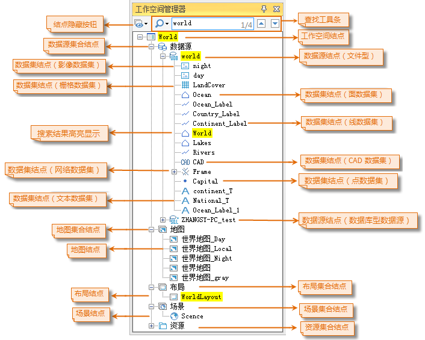
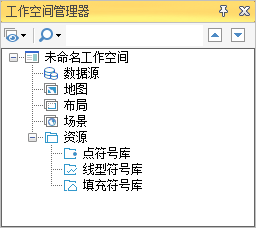

工作空间管理器提供一个可视化管理工作空间的工具，如下图所示即为工作空间管理器，它采用树状结构的管理层次，这恰好是工作空间管理其自身数据的层次结构，正如一个工作空间包含有一个数据源集合，一个地图集合，一个布局集合、一个场景集合和一个资源集合，工作空间管理器的根结点对应着打开的工作空间，根节点显示的名称为打开的工作空间的名称，其次一级结点分别是：

  * 结点隐藏按钮：工作空间管理器结点隐藏功能，可根据用户需要选择显示或隐藏结点，如：数据源、地图、布局、场景、资源等结点。默认显示所有数据结点，若需隐藏某结点，单击结点隐藏按钮，去掉该结点的勾选即可将其隐藏。
  * 查找工具条：工作空间管理器支持查找定位功能，方便在众多的树节点中定位需要查找的节点。支持全字匹配和大小写匹配的方式查找数据集、数据源、地图、布局、场景等。当查找结果存在多个匹配项时，可以通过上下标按钮，查找上一个或下一个，定位到不同的匹配项。
  * 数据源，该结点对应着工作空间的数据源集合，该结点的次一级列出了所有打开的数据源，每一个数据源对应一个结点，结点的显示名称为相应数据源的别名称，而每一个数据源所在结点的次一级列出了该数据源中包含的所有数据集，每一个数据集对应一个结点，结点的显示名称为数据集的名称。
  * 地图，该结点对应工作空间的地图集合，该结点的下一级将列出工作空间中存储的所有地图，每一个地图对应一个结点，结点的显示名称为地图的名称。
  * 布局，该结点对应工作空间的布局集合，该结点的下一级将列出工作空间中存储的所有布局，每一个布局对应一个结点，结点的显示名称为布局的名称。
  * 场景，该结点对应工作空间的场景集合，该结点的下一级将列出工作空间中存储的所有场景，每一个场景对应一个结点，结点的显示名称为场景的名称。
  * 资源，该结点对应工作空间的资源，包括符号库、线型库和填充库，每一种资源库对应资源库结点下的次一级结点。

在一个应用程序中，当前只能打开一个工作空间，不能同时打开多个工作空间，因此，工作空间管理器所管理的工作空间是应用程序中当前打开的工作空间。

  
---  
图：当前工作空间的工作空间管理器  
  
当启动一个新的应用程序时或者没有打开其他工作空间时，应用程序会默认打开一个的空的工作空间，其名称为未命名工作空间，其所对应的工作空间管理器的管理结构如下图所示，数据源、地图、布局、场景的结点下都不包含任何数据，而仅仅包含一些符号资源。当打开一个已经存在的工作空间时，工作空间中的数据会依据其组织结构显示在工作空间管理器相应的结点下，如上图所示。

  
---  
图：应用程序默认打开空工作空间时的工作空间管理器  
  
此外，工作空间管理器提供了丰富的右键菜单功能，每一级结点都有右键菜单，用来处理与该结点相关的功能操作。

