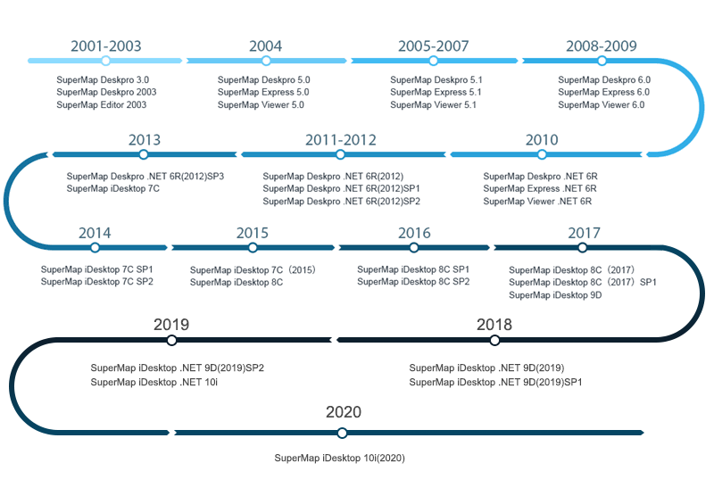

---
id: ProductIntro
title: 产品介绍
---  

SuperMap iDesktop 是一款企业级插件式桌面GIS软件，可以高效的进行各种 GIS 数据处理、分析、二三维制图及发布等操作。基于它可以快速搭建自己的桌面GIS应用平台。 是通过
SuperMap iObjects .NET 10i 、桌面核心库和 .NET Framework 4.0 构建的插件式 GIS
应用，能够满足用户的不同需求。 分为64位和32位两个产品，分别提供了绿色包和安装包。

具备二三维一体化的数据管理与处理、编辑、制图、分析、二三维标绘等功能，支持海图，支持在线地图服务访问及云端资源协同共享，可用于空间数据的生产、加工、分析和行业应用系统快速定制开发。

  

###  功能介绍：

**数据管理**

支持50 多种常用的矢量、栅格、模型文件格式导入，25 种以上文件格式导出，20
余种不同类型数据的相互转换，用户可以轻松集成数据进行可视化和分析。提供多种地理格式的数据集的打开、新建、复制、删除等管理操作。

  * 支持 PostGIS、DM、Oracle、SQL Server、PostgreSQL 、BeyonDB MongoDB数据库引擎。
  * 直接打开 OGC 服务、REST 服务、谷歌地图、百度地图、超图云服务、天地图服务、OpenStreetMap 等Web 地图。
  * 采用镶嵌数据集的方式，对海量影像数据进行管理与显示。
  * 提供多种起始页、目录管理、功能搜索等工具，数据管理更轻松。

**数据处理**

诸多投影和地理坐标系统的选择，可以将来源不同的数据集集成到共同的框架中。提供全面的数据编辑功能；提供30
种以上矢量、栅格数据处理方法，综合解决数据缺失、数据冗余等问题，修缮问题数据，帮助用户生产出具有专业品质的地图；也提供了多种方法对栅格、影像数据进行处理，处理后的数据可以用来作为地图底图，或者参与分析，包括：

  * 支持坐标系反算转换模型参数值，支持10种坐标系转换模型。
  * 提供拓扑检查，对有拓扑错误的数据进行检查；使用拓扑处理，对有拓扑错误的地方直接进行处理。
  * 支持二三维缓存存储到 MongoDB、GeoPackage，提高海量数据的浏览效率。
  * 提供200多种数据处理功能，例如融合、追加、抽稀、聚类、采样、光滑等。

**制图与可视化**

提供综合的地图显示、渲染、编辑以及出图等功能。丰富的可视化效果，简单易用的制图工具，无需复杂设计就可以生产出高质量的地图。包括：

  * 内置7种色板，200多个色带，1000个以上的点、线、面符号。
  * 支持地图生成地图瓦片、更新/追加瓦片、检查瓦片、发布瓦片全流程的地图瓦片技术。实现简单快捷地通过缓存机制提升地图服务的效率。 
  * 支持多机生成 MapBox MVT 规范的矢量瓦片，可节约瓦片的生产时间，极大的提升生产效率。
  * 提供地图分幅、地图网格、标准图幅图框等制图工具。
  * 提供了制作各种专题图的功能，支持单值、分段、标签、统计、点密度、自定义、栅格单值、栅格分段等多种专题图的创建和修改。
  * 支持自动化制图，行业标准数据向导式自动制图，根据国家公共地理框架电子地图数据和规范的电子地图符号库，自动生成符合规范的电子地图。 

**空间分析**

提供了多种分析功能，其中既包含基础的矢量、栅格分析功能，也支持高级的分析功能，协助解决实际分析问题。

  * 支持缓冲区分析、叠加分析、插值分析、水文分析、动态分段等分析功能。
  * 提供等值线/面提取，坡度、坡向、填挖方、三维晕渲等表面分析功能。
  * 提供最佳路径分析、旅行商分析、公交分析、路径分析、导航分析等交通分析功能。
  * 提供关键要素分析、两点连通性、单要素追踪、通达要素、爆管分析等设施网络分析功能。

**统计图表**

  * 支持将数据集属性信息图形化，可通过直方图、时序图、柱状图、散点图等11种形式，直观的展示和挖掘数据的关系、结构和趋势等。
  * 支持图表与地图间的联动显示，便于用户分析数据在地理上的分布特征。
  * 支持图表与专题图之间的直接转换，可快速的通过不同的方式展示数据信息。
  * 支持将统计图表输出为图片，可应用于 Word、PPT 等其他文档工具中。

**三维**

提供了多源地理空间数据的管理、场景展示、信息查询、空间分析等诸多功能，满足智慧城市建设、测绘、应急等多个行业的三维应用需求。

  * 支持多源数据的显示和浏览，包括：影像数据、地形数据、三维模型数据、矢量数据，以及二维地图。
  * 提供了丰富、炫彩的三维特效，从而使三维表现形式更加贴近现实世界的地理事物，如太阳光照和阴影、仿真海洋水体、地下三维场景、海底三维效果、粒子特效（火焰、降雨、降雪、喷泉、爆炸、烟火等）。
  * 多种三维空间分析与网络分析功能，并且支持保存分析结果。
  * 提供了飞行管理功能，通过设置飞行路线上站点的参数，可实现飞行仿真应用。
  * 支持倾斜摄影模型、BIM、激光点云等数据的管理和展示。
  * 支持将本地倾斜摄影数据上传至SuperMap iServer、SuperMap Online。

**海图**

涉足海洋测绘领域的GIS应用，实现对海图数据的存储、显示和发布。

  * 提供基于最新IHO S-57数字海道测量数据传输标准的海图数据转换功能。
  * 支持对S-57海图数据的导入、海图一体化存储和导出。
  * 实现基于最新IHO S-52电子海图内容和显示规范的标准化显示。
  * 支持海图物标要素显示控制，可以对物标要素的显示状态进行控制；支持海图物标属性信息编辑功能，可以方便地增加或者修改物标要素的属性信息。

**云端协同**

  * 直接访问WMS、WFS、WMTS、SuperMap REST、天地图等标准在线地图服务。
  * 一键发布地图、瓦片、三维场景为iServer服务。
  * 管理SuperMap Online或SuperMap iPortal中的在线数据与服务。
  * 支持在线检索和分享地图、数据、符号库、颜色方案、扩展插件和自定义资源。

**定制开发**

  * 提供多种VS项目模板，同时在IDE中集成了iDesktop工具箱、iDesktop快速引用，方便用户开发使用。
  * 支持界面的定制功能，可通过工作环境设计器对已有的界面元素进行重新组织。
  * 支持插件的加载定制，可开发新插件，扩展桌面功能，同时提供了了插件的下载、加载、共享、卸载等功能。

###  版本历程：

  

