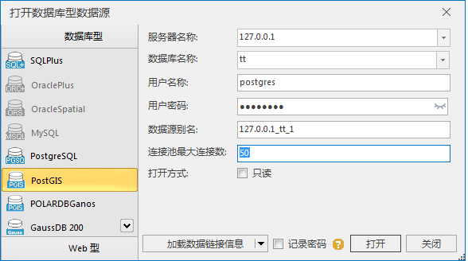
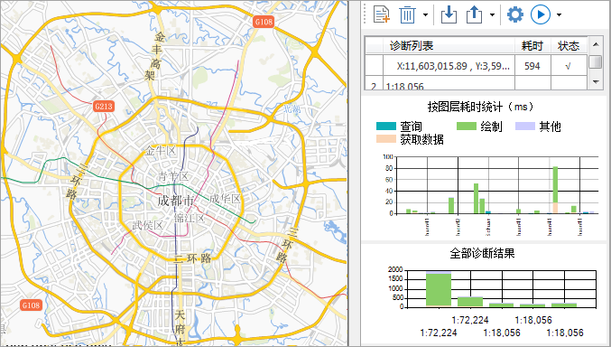
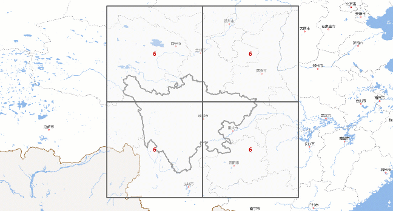

**SuperMap iDesktop 10i(2021) 桌面产品在上一版本基础上，包含以下新增功能和优化之处：**

**数据管理**

  * 支持通过配置文件自定义新建数据源时的默认坐标系，默认为 CGCS2000坐标系。
  * 新建、打开数据库型数据源，PostGIS 数据库连接池最大连接数默认值调整为50，其余数据库保持默认值1。
  
---  
  * 新建、打开OracleSpatial 数据库时，支持设置连接池最大连接数。
  * 新增2个日文地理坐标系：JGD2000、JGD2011。

**数据处理**

  * 支持对矢量线数据集重新计算长度，矢量面数据集支持重新计算周长和面积。
  * 提取边界线功能支持处理三维线数据集和三维面数据集。

**空间分析**

  * 优化叠加分析功能，支持设置面内自相交参数，可将自相交区域的结果数据保存为多个重叠对象。

**网络分析**

  * 优化两点连通性分析结果展示，分析结束后将连通线结果在地图中直观显示。

**地图制图**

  * 优化地图性能诊断功能： 
    * 优化了界面交互方式，以浮动窗口右停靠的形式，在不干扰用户与地图交互基础上进行设置和展示检测结果，使功能更易用；
    * 新增全地图性能诊断，能够同时检测整幅地图在多个比例尺下的性能。
  
---  
  * 新增多个适用于DEM、适用于聚合图的颜色方案，丰富了数据的显示效果。
  * 新增142个符号资源、其中包括49个线符号、12个面符号、81个SVG点符号，满足更多行业的制图需求。
  * 新增 GeoSOT 网格功能，可基于 GeoSOT 网格剖分标准生成网格数据。
  
---  

**地图瓦片**

  * 优化多任务切图功能： 
    * 支持调整某个切图比例尺的优先级以及暂停该比例尺的相关切图任务；
    * 选择全球剖分方式执行多任务切图时，支持设置基础比例尺切图，可以有效提高镶嵌数据集全球剖分的切图速率；
    * 支持切图进度和日志的实时刷新显示。
  
---  

**三维**

  * 数据处理
    * 优化“创建空间索引”功能，支持创建嵌套结构的空间索引。
    * 优化“地图生成三维缓存”功能，支持设置剖分类型。
    * 优化模型“生成缓存”功能，单切片缓存大于5M时输出窗口会输出提示信息；LOD设置默认参数改为75%，50%，25%；支持设置属性存储类型、材质关联文件、S3M版本号等参数；过滤阈值单位改为米；顶点权重模式中三角形最短边参数改为高度。
    * 优化矢量“生成缓存”功能，支持设置属性存储类型、S3M版本号等参数。
    * 优化场景“生成缓存”功能，支持S3M版本号。
    * 优化体元栅格“生成缓存”功能，支持S3M版本号。
  * 三维数据
    * 优化“矢量面拉伸生成模型缓存”功能，支持设置属性存储类型、S3M版本号等参数；优化了模型缓存边框线效果。
    * 优化“点集生成缓存外挂模型”功能，支持设置属性存储类型、S3M版本号等参数；支持设置游戏引擎资产路径。
    * 新增“瓦片管理”功能，支持将数据存储到MongoDB库中；数据存入MongoDB数据库后，会在指定路径生成配置文件；支持连接MongoDB数据库，对数据进行增、删、查等操作。
    * 新增“3DTiles转S3M”功能，支持三维模型数据和倾斜摄影模型数据，支持3DTiles中的压缩纹理直接存储到S3M。
    * 新增模型“纹理重映射”功能，支持将模型的纹理重新拼接。
    * 优化“倾斜入库”功能，支持批量入库；支持设置中心点坐标单位、目标坐标系、S3M版本号等参数。
    * 优化“生成缓存”（点云）功能，支持设置S3M版本号；支持分隔符为空格符的点云数据生成缓存。
    * 新增“模型检查”功能，查看模型对象和子对象的最大顶点数和最大三角面数据信息。
  * 场景
    * 优化“导出模型”功能，支持导出OBJ、FBX、KML+S3MB、KML+FBX四种数据格式。
    * 支持设置相机视场模式。
    * 支持设置速度倍率参数，控制HTC手柄速度。
  * 三维地理设计
    * 优化“三角网简化”功能，支持设置顶点阈值参数。
    * 优化“放样”功能，支持用立方体、平面等贴图方法给模型贴图。
    * 新增“3D极坐标建模”功能，支持根据UV参数和数学表达式构建曲面模型。
    * 优化模型“布尔运算”功能，运算耗时更短。
  * 三维分析
    * 优化“视频投放”功能，支持设置翻滚角参数。
    * 优化“坡度坡向分析”功能，仅且当数据为栅格数据集时，支持获取指定位置的坡度、坡向值，单位为度。

* * *

[版权所有(C) 2007-2021 北京超图软件股份有限公司。保留所有权利。](http://www.supermap.com)  
  
---

