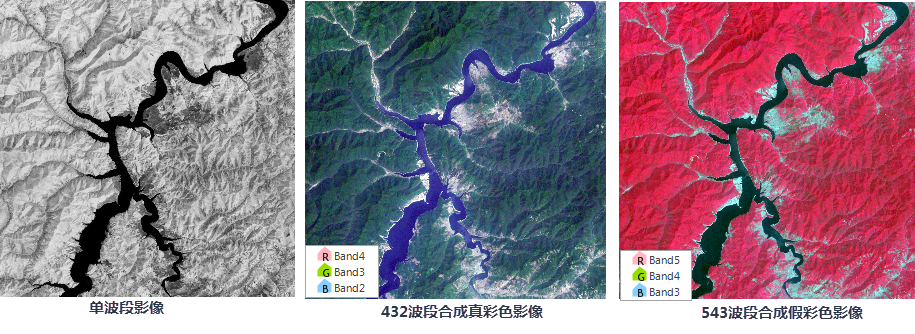
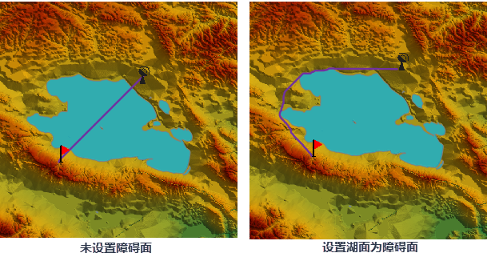

**SuperMap iDesktop 10i SP1 桌面产品在上一版本基础上，包含以下新增功能和优化之处：**

**数据管理**

  * 支持将[多个数据集同时导出至 File GeoDatabase Vector(*.gdb)文件](../../tutorial/DataProcessing/DataConversion/ExportData#1) 。
  * 支持将DEM数据导出为军用数据高程模型（*.EGC）文件和 ArcGIS ASC（*.asc）文件。
  * 镶嵌数据集的影像图层，[支持设置对象显示顺序](../../tutorial/DataProcessing/DataManagement/MosaicDatasetView#3)。

**数据处理**

  * 支持[将单波段影像组合成为多波段影像](../../tutorial/DataProcessing/DataManagement/DTgroupDiaImage#1)，便于用户通过组合不同波段展示及处理遥感影像数据。
  
---  

**地图制图**

  * 优化[ MongoDB 瓦片管理](../../tutorial/MapTiles/MongoDBTilesManger)功能：
    * 支持开启多进程进行瓦片合并，用户可根据机器资源合理设置进程数，提升合并性能。
    * 支持 JPG_PNG 格式的瓦片合并，可用于解决瓦片接边处的白图问题。
  * 优化 AI 配图功能：
    * 优化色相、亮度、对比度、饱和度、填充柔化、填充锐化设置，支持对地图的整体风格进行调整，也可单独对填充、边框、线、文本风格进行调整。
    * 优化填充柔化和锐化的算法，使得调整后的效果更佳。
    * 支持输入数值进行风格调整。
  * 优化[地图角度量算](../../tutorial/Visualization/Interaction/Measuregroup)，量算时明确地图中真北方向，帮助用户更好的理解方位角。

**空间分析**

  * 优化两点最短地表路径和两点最小耗费路径功能，[支持设置障碍面](../../tutorial/Analyst/Raster/Distance/TwoPointDis#1)，可在分析时添加更多的障碍影响因素，使分析结果更符合实际需求。
  
---  

**统计图表**

  * 优化[统计图表风格设置](../../tutorial/DataMining/Diagrams/CreateDiagram)，支持自定义坐标轴极值，使图表能更好的表现数据变化的有效范围。 

**可视化建模**

  * 新增栅格代数运算工具，便于用户根据指定的算子构建模型，同时支持直接运行指定的算子。

**示例数据**

  * 新增基于天地图的影像地图模板，方便用户基于模板创建天地图的影像地图。

**易用性**

  * 优化关联浏览光标效果，使光标显示更明显；同时优化了场景中存在地形、模型等建筑物时光标被遮挡等问题，提升了功能的易用性。

