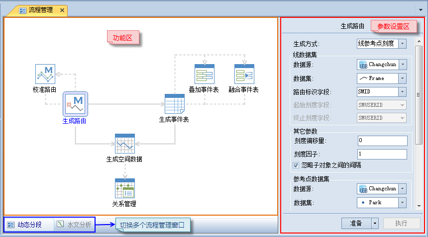

SuperMap GIS 10i 桌面推出一种全新功能管理机制----
流程管理，这种全新操作机制针对流程化的系列功能，按照各个流程的组织顺序自动化执行多个流程，其目的在于帮助用户迅速执行用户定制的操作流程，对于不了解 GIS
背景知识的用户也能快速地使用。

目前，动态分段和水文分析模块采用流程化管理的方式组织相关的功能。了解更多内容，请参阅[动态分段](../DynamicSeg/DynamicS)和[水文分析](../Hydrology/HydrologyAnalyst)。

### 流程管理的优点

  * 可视化：将整个分析模块的各个功能流程化结合在一起，通过图形方式展示，通俗易懂。
  * 简单易用，操作灵活：参数设置简单，既可以执行单个功能，也可以灵活定制要执行的多个流程。
  * 自动化流程：将一系列的功能按照实际需求进行定制，执行的时候可以按照定制的顺序依次执行。

### 流程管理窗口介绍

流程管理窗口主要由两大部分组成，如下图所示，左侧是功能区，用来显示当前分析模块的所有流程，以及它们之间的相互关系。右侧是参数设置区，在功能区中选择任一流程（单击选中对应的按钮），右侧窗口会自动切换到该功能对应的参数设置页面上，方便用户对该流程参数进行设置。

当存在多个流程时，左侧下方的标签页用来选择当前操作流程。每次只能执行一个流程管理窗口中的流程。

  

### 参数传递

参数设置区用来对各个功能必需（或者可选）的参数进行设置。当执行单个功能时，通过参数设置窗口中输入的参数进行；对于耦合性较高的多个功能，允许上下游功能之间通过传递的方式获取参数，即后续的功能可以从已经执行的功能得到的结果中获取。此种方式为自动化执行多个流程提供了条件。

### 功能区介绍

功能区包含了功能按钮和连接符两类元素。

功能按钮代表了一个具体的功能，单击某一个功能按钮，可以进入该功能对应的参数设置页面。

当按住鼠标中键，鼠标状态变为，上下左右拖动鼠标，可以实现功能区的移动。

### 连接符介绍

不同的功能按钮之间通过连接符进行连接，从连接次序可以了解各个功能之间的逻辑关系。流程管理中主要的连接符包括：

  * **箭头** ：指示了流程的方向，即表示数据各个功能的逻辑执行顺序。
  * **带箭头的实线** ：表示实线连接的两端的功能之间按照箭头所指的方向默认存在参数传递。当然修改参数后，允许不存在参数传递。
  * **带箭头的虚线** ：表示虚线两端连接的两个功能之间不会发生参数传递。
  * **蓝色高亮实线** ：当实线两端的连接的两个功能发生传输传递时，该实线会用高亮的蓝色显示。

### 功能区的状态

在不同的操作过程中，功能按钮会处于不同的状态。随着功能按钮状态的改变，其图标也会发生相应的改变。下面分别进行介绍：

  * **准备状态** ：在参数设置完毕后，该功能准备完毕，处于准备状态。功能按钮图标的右上角会出现准备状态的图标 。
  * **参数错误** ：表示参数设置存在问题，需要修改参数，然后再使该功能处于准备状态功能按钮图标的右上角会出现参数错误的图标 。
  * **执行中** ：表示该功能正在执行。只有处于准备状态的功能才能执行。在执行过程中，会弹出进度条，显示当前的执行进度。
  * **执行成功** ：该功能执行成功。如果有多个功能处于准备状态，执行完成后会继续执行下一个功能，直到全部执行完毕。功能按钮图标的右上方会出现执行成功的图标 。
  * **执行失败** ：表示执行过程中发生错误，执行失败。功能按钮图标的右上方会出现执行失败的图标 。
  * **帮助信息** ：对于每个功能按钮，应用程序提供了帮助内容。鼠标划过功能按钮上时，右上方会出现帮助按钮图标 ，鼠标移到该按钮上即可查看相应的帮助信息。

* * *

|

  
  
---

