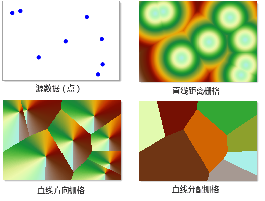
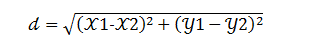
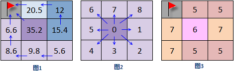
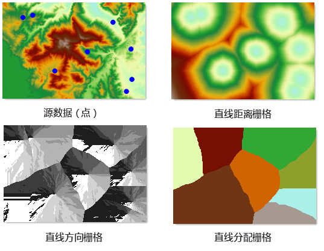
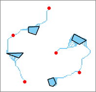
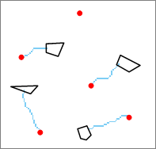

距离栅格分析是对每一个栅格距离其邻近像元（源）的空间距离进行分析，从而反映每个像元到邻近像元的空间关系。不仅考虑栅格表面距离，还会考虑成本等各种耗费因素的影响。通过距离分析，可以获取很多有用信息，指导人们进行资源的管理和规划，如地震紧急救援震区到最近医院的距离；连锁超市的服务区域评估等。

距离栅格分析主要包含三方面内容：

  * 一是生成距离栅格，即计算每个单元格到最近源（感兴趣的对象）之间的距离，包括直线距离、耗费距离和表面距离三种类型，以及生成相应的方向栅格和分配栅格；
  * 二是根据方向栅格和分配栅格，分析得出目标地到源的最短路径；
  * 三是计算两点（源点和目标点）间的最短路径，包括最小耗费路径、最短表面距离路径。

###  基本概念

首先来了解距离栅格分析有关的基本概念。

**源：** 感兴趣的研究对象或地物，如学校、道路或消防栓等。

**源数据集：** 包含源的数据集，可以为二维点、线、面数据集或栅格数据集。对于栅格数据集，要求除标识源以外的单元格为无值。

**距离：** 包括直线距离、耗费距离和表面距离，描述如下：

  * 直线距离即欧氏距离，是每一个单元格到最近源的直线距离；
  * 耗费距离是根据单元格的某个或某几个属性因子的加权得到的实际到达最近源所需的耗费值；
  * 表面距离即根据表面栅格计算出的单元格到达最近源的实际表面距离。

直线距离可以看做是长短的耗费，是最简单的一种耗费。另一方面，实际的地表覆盖类型多样，通过直线距离来到达源几乎是不可能的，必须要绕道以避开如河流，高山等的障碍物，因而可以说耗费距离是对直线距离的扩展和延伸

**耗费栅格：**
生成耗费距离栅格以及计算最小耗费路径时都需要提供耗费栅格。耗费栅格用于确定经过每个单元格所需的成本。单元格的值表示经过此单元格时一个单位的耗费，不能为负值。例如一个表示不同地面环境中汽车前进阻力的耗费栅格，其栅格值代表经过该单元格时每前进1公里的阻力值，那么经过该单元格的总耗费为单位耗费值（即栅格值）乘以单元格大小。耗费栅格的单位可以是任何单位类型，如长度、时间、金钱等，也可以无单位，如重分级后的坡度、坡向、土地利用类型等。

###  生成距离栅格

生成距离栅格功能用来计算栅格数据的每个像元与源数据的距离。获得的结果可以用来解决三个问题：

  * 栅格数据中每个像元到最近源数据的距离，例如到最近学校的距离。
  * 栅格数据中每个像元到最近源数据的方向，例如到最近学校的方向。
  * 根据资源的空间分布，要分配给源数据的像元，例如最近的几个学校位置。

生成距离栅格会得到三种数据集，即距离栅格、方向栅格和分配栅格。如下图所示，分别展示了这三种栅格。

 
  
**距离栅格**

距离栅格包括直线距离栅格和耗费距离栅格。

  1. 直线距离栅格 

直线距离栅格的值代表该单元格到最近的源的欧氏距离（即直线距离）。直线距离实际上可看作以长短作为耗费，是最简单的一种耗费。直线距离栅格不考虑耗费，即认为经过的路线没有障碍或等同耗费。生成直线距离栅格的源数据可以是矢量数据（点、线、面），也可以是栅格数据。分析的结果包含直线距离栅格数据集、直线方向栅格数据集和直线分配栅格数据集。

直线距离栅格是计算每个单元格距离最近源的欧氏距离的结果。假设 A 点坐标为（x1,y1），B 点坐标为（x2,y2），则 AB 两点的欧氏距离为：

  

  2. 耗费距离 

耗费距离栅格的值表示该单元格到最近的源的耗费值（可以是各种类型的耗费因子，也可以是各感兴趣的耗费因子的加权）。例如，翻越一座山的路程耗费较小，但如果考虑时间的耗费，则可能比绕行它的时间耗费要多。另一方面，实际的地表覆盖类型多样，通过直线距离来到达源往往是不可能的，必须要绕道以避开如河流，高山等的障碍物，因而可以说耗费距离对直线距离的扩展和延伸。由于距离栅格记录了每个单元格到最近源（资源点）的距离，因此通过距离栅格，可以将“用户期望离最近资源点的距离小于多少”作为选址条件，从而服务于选址分析。

**方向栅格**

方向栅格表示了每个栅格像元与最近源之间的方位角方向。同样也可以分为直线方向栅格和耗费方向栅格。直线方向栅格的值表示该单元格到最近的源的方位角，单位为度。以正北方向为0度，顺时针方向旋转，范围为0-360度。例如，如果最近源在该单元格的正东方向，则该单元格的值为90度。

耗费方向栅格的值表达的是从该单元格到达最近的源的最小耗费路径的行进方向。如下图所示，对图1所示的栅格数据中，使用箭头标识出了每个单元格到达源（图中使用小红旗标识）的最小耗费路线，由于对方向的值的规定如图2所示，因而图1中每个单元格的方向值如图3所示，图3即为图1栅格数据的耗费方向栅格。对于源所在的单元格在耗费方向栅格数据集中的值为0。当然，方向数据集中栅格值为0的单元格也不都是源，例如，输入栅格数据集中为无值的单元格在输出的耗费方向数据集中的值也为0。

   

**分配栅格**

分配栅格是将空间资源（栅格像元）分配给不同的源对象，例如可以表示多个邮局的服务区域，方便客户选择最近的邮局办理服务。

分配栅格包括了直线分配栅格和耗费分配栅格。分配栅格又称服务区栅格，其栅格值为最近的源的值，因此从分配栅格中可以得知每个单元格的最近的源是哪个。当计算直线距离时，最近源是由单元格与源之间的直线距离决定的；当计算耗费距离时，最近源是由单元格与源之间的耗费距离决定的。

下图中，源数据为点数据集，以 DEM 数据为耗费数据，进行生成耗费距离栅格得到的栅格数据结果。

  
  
### 计算最短路径

最短路径分析是根据目标点数据以及通过“生成距离栅格”功能生成的距离栅格和方向栅格，计算目标到达最近的源的最短路径，如从郊区的点到最近的购物商场（目标数据）的最短路径。

例如，分析从各居民小区（面数据集）出发，如何到达最近的购物商场（点数据集）。首先将购物商场作为源，生成耗费离栅格和耗费方向栅格；将居民小区作为目标区域，根据生成的耗费距离栅格和耗费方向栅格进行最短路径分析，就可以得到各居民小区（目标）到最近购物商场（源）的最短路径。

计算最短路径的路径类型有三种：

  1. **像元路径** ：每一个栅格像元都生成一条路径，即每个目标像元到最近源的距离。 

如下图所示，红色点作为源，黑线框多边形作为目标，采用该方式进行栅格最短路径分析，得到蓝色单元格表示的最短路径。

  

  2. **区域路径** ：每个栅格区域都生成一条路径，此处栅格区域指栅格值相等的连续栅格，区域路径即每个目标区域到最近源的最短路径。 

如下图所示，红色点作为源，黑线框多边形作为目标，采用该方式进行栅格最短路径分析，得到蓝色单元格表示的最短路径。

  

  3. **单一路径** ：所有像元只生成一条路径，即对于整个目标区域数据集来说所有路径中最短的一条。 

如下图所示，红色点作为源，黑线框多边形作为目标，采用该方式进行栅格最短路径分析，得到蓝色单元格表示的最短路径。

  

### 计算两点最短路径

计算源点和目标点两个点之间的最短路径。根据指定的表面栅格或耗费栅格，可以计算出两点间的最短表面距离路径、最小耗费路径或考虑表面距离的最小耗费路径。

### 耗费距离

计算最小耗费路径需要指定耗费栅格。耗费栅格用于确定经过每个单元格所需的成本。单元格的值表示经过此单元格时一个单位的耗费。例如一个表示不同地面环境中汽车前进阻力的耗费栅格，其栅格值代表经过该单元格时每前进1公里的阻力值，那么经过该单元格的总耗费为单位耗费值（即栅格值）乘以单元格大小。耗费栅格的单位可以是任何单位类型，如长度、时间、金钱等，也可以无单位，如重分级后的坡度、坡向、土地利用类型等。通常，一个实际研究涉及到的成本影响因素可能有多个，例如，规划一条新的道路，影响成本的因素可能包括修建的总长度、经过的地区的土地利用类型、坡度、距离人口聚集区的距离等，那么分析时，就需要对这些因素进行加权从而得到一个综合权重作为耗费数据。此外，需注意耗费并不能为负值。