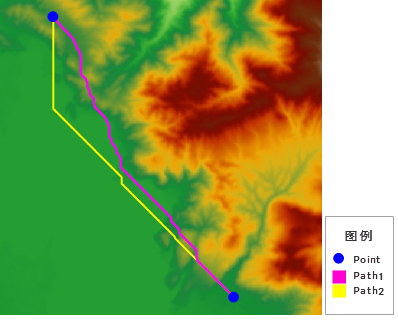
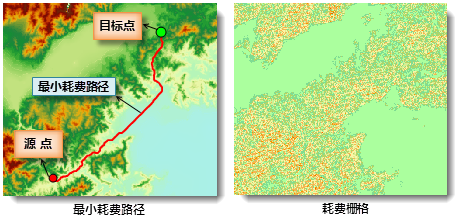

两点最短路径根据参数设置的不同，可分为两种不同的情况。

1. 只指定 DEM 栅格而未指定耗费栅格，即源数据为 DEM 栅格数据，则计算得到的结果为表面距离最短路径，可以通过计算[两点最短地表路径](TwoPointDis)功能实现。
2. 只指定耗费栅格而未指定 DEM 栅格，即源数据为耗费数据，则计算得到的结果为最小耗费路径，可以通过计算两点最小耗费路径功能实现。具体内容请参见下文的介绍。

下图为源点和目标点相同的情况下，计算两点最短地表路径和两点最小耗费路径的对比结果。

 

如图例所示，蓝色点为计算路径的起始点和终止点，Path1为只指定 DEM 栅格计算得到的表面距离最短路径；Path2为只指定耗费栅格得到的最小耗费路径。

###  使用说明

计算指定的源和目标点之间（两个点）的最小耗费路径，即沿耗费栅格表面的最短路径。

除了指定源点和目标点外，还需要设置其他参数。包括：

* 耗费栅格、结果数据保存的数据源和数据集的名称。这些参数为必需的参数。
* 结果路线的光滑方法和光滑度。

###  功能入口

* **空间分析** 选项卡-> **栅格分析** 组-> **距离栅格** 下拉按钮->“**两点最小耗费路径** 。
* **工具箱** -> **栅格分析** -> **距离栅格** -> **两点最小耗费路径** 。(iDesktopX) 

###  参数说明

* **耗费数据** ：计算距离时使用的耗费栅格。耗费栅格用于确定经过每个单元格所需的成本。
* **参数设置** ：可以设置光滑处理参数，为生成的结果路径进行光滑处理。 
  * **光滑方法** ：SuperMap 提供两种光滑处理的方法，“B 样条法”和“磨角法”。有关光滑方法的说明请参见[光滑方法说明](../../../DataProcessing/Vector/SmoothMeth)。
  * **光滑系数** ：光滑系数的取值与光滑方法有关，当光滑方法为 B 样条法时，光滑系数的值小于 2 时将不会进行光滑；当采用磨角法时，光滑系数的值设置为大于等于 1 时有效。一般来说，光滑系数的值越大，则光滑度越高。
* **障碍面参数设置** ：支持设置障碍面，可在分析时添加更多的障碍影响因素，使分析结果更符合实际需求。例如计算两点最小耗费路径时，需要绕过路径中的湖泊，即可将湖泊面作为障碍面。详细信息请参看[计算两点最短地表路径](TwoPointDis)页面的相关描述。

* **结果数据** ：选择结果数据要保存的数据源，并指定结果数据集名称。

下图为计算两点间最小耗费路径的实例。该例以 DEM 栅格的坡度的重分级结果作为耗费栅格，分析给定的源点和目标点之间的最小耗费路径。

  

### 注意事项

耗费数据中的栅格值必须都大于 0，才能分析成功，若耗费栅格数据中存在栅格值小于 0 的栅格，则会分析失败。