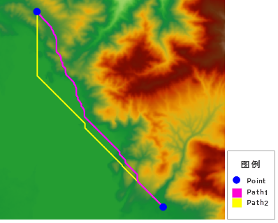
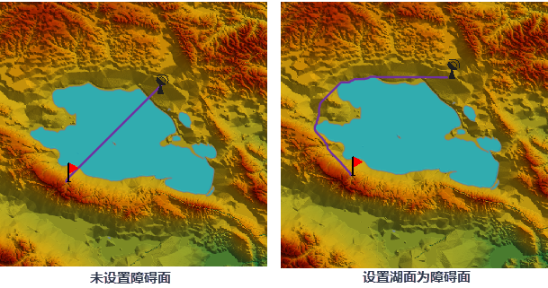

两点最短路径根据参数设置的不同，可分为两种不同的情况。

  1. 只指定 DEM 栅格而未指定耗费栅格，即源数据为 DEM 栅格数据，则计算得到的结果为表面距离最短路径，可以通过计算两点最短地表路径功能实现。具体内容请参见下文的介绍。
  2. 只指定耗费栅格而未指定 DEM 栅格，即源数据为耗费数据，则计算得到的结果为最小耗费路径，可以通过计算[两点最小耗费路径](TwoPointCostDis.htm)功能实现。

下图为源点和目标点相同的情况下，计算两点最短地表路径和两点最小耗费路径的对比结果。

  
---  
图：两点最短路径结果

如图例所示，蓝色点为计算路径的起始点和终止点，Path1为只指定 DEM 栅格计算得到的表面距离最短路径；Path2为只指定耗费栅格得到的最小耗费路径。

### 使用说明

计算指定的源和目标点之间（两个点）的最短地表路径，即源点和目标点之间，沿栅格表面起伏的地表距离。

除了指定源点和目标点外，还需要设置其他参数。包括：

  * 表面距离栅格、结果数据保存的数据源和数据集的名称。这些参数为必需的参数。
  * 结果路线的光滑方法和光滑度。

### 操作步骤

  1. 在“ **空间分析** ”选项卡上的“ **栅格分析** ”组中，单击“ **距离栅格** ”下拉按钮，在弹出的下拉菜单中选择“ **两点最短地表路径** ”项，弹出“ **两点最短路径** ”对话框。
  2. 选择地形数据。此地形数据提供了计算距离的高程信息。
  3. 参数设置。可以设置光滑处理参数，以及最大上坡和下坡角度。设置最大上坡角度和最大下坡角度可以使分析得到的路线不经过比较陡峭的地形。 
  * **光滑方法** ：SuperMap 提供两种光滑处理的方法，“B 样条法”和“磨角法”。有关光滑方法的说明请参见[光滑方法说明](../../../DataProcessing/Vector/SmoothMeth.htm)。
  * **光滑系数** ：光滑系数的取值与光滑方法有关，当光滑方法为 B 样条法时，光滑系数的值小于 2 时将不会进行光滑；当采用磨角法时，光滑系数的值设置为大于等于 1 时有效。一般来说，光滑系数的值越大，则光滑度越高。
  * **最大上坡角度** ：上坡角度即上坡方向与水平面的夹角。当实际上坡角度大于最大上坡角度时，则不会考虑此行进方向，计算的最短路径不会经过该像元所在的位置。默认最大上坡角度为90°，即不受上坡角度的限制。
  * **最大下坡角度** ：下坡角度即下坡角度与水平面的夹角。同样，当实际下坡角度大于最大下坡角度时，则也不会考虑此行进方向，即计算的最短路径不会经过该像元所在的位置。默认最大下坡角度为90°，即当前分析不受下坡角度的限制。

注意：如果设置了最大上（下）坡角度，有可能得不到分析结果，可能在输入的地形数据中不存在满足条件的路径。

如下图所示为使用相同的源点和目标点，不同的上坡角度和下坡角度的分析结果。

|   

  4. **障碍面参数设置** ：支持设置障碍面，可在分析时添加更多的障碍影响因素，使分析结果更符合实际需求。例如计算两点最短地表路径时，需要绕过路径中的湖泊，即可将湖泊面作为障碍面。 

可通过选择数据集、绘制面、选择面三种方式设置障碍面：

  * **数据集** ：选择当前工作空间中指定数据源中的面数据集作为障碍面数据。
  * **绘制面** ：勾选“自定义区域”项，可在当前源数据集上通过鼠标绘制面对象，并将其作为障碍面。 
  * **选择面** ：若当前地图窗口中有面图层，则可激活下拉选项中的“选择面”选项，在当前地图窗口中选择一个面对象后，即可将选中面对象作为障碍面数据。 

**注意** ：当选择数据集或选择面对象作为障碍面时，选择的面数据集的坐标系需与源数据坐标系一致。

如下图所示，不选择障碍面与选择湖泊对象作为作为障碍面，得到的对比结果图。

  

  5. 设置结果数据。选择结果数据要保存的数据源，并指定结果数据集名称。
  6. 单击“确定”按钮，执行操作。单击“取消”按钮，退出当前对话框。

  

