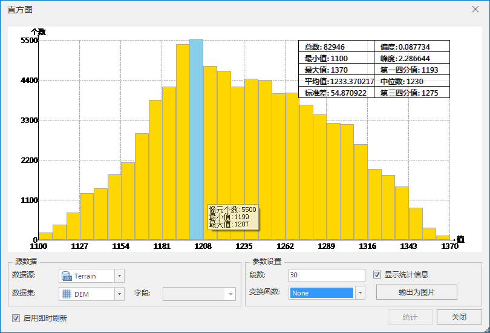

应用程序提供了直方图功能，方便使用者查看采样点的分布情况。单击“ **空间分析** ”选项卡的“ **栅格分析** ”组中的“ **直方图**
”按钮，即可查看采样数据的直方图。

直方图，又叫频率分布直方图，提供了采样点数据的某一个字段分组后的频率分布图并汇总了统计数据。每一个柱状条的面积代表了位于特定分区间或者某一分组内的相对频数。直方图中默认使用的等宽类数目。下图显示了一个数据集的某一个字段的频率分布（15个分组）：

  
 
  
通过使用直方图，可以检查样点分布的形状。通过观察汇总的统计信息可以了解数据的位置分布、形状、离散度等等。例如通过对比均值和中位数的统计结果，可以方便地定位样点分布的中心位置。当均值和中位数非常接近的时候，可以认为该数据呈正态分布。

### “直方图”对话框说明

对话框的上部的图表区主要用来显示直方图和统计信息，下部用来设置直方图的统计的数据和参数。

**图表区**

直方图的横轴（X 轴）代表了每个样点的取值情况，纵轴（Y 轴）代表了样点个数。直方图右上角显示了所有样点的统计结果，统计内容包括样点总数、最小值、最大值、平均值、标准差、峰度、第一四分值、中位数、第三四分值共10项内容。

**源数据**

- **数据源** ：列出了当前工作空间中所有的数据源，选择待分析的点数据集所在的数据源。

- **数据集** ：列出了源数据源中所有的点数据集，选择一个点数据集作为分析数据集。

- **字段** ：选择点数据集的一个字段作为分析字段。要求该字段中属性信息不能为空。否则会弹出提示"属性值存在空值，不能进行统计。"

**参数设置**

- **段数** ：输入一个正整数作为统计分析段数即直方数。

- **变换函数**：即对字段值做变换处理的函数，系统提供了NONE（无函数，即不进行变换处理）、LOG（对数函数）、ARCSIN（反正弦函数）三种变换处理函数。变换函数在对样点数据进行插值的时候，有一些插值方法（比如普通克吕金、简单克吕金和泛克吕金等）都假设数据服从正态分布。如果样点数据不服从正态分布，需要先进行数据变换，从而使数据服从正态分布。三种变换处理函数说明如下：
  * **None** ：无函数，即不进行变换处理，使用原始数据进行插值。
  * **Log** ：对数函数，即对原始数据进行以自然对数为底的对数变换。对数变换适用于呈正偏分布，即峰值靠左，即中位数大于中值的样点数据。对数函数的定义域为大于0的实数，因此在进行 log 函数变化时，请保证满足该条件。
  * **Arcsin** ：反正弦函数，即对原始数据进行反正弦变换。反正弦函数适用于数据成比例或者按百分比分布的数据。此函数的定义域范围为[-1,1]，因此在进行反正弦函数变换时，请注意统计字段的取值范围。

- **显示统计信息** ：选中该复选框则直方图的统计信息将在对话框的右上角显示。当不选中该复选框时，不会显示统计信息。

**统计信息**

* **总数** ：点数据集对象的总数。
* **最小值/最大值/平均值/标准差** ：直方图中统计结果的最小值/最大值/平均值/标准差。
* **偏度** ：是用来描述分布的对称性。如果是对称分布，该值为0；如果分布曲线向左倾斜，该值为正，此时平均值大于中位数；如果分布曲线向右倾斜，该值为负，此时平均值小于中位数。
* **峰度** ：是用来描述分布产生离群值可能性大小的指标。正态分布时，该值为3；分布呈尖顶状时，该值大于3；分布呈扁平状时，该值小于3。
* **第一四分值/第三四分值** ：分别相当于累积比例的0.25倍和0.75倍。即所有数据按递增排序，第一四分值表示排序数据中位于1/4处的值，而第三四分值表示排序数据中位于3/4处的值。
* **中位数** ：分别相当于累积比例的0.5倍。即所有数据按递增排序，中位数表示排序数据中位于1/2处的值。如果数据量为偶数，则有两个中位数，在此取第一个中位数作为该值。

**输出为图片** ：将直方图输出为图片，支持的图片格式包括：bmp、emf、eps、jpg、png 和 tif 等多种格式。

###  备注

当鼠标滑过或者选中直方图中某一段柱状条时，会实时显示该段柱状条的信息，包括该段数据包含的对象以及最小/最大值。

  * **对象个数** ：选中直方的对应点对象的个数。
  * **最小值/最大值** ：选中直方统计结果的最小值/最大值。

