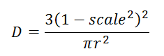
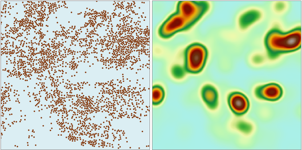

### 使用说明

核密度分析用于计算点、线要素测量值在指定邻域范围内的单位密度。简单来说，它能直观的反映出离散测量值在连续区域内的分布情况。其结果是中间值大周边值小的光滑曲面，栅格值即为单位密度，在邻域边界处降为0。

核密度分析可用于计算人口密度、建筑密度、获取犯罪情况报告、旅游区人口密度监测、连锁店经营情况分析等等。例如：

* 某街区分布了多栋高层公寓及住宅，已知每栋的入住人数，想要了解街区内各处的人口分布情况，即可使用此功能，相当于将每栋楼的人口数量以核函数的变化趋势分布到指定的圆形邻域内，重叠区域进行加和，最后得到街区内各处的人口密度。而人口密度结果可用于店铺选址决策、犯罪率估算等。
* 某地区有多家店面的连锁零售店，假定顾客会根据路程的远近来选择光顾哪家店面，假定任何一个顾客总是会选择最近的那家店面。根据顾客到店面的距离字段，得出各个店面顾客分布情况的栅格面。
* 某地区准备修建道路（或者公用设施管线），可根据道路（或管线）对野生动物栖息地的影响字段，计算道路（管线）对野生动物栖息地造成影响。

### 工作原理

核密度分析使用的核函数为：

  
---  

其中，r 为查找半径，scale 为栅格中心点到点、线对象的距离与查找半径的比例。

对于点对象，其核密度曲面与下方的平面所围成的空间的体积近似于此点的测量值；对于线对象，其核密度曲面与下方的平面所围成的空间的体积近似于此线的测量值与线长度的乘积。点或线的邻域叠加处，其密度值也相加。每个输出栅格的密度均为叠加在栅格上的所有核曲面值之和。

结果栅格值的单位为原数据集单位的平方的倒数，即若原数据集单位为米，则结果栅格值的单位为每平方米。注意对于地理坐标数据集，结果栅格值的单位为“每平方度”，是没有实际意义的。

### 操作步骤

1. 打开“ExerciseData/RasterAnalysis”文件夹下的 **Shop** 数据源，其中有某连锁店的会员在某地的分布情况 Shop 点数据集，我们用此数据来做示例。
2. 在“ **空间分析** ”选项卡上的“ **栅格分析** ”组中，单击“ **密度分析** ”下拉按钮，在下拉选项中选择“核密度分析”项，即可弹出“核密度分析”对话框。

3. 在“核密度分析”对话框中，需要设置相关参数，包括源数据、分析范围和结果数据，各参数的具体说明如下所示： 

**源数据**

* **数据源** ：选择要进行核密度分析的数据集所在的数据源。
* **数据集** ：选择要进行核密度分析的数据集。系统自动过滤选中的数据源下的数据集，只显示该数据源下的点数据集和线数据集。
* **密度字段** ：选择要进行核密度分析的相关字段，自动过滤掉非数值型字段。因此在进行分析前，选择的数据集要有相关字段才可以进行分析。
* **查找半径** ：指定半径范围内所有的采样点都参与栅格单元的密度运算。

**分析范围**

用于显示和设置核密度分析范围。默认为数据集范围。

* **选择面** ：单击“选择面”按钮，可在当前地图窗口中选择一个面对象作为分析范围。
* **重置** ：单击“重置”按钮，可将分析范围重置为数据集范围。
* **复制粘贴** ：单击“ **复制** ”按钮可复制当前设置的范围，在支持粘贴的范围设置处单击“粘贴”按钮，即可将复制范围的左、下、右、上值设置到当前范围。

**结果数据**

* **数据源：** 选择核密度分析结果要保存的数据源。
* **数据集：** 输入核密度分析结果要保存的数据集名称。如果输入的数据集名称已经存在，则会提示数据集名称非法，需要重新输入。
* **分辨率：** 输入核密度分析结果的分辨率，即单个像元所对应的地面面积大小，单位与数据集单位一致。
4. 单击“完成”按钮，即可执行核密度分析功能。下图为某连锁店会员推广情况分布图：
  
     

从分析结果可以看出，该连锁店的会员在颜色较深处分布比较密集，而在颜色较浅处分布相对稀疏。

