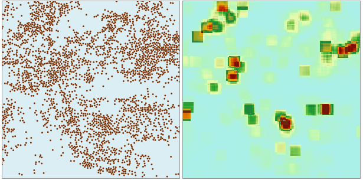

###  使用说明

简单点密度分析用于计算每个点的指定邻域形状内的每单位面积量值。计算方法为点的测量值除以指定邻域面积，点的邻域叠加处，其密度值也相加，每个输出栅格的密度均为叠加在栅格上的所有邻域密度值之和。

结果栅格值的单位为原数据集单位的平方的倒数，即若原数据集单位为米，则结果栅格值的单位为每平方米。

注意：对于地理坐标数据集，结果栅格值的单位为“每平方度”，是没有实际意义的。

打开“ExerciseData/RasterAnalysis”文件夹下的 **Shop** 数据源，其中有某连锁店的会员在某地的分布情况 Shop
点数据集，我们用此数据来做示例。

###  功能入口

  * **空间分析** 选项卡-> **栅格分析** 组-> **密度分析** -> **简单密度分析** 。
  * **工具箱** -> **栅格分析** -> **密度分析** -> **简单密度分析** 。(iDesktopX) 

###  参数说明

  * **源数据**
    * **数据源** ：选择要进行简单密度分析的数据集所在的数据源。
    * **数据集** ：选择要进行简单密度分析的数据集。系统自动过滤选中的数据源下的数据集，只显示该数据源下的点数据集。
    * **密度字段** ：选择要进行简单密度分析的相关字段，自动过滤掉非数值型字段。因此在进行分析前，选择的数据集要有相关字段才可以进行分析。
  * **分析范围**：用于显示和设置核密度分析范围。默认为数据集范围。
    * **选择面** ：单击“选择面”按钮，可在当前地图窗口中选择一个面对象作为分析范围。
    * **重置** ：单击“重置”按钮，可将分析范围重置为数据集范围。
    * **复制粘贴** ：单击“ **复制** ”按钮可复制当前设置的范围，在支持粘贴的范围设置处单击“粘贴”按钮，即可将复制范围的左、下、右、上值设置到当前范围。
  * **结果数据**
    * **数据源：** 选择简单密度分析结果要保存的数据源。
    * **数据集：** 输入简单密度分析结果要保存的数据集名称。如果输入的数据集名称已经存在，则会提示数据集名称非法，需要重新输入。
    * **分辨率：** 输入简单密度分析结果的分辨率，即单个像元所对应的地面面积大小，单位与数据集单位一致。
  * **邻域设置**
    * **邻域形状**：用于显示和设置点对象进行密度分析的邻域形状，提供了矩形、圆形、圆环、扇形四种形状，选择不同的邻域形状，需设置的相关参数略有不同，如下所述： 
      * **矩形** ：若将邻域形状设置为矩形，则需设置矩形的宽度和高度。
      * **圆形** ：若将邻域形状设置为圆形，则需设置圆形的半径。
      * **圆环** ：若将邻域形状设置为圆环，则需设置圆环的环形内径和环形外径大小。
      * **扇形** ：若将邻域形状设置为扇形，则需设置扇形的起始角度、终止角度和扇形半径，起始角度和终止角度的值域为[0，360]。
    * **单位类型**：应用程序提供了行列数和地理坐标两种，行列数即栅格像元，默认为3个像元；地理坐标则表示与数据集单位一致，默认为数据集范围边长的二十分之一。

下图为某连锁店会员推广情况分布图：

  

从分析结果可以看出，该连锁店的会员在颜色较深处分布比较密集，而在颜色较浅处分布相对稀疏。
