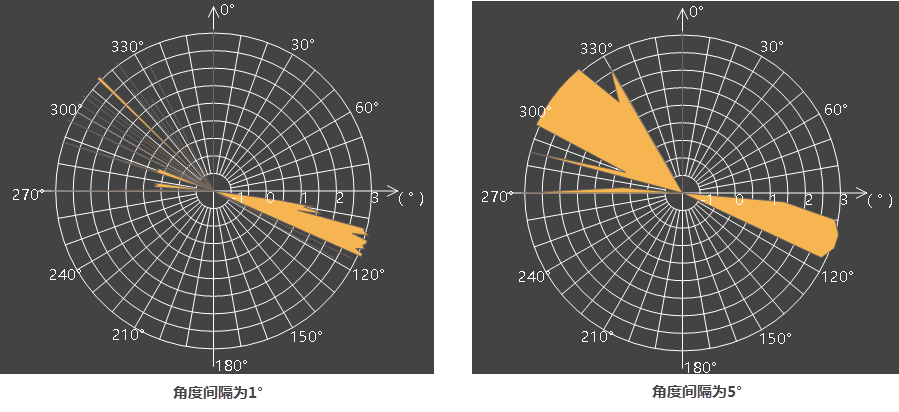

雷达站点分析提供了分析遮蔽角、功效域、可视域三个功能，可为雷达基站选址和设计提供一定的参考数据。

###  数据准备

提前配置好地图，雷达站点分析结果可直接展示结果图，在使用该功能前，可先[下载雷达示范数据Radar.rar](img/Radar.rar)，也可使用或导入用户数据进行分析。

**Radar示范数据说明：**

* **Jingjin数据源** ：数据源中包含了雷达基站点数据和地形数据，雷达基站点数据集，包含雷达架高、功效范围、俯仰角、校对常数、角度间隔等属性信息；地形数据为包含雷达功效范围在内的栅格数据（如DSM、DEM）。用户也可导入或打开自己的雷达基站和地形数据， **注意** ：雷达基站数据与地形数据的坐标系需保持一致。
* **专题图数据源** ：包含了地图中需要的数据，分析结果会自动保存到“专题图”数据源中。
* **地图** ：提供了预定义好的结果地图，便于分析结果图的浏览与打印。

###  共有参数设置

1. **雷达数据** ：设置雷达基站点数据集后，单击“雷达”组合框下拉按钮，选择雷达点数据中的一个基点进行分析。
2. **地形数据** ：选择包含雷达功效范围在内的栅格数据。
3. **雷达属性**
  * **X/Y** ：显示所选雷达站点的坐标，也可调整坐标后再进行分析。
  * **海拔** ：根据雷达站点坐标，从指定的地形数据中自动获取站点的海拔。
  * **雷达架高** ：显示和设置雷达天线离地面的高度，默认值为雷达基站属性表RackHigh字段值。
  * **功效半径** ：显示和设置该基站雷达的功效半径，功效半径是指雷达能探测到目标物的最大作用距离。默认值为雷达基站属性表EfficacyScope字段值。
  * **俯仰角** ：显示和设置雷达天线中心位置与水平方向的夹角。默认值为雷达基站属性表PitchAngle字段值。
  * **校对常数** ：用于校正雷达遮蔽角的结果，若计算出来的雷达架高为β，校对常数为n度，则输出的遮蔽角结果为β+n度。 **注意：** 校对常数只对“雷达遮蔽角”功能生效。
  * **角度间隔** ：结果输出时方位角的采样间隔，若设置为5，则表示每间隔5度进行结果采样，即0°、5°、10°、15°……355°方向上分别进行结果采样。  
  
    

### 相关主题

 [雷达遮蔽角](RadarShieldingAngle)

 [雷达功效域](RadarPowerDomain)

 [雷达可视域](RadarVisibleArea)
