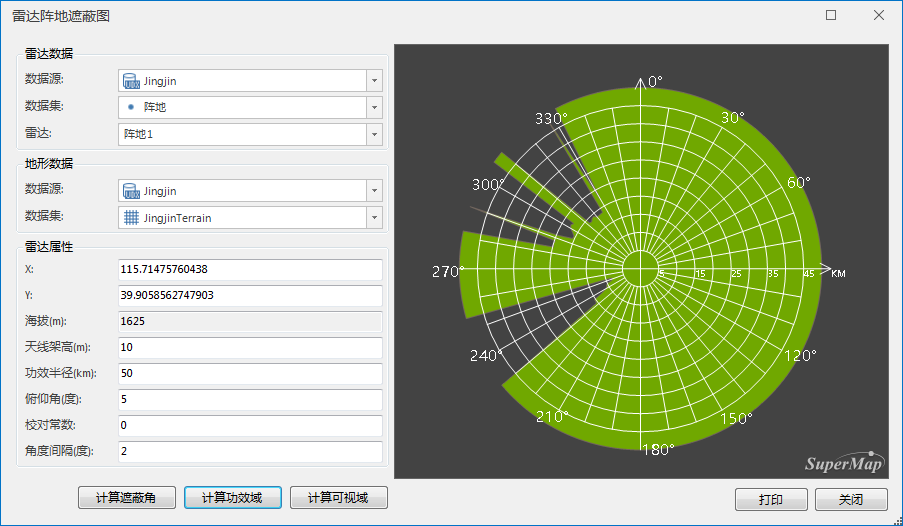
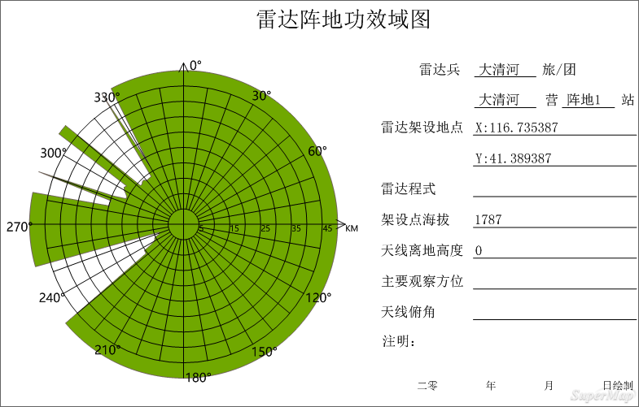

雷达功效域是指雷达能发现目标的空间范围，根据雷达作用距离、俯仰角以及地形数据等，分析雷达的探测范围，结果图会展示指定方位角的功效域。可用于分析重要区域是否在雷达探测范围内，为雷达站的点位和天线高度提供设计依据。

###  操作步骤

1. 数据准备：用户可使用自己的数据进行分析，也可下载示范数据，请参见雷达基站分析页面中[数据准备](RadarAnalyst)。
2. **空间分析** -> **栅格分析** -> **表面分析** -> **雷达功效域** ，即可弹出“雷达阵地遮蔽图”对话框。
3. 参数设置的详细说明请参见：[公共参数设置](RadarAnalyst)。
4. 单击“计算功效域”按钮，即可开始分析雷达的探测范围，全方位计算完之后再根据角度间隔输出指定方向上的结果，分析结果图会在对话框右侧显示，如下图所示：   
5. 功效域结果支持直接打印出图，单击对话框中的“打印”按钮，可将功效域结果地图输出为PDF文件。参数设置如下： 
  * 文件名称：设置PDF文件的保存路径和名称。
  * 分辨率：输出分辨率或输出图像的 DPI（每英寸点数）。值越高通常图像越清晰，但随着DPI值的增大，输出PDF的文件大小和处理时间也会显著增加。默认情况下，输出DPI值为96。 
  * 背景透明：勾选该复选框，则输出PDF文件中地图的背景透明。

   

###  备注

* 切换雷达基站后，右侧计算结果图将清除，不会保留前一次的计算结果。
 * 分析结果图为地图中的“雷达功效域”。

###  相关主题

 [雷达遮蔽角](RadarShieldingAngle)

 [雷达可视域](RadarVisibleArea)
