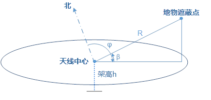
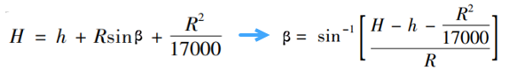
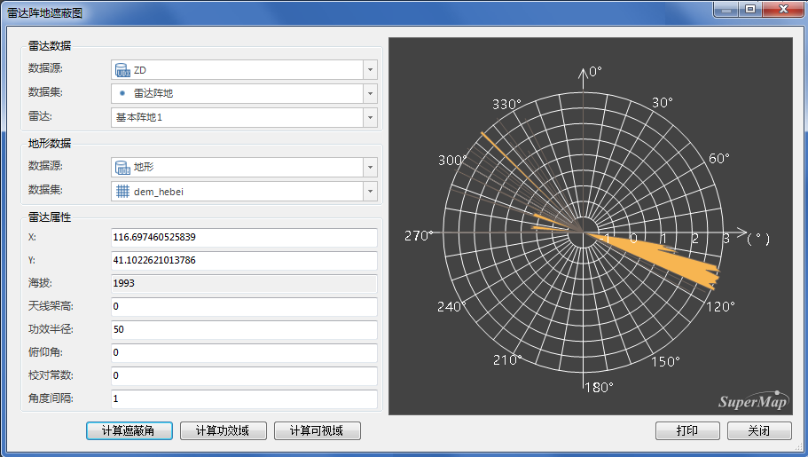
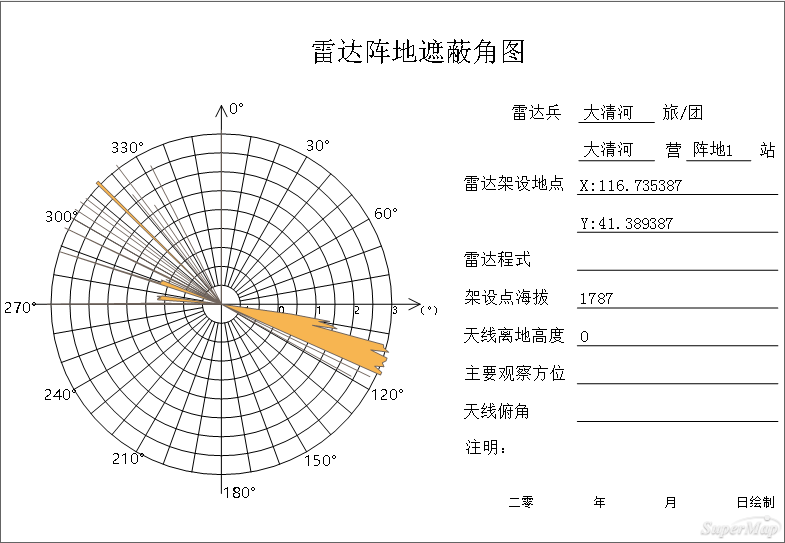

雷达遮蔽角是指在某个方向上发现目标、影响雷达探测的最小角度（与水平方向的夹角），能够为雷达站的点位和天线高度提供设计依据。SuperMap iDesktop
可快速、准确地计算出气象雷达各方向的最大遮蔽角，并输出雷达遮蔽角图。雷达遮蔽角图是区域内所有方向上的雷达遮蔽角的集合，绘制雷达遮蔽角图是雷达选址以及掌握雷达站周边遮蔽状况的一项重要工作。雷达遮蔽角的计算是雷达基站建设和运行的前提与基础，是军事上通视分析的典型应用。
 
###  计算原理

根据输入的雷达天线中心位置高度信息，得到观测点的坐标。以1°为方位角(φ)的分辨率，从该观测点向四周发射出360条射线，正北方向的射线作为方位角的0°，方位顺时针增加，依次为1°～359°。

根据高精度地形数据依次计算每个方位上的遮蔽角，对于任一方位角 ，统计所有方位上的遮蔽角，从中提取最大的遮蔽角作为方位角γ处的遮蔽角。

遮蔽角为下图中的β，单位为度( °) ; H 为阻挡地物的高度， 单位为 km; h 为天线离地面的高度(即架高)， 单位为 km; R 为测站到地物的斜距， 单位为 km。

  

  
因此，在标准大气时的雷达遮蔽角的计算公式如下：

  
  
###  操作步骤

1. 数据准备：用户可使用自己的数据进行分析，也可下载示范数据，请参见雷达基站分析页面中[数据准备](RadarAnalyst)。
2. **空间分析** -> **栅格分析** -> **表面分析** -> **雷达遮蔽角** ”，即可弹出“雷达阵地遮蔽图”对话框。
3. 参数设置的详细说明请参见：[公共参数设置](RadarAnalyst)。
4. 单击“计算遮蔽角”按钮，即可开始计算雷达功效范围内的遮蔽角，全方位计算完之后再根据角度间隔输出指定方向上的结果，分析结果图会在对话框右侧显示，如下图所示：   
5. 遮蔽角结果支持直接打印出图，单击对话框中的“打印”按钮，可将遮蔽角结果地图输出为PDF文件。参数设置如下： 
   * 文件名称：设置PDF文件的保存路径和名称。
   * 分辨率：输出分辨率或输出图像的 DPI（每英寸点数）。值越高通常图像越清晰，但随着DPI值的增大，输出PDF的文件大小和处理时间也会显著增加。默认情况下，输出DPI值为96。 
   * 背景透明：勾选该复选框，则输出PDF文件中地图的背景透明。

  
  
###  备注

* 切换雷达基站后，右侧计算结果图将清除，不会保留前一次的计算结果。
* 分析的结果图为地图中的“雷达遮蔽角”。

### 相关主题

 [雷达功效域](RadarPowerDomain)

 [雷达可视域](RadarVisibleArea)
