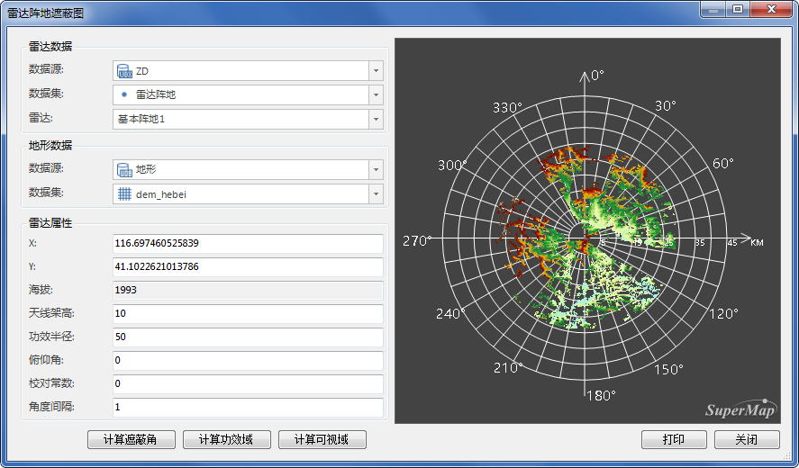
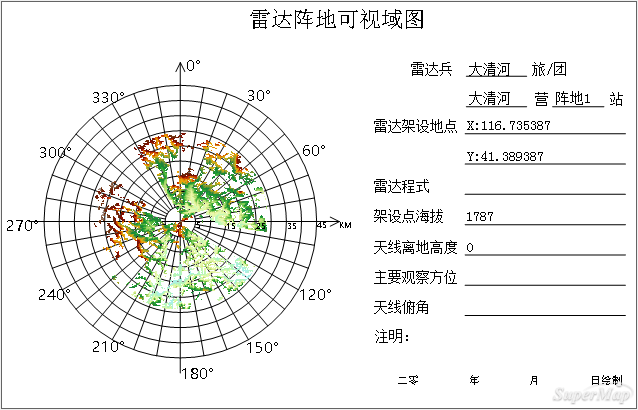

雷达可视域分析是以指定的雷达基站作为观察点，根据地形数据以及基站海拔、雷达架高等参数，分析雷达功效半径范围内的可视域，分析结果为栅格数据。

###  操作步骤

1. 数据准备：用户可使用自己的数据进行分析，也可下载示范数据，请参见雷达基站分析页面中[数据准备](RadarAnalyst)。
2. **空间分析** -> **栅格分析** -> **表面分析** -> **雷达可视域** ”，即可弹出“雷达阵地遮蔽图”对话框。
3. 参数设置的详细说明请参见：[公共参数设置](RadarAnalyst)。
4. 单击“计算功效域”按钮，即可开始分析雷达的探测范围，全方位计算完之后再根据角度间隔输出指定方向上的结果，分析结果图会在对话框右侧显示，如下图所示：    
5. 功效域结果支持直接打印出图，单击对话框中的“打印”按钮，可将遮蔽角结果地图输出为PDF文件。参数设置如下： 
  * 文件名称：设置PDF文件的保存路径和名称。
  * 分辨率：输出分辨率或输出图像的 DPI（每英寸点数）。值越高通常图像越清晰，但随着DPI值的增大，输出PDF的文件大小和处理时间也会显著增加。默认情况下，输出DPI值为96。 
  * 背景透明：勾选该复选框，则输出PDF文件中地图的背景透明。

  

###  备注

* 切换雷达基站后，右侧计算结果图将，不会保留前一次的计算结果。
* 分析的结果图为地图中的“雷达可视域”。

###  相关主题

 [雷达遮蔽角](RadarShieldingAngle)

 [雷达功效域](RadarPowerDomain)
