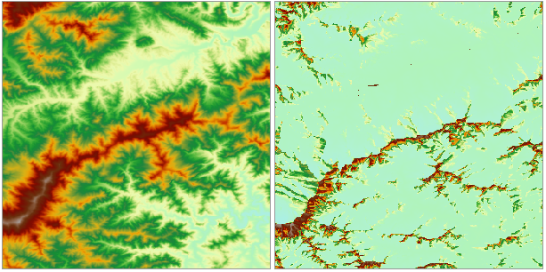

### 使用说明

太阳辐射分析功能可以针对特定时间段太阳对某地理区域的影响进行制图和分析。获得分析区域的太阳总辐射、直接太阳辐射、散射太阳辐射和直射持续时间的栅格图。这将考虑大气效应、地点的纬度和高程、坡度、坡向、太阳角度的日变化和季节性变化以及周围地形投射的阴影所带来的影响。

在景观尺度上，地形是决定日照的空间变化性的一个重要因素。不同位置在高程、方向（坡度和坡向）及地形要素投射的阴影等方面存在的差别，会对接收到的日照量产生影响。这种差异还将随一天和一年中时间的不同而发生变化，从而导致气候的不同，其中包括空气和土壤温度状况、蒸发量、积雪融化模式、土壤湿度以及可用于光合作用的光等因素。

入射的太阳辐射穿过大气层时会发生直射、散射、反射等，然后由于地形和表面要素进一步发生改变，最后在地球表面被分别截取成直射部分、散射部分和反射部分。直接辐射是源自阳光的畅通无阻的直光线；散射辐射则是由于被大气中的云和尘埃等成分分散；反射辐射则是经过表面要素的反射。直射、散射和反射辐射的总和称为太阳辐射总量。

太阳辐射分析对了解特定地理位置的日照量对各种领域中的应用都很有帮助，如农业、资源管理、气象、土木工程和生态研究等。具体应用如下：

* 某一区域在某一时间段内接受的日照量有助于新滑雪场选址，还有助于为需要特殊小气候条件以达到最佳生长状态的特种作物选择最佳种植位置。
* 在城市规划中，太阳总辐射量可作为选址适宜性分析的重要因素。
* 分析某区域指定时间段的直接辐射量、散射辐射量及直射持续时间，综合考虑这几方面因素，从而确定在这个区域内最适宜种植苹果（或其他农作物）的位置。

### 功能入口

* **空间分析** 选项卡-> **栅格分析** 组-> **太阳辐射** 。
* **工具箱** -> **栅格分析** -> **太阳辐射** 。(iDesktopX) 

### 参数说明

  * **地形数据** ：选择需进行太阳辐射分析的 DEM 数据集所在的数据源，及其 DEM 数据集。
  * **分析类型** ：太阳辐射分析支持分析一段时间或一天内的太阳辐射，分为年辐射分析和日辐射分析两种类型。 
    * **年辐射分析** ：单击选中“年辐射分析”单选框，即表示分析一年中指定时间段内的太阳辐射，可设置起始时间、终止时间和采样间隔。注意：年辐射分析与年份无关，设置起始时间和终止时间时，只需选择月份和日期即可，不考虑年份。 
      * 起始时间：可在右侧文本框中直接输入月份和日期，或单击下拉按钮选择分析的起始日期。
      * 终止时间：可在右侧文本框中直接输入月份和日期，或单击下拉按钮选择分析的终止日期。注意：若起始时间大于终止时间，则时间计算将进行到下一年。
      * 采样间隔(天)：用于设置采样间隔的天数，默认为 14 天，即每14天计算一次该区域的太阳辐射。
      * 采样间隔(小时)：用于设置采样间隔的小时数，默认为 1 小时，即每 1 小时计算一次该区域的太阳辐射。
    * **日辐射分析** ：单击选中“日辐射分析”单选框，在右侧文本框中直接输入具体的月份和日期，或单击下拉按钮选择日期，即可分析某一天中指定时间段内的太阳辐射，可设置起始时间、终止时间和采样间隔。 
      * 起始时间：可在右侧文本框中直接输入小时和分钟，或通过右侧按钮进行设置，默认起始时间为00:00。
      * 终止时间：可在右侧文本框中直接输入小时和分钟，或通过右侧按钮进行设置，默认终止时间为23:59。注意：终止时间必须要大于起始时间，不会跨天进行分析。
      * 采样间隔(小时)：用于设置采样间隔的小时数，默认为 0.5 小时，即每 0.5 小时计算一次该区域的太阳辐射。
  * **辐射参数**处可设置太阳辐射分析所需的两个重要参数，即区域纬度、透射率： 
    * **区域纬度** ：用于显示和设置分析区域的中心纬度，值域为[-90，90]。太阳辐射分析过程中需要根据分析区域的中心纬度来计算太阳位置和太阳高度。因为太阳辐射分析是在景观尺度和局部尺度下执行，所以可以为整个 DEM 使用一个纬度值，对于更广的地理区域，建议将研究区域按纬度分割为不同的区域分别进行分析。 

若 DEM 数据为平面坐标系，则需要用户根据分析区域所处的位置进行设置；若 DEM 数据为地理坐标系或投影坐标系，且地理位置正确，则会自动获取DEM数据的中心纬度，不支持设置，若其纬度范围有误，则需要用户手动输入。

  * **透射率：** 透射率是指到达地球表面的能量（所有波长的平均值）与大气上边缘接收到的能量（大气圈外）的比率。值的范围为 0 到 1，0 表示无透射，1 表示完全透射。通常，在天空非常晴朗的条件下，观测值为 0.6 或 0.7；在天空普通晴朗的条件下，观测值为 0.5。
  * **高程缩放系数** ：当地形栅格值（即高程值）的单位与 x，y 坐标的单位不相同时，通常需要将高程值乘以一个高程缩放系数，使得三者单位一致。例如，X、Y 方向上的单位是米，而 Z 方向的单位是英尺，由于 1 英尺等于 0.3048 米，则需要指定缩放系数为 0.3048。如果设置为 1，表示不缩放。 

建议进行分析的数据为投影坐标系统（单位：米）。如果选择使用球坐标系运行分析，需要为该纬度指定一个适当的 z 因子。如果 x,y 单位是经纬度而 z 单位是米，则可使用下表列出的某些适当的 z 因子：     
                
  ```  
  Latitude     Z-factor
     0         0.00000898  
     10         0.00000912  
     20         0.00000956  
     30         0.00001036  
     40         0.00001171  
     50         0.00001395  
     60         0.00001792  
     70         0.00002619  
     80         0.00005156  
  ```
        
        

*  **结果栅格** ”可设置要保存的结果数据集合数据集名称，以及结果数据要保存到的数据源。 
    - **数据源：** 选择结果数据要保存的数据源。
    - **总辐射量** ：用于显示设置总辐射量栅格数据集的名称，默认为 TotalDatasetGrid。
    * **直射辐射量** ：勾选“直射辐射量”复选框，表示结果会生成分析区域的直射辐射量栅格数据。可在右侧文本框中设置直射辐射量数据集的名称，默认为 DirectDatasetGrid。
    * **散射辐射量** ：勾选“散射辐射量”复选框，表示结果会生成分析区域的散射辐射量栅格数据。可在右侧文本框中设置散射辐射量数据集的名称，默认为 DiffuseDatasetGrid。
    * **直射持续时间** ：勾选“直射持续时间”复选框，表示结果会生成分析区域的在指定时间段中直射持续时间数据。可在右侧文本框中设置直射持续时间数据集的名称，默认为 DurationDatasetGrid。

  


###  注意事项

  1. 计算太阳辐射比较耗时， DEM 数据量较大时，可能需要数小时或更长的时间进行分析。
  2. 当选择的分析类型为日辐射分析时，分析的最大时间范围为一天，即 24 小时，不能跨天计算，所以起始时间必须小于终止时间。
  3. 当选择的分析类型为年辐射分析时，最大的天数范围为一年的总天数，起始日期可以大于终止日期。例如起始日期为10月1日，终止日期为1月31日，则分析的时间为10月1日至下一年的1月31日。

