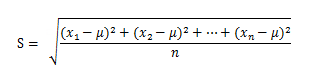

###  使用说明

根据输入的栅格数据计算每个像元的基本统计信息进行统计，同时还可以通过直方图直观地查看统计结果以及灰度信息。统计的内容包括:最大值、最小值、平均值、标准差、方差。

###  功能入口

  * **空间分析** 选项卡-> **栅格分析** 组-> **栅格统计** -> **基本统计** 。
  * **工具箱** -> **栅格分析** -> **栅格统计** -> **基本统计** 。(iDesktopX) 

###  参数说明

  * **源数据** ：选择要进行统计的栅格数据，包括数据所在的数据源和数据集。
  * **统计结果** ：执行统计后，在统计结果区域，显示基本统计的内容。包括最大值、最小值、平均值和标准差等。 
    * **最大值** ：查找栅格像元值中的最大值。
    * **最小值** ：查找栅格像元值中的最小值。
    * **平均值** ：统计栅格数据中所有像元值的平均值。
    * **标准差** ：统计栅格数据中所有像元值的标准差。标准差是各个统计数据偏离平均数的距离的平均数，能够反映数据的离散程度。标准差是方差的算术平方根。如下面的公式所示，x1,x2,x3,......xn 为一组样本数据，µ 为其平均值，则标准差公式计算方法如下：   
    * **方差** ：统计栅格数据中所有像元值的方差。方差是各个统计数据源与其平均数的差的平方和。
  * **直方图** ：查看当前栅格数据的直方图。关于直方图的介绍内容，请参见[栅格直方图](../Histograms)。