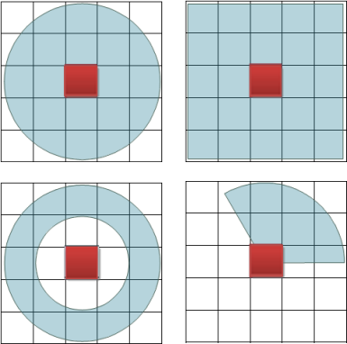
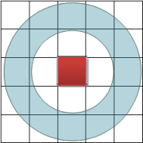
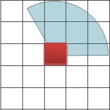

### 使用说明

邻域统计是对数据集中的每个像元值的邻域范围内的像元进行统计，即以待计算栅格为中心，向其周围扩展一定范围，基于这些邻域范围内的栅格数据进行统计计算，将运算结果作为像元的值。目前提供的统计方法包括：最大值、最小值、众数、最少数等。常用的邻域范围类型包括：矩形、圆形、圆环和扇形等。

下图为邻域统计的示意图，图中位于第二行第三列的单元格，它的值由其周围扩散得到的3*3（矩形邻域）的邻域内所有像元值来确定。

  

* **统计模式**：SuperMap 邻域统计提供了10种统计模式，分别如下：
    * **最小值** ：查找区域内栅格像元值的最小值。
    * **最大值** ：查找区域内栅格像元值的最大值。
    * **平均值** ：计算区域内所有栅格像元值的平均值。
    * **标准差** ：计算区域内所有栅格像元值的标准差。
    * **和** ：计算区域内栅格像元值之和。
    * **种类** ：统计区域内栅格像元值出现的个数。
    * **值域** ：计算区域内栅格像元值的范围，即区域内的最大值减去最小值。
    * **众数** ：统计区域内栅格像元值出现频率最高的数值。
    * **最少数** ：统计区域内栅格像元值出现频率最低的数值。
    * **中位数** ：区域内栅格像元值按照从小到大的顺序排列，处于最中间的数值。

* **邻域形状类型**：邻域统计过程中，对于邻域的设置有不同的方式，提供了四种邻域窗口，分别如下：
    * **矩形** ：矩形的大小由指定的宽度和高来确定，矩形范围内的像元参与邻域统计的计算。矩形邻域宽和高的默认值均为 0（单位为地理单位或栅格单位）。
    * **圆形** ：圆形邻域的大小根据指定的半径来确定，圆形范围内的所有像元都参与邻域处理（注意：只要像元有部分包含在圆形范围内都将参与邻域统计）。圆形邻域的默认半径为 3（单位为地理单位或栅格单位）。
    * **圆环** ：环形邻域的大小根据指定的外圆半径和内圆半径来确定，环形区域内的像元都参与邻域处理。环行邻域的默认外圆半径和内圆半径分别为3和6（单位为地理单位或栅格单位）。 
    * **扇形** ：扇形邻域的大小根据指定的圆半径、起始角度和终止角度来确定。在扇形区内的所有像元都参与邻域处理。扇形邻域的默认半径为 3（单位为地理单位或栅格单位），起始角度和终止角度的默认值分别为0度和360度。

四种形状如下图所示，默认邻域大小为3*3。图上单元格仅为示意。

|  |   
---|---  
 |  

###  功能入口

  * **空间分析** 选项卡-> **栅格分析** 组-> **栅格统计** -> **邻域统计** 。
  * **工具箱** -> **栅格分析** -> **栅格统计** -> **邻域统计** 。(iDesktopX) 

###  参数说明

  * **源数据** ：选择要进行统计的源数据（栅格数据），包括栅格数据所在的数据源和数据集。
  * **参数设置** ：设置邻域统计的相关参数，包括统计模式、单位类型和邻域形状。 
    * **统计模式** ：选择使用的统计模式，一共有10种类型可选。包括最小值、最大值、平均值、标准差、和、种类、值域、众数、最少数和中位数。
    * **单位类型** ：选择进行统计时使用的单位类型。目前支持2种单位类型，包括栅格坐标和地理坐标。栅格坐标是指使用栅格数作为邻域单位；地理坐标是指用地图的长度单位作为邻域单位。
    * **邻域形状** ：选择邻域统计的形状。目前支持4种邻域形状，包括矩形、圆形、圆环和扇形。选定要使用的形状后，还需设置具体形状大小，例如对于矩形需要设置矩形的宽度和高度；对于扇形，需要设置扇形的半径、起始角度和终止角度。
  * **忽略无值数据** ：选中忽略无值数据时，统计时仅对值栅格数据中有值的像元进行统计；否则会对无值像元进行统计。
  * **结果数据** ：需要设置邻域统计结果数据要保存的数据源以及栅格数据的名称。