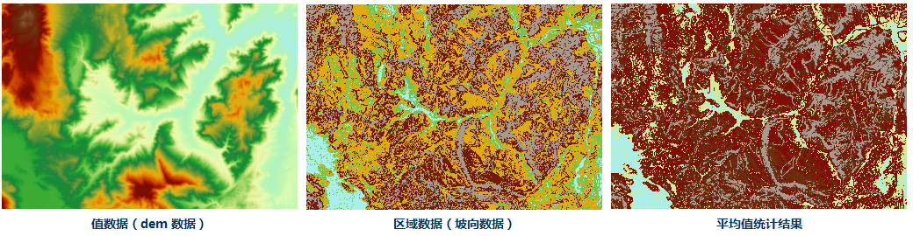
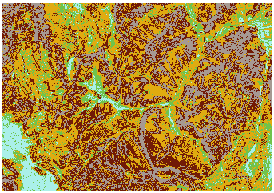
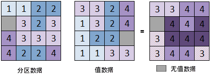

### 使用说明

  1. 区域统计是根据一个数据集所包含的不同类别的区域范围（区域数据，矢量面数据或者栅格数据）对另一个数据集（值数据，必须为栅格数据）进行统计。不考虑栅格像元的相邻关系，按照区域对栅格数据进行划分，对同一个区域中的栅格数据进行统计，同一个区域内的栅格像元赋值为同一个值输出，最终得到一个新的栅格数据集。例如，可以利用区域统计计算每个污染区内的平均人口密度、计算同一高程处植被类型、每个同一坡度区域内土地利用类型。以下为某一地区坡度分类栅格数据为区域数据，高程数据为值数据，计算同一坡度区域内高程的平均值。  

 |  |   
---|---|---  
值数据（dem 数据） | 区域数据（坡向数据） | 平均值统计结果

  2. SuperMap 应用程序提供了10种统计模式，包括：

  * **最小值** ：查找区域内栅格像元值的最小值。
  * **最大值** ：查找区域内栅格像元值的最大值。
  * **平均值** ：计算区域内所有栅格像元值的平均值。
  * **标准差** ：计算区域内所有栅格像元值的标准差。
  * **和** ：计算区域内栅格像元值之和。
  * **种类** ：统计区域内栅格像元值出现的个数。
  * **值域** ：计算区域内栅格像元值的范围，即区域内的最大值减去最小值。
  * **众数** ：统计区域内栅格像元值出现频率最高的数值。
  * **最少数** ：统计区域内栅格像元值出现频率最低的数值。
  * **中位数** ：区域内栅格像元值按照从小到大的顺序排列，处于最中间的数值。
  3. 使用忽略无值数据选项时，无值的区域数据将不参与统计。如下图所示的是对两个栅格区域统计，统计模式为最大值。对无值数据的处理设置是忽略无值数据，从这个例子中可以看出，忽略的是值数据集中的无值数据，而区域数据中的无值数据则是考虑的。      
     

### 操作步骤

  1. 在“ **空间分析** ”选项卡上的“ **栅格分析** ”组中，单击“ **栅格统计** ”下拉按钮，在弹出的下拉菜单中选择“ **区域统计** ”项，弹出“ **区域统计** ”对话框。
  2. 选择要进行统计的值数据（栅格数据），包括栅格数据所在的数据源和数据集。
  3. 选择待统计的区域数据。区域数据可以为矢量面数据集或者栅格数据集。目前仅支持像素格式为1位（ UBit1）、4位（UBit4）、单字节（UBit8） 和 双字节（Bit16）的栅格数据集进行区域统计。 
  4. 设置区域字段。矢量区域数据集中用于标识区域区域的字段。字段类型只支持32位整型。默认使用矢量数据集的 SMID 进行统计。不能对栅格数据集设置统计字段。
  5. 设置统计参数。包括统计模式和是否忽略无值数据。 

选择使用的统计模式，一共有10种类型可选。包括最小值、最大值、平均值、标准差、和、种类、值域、众数、最少数和中位数。

设置是否忽略无值数据。选中忽略无值数据时，统计时仅对值栅格数据中有值的像元进行统计；否则会对无值像元进行统计。

  6. 设置结果数据。区域统计的结果会以一个栅格数据集输出。需要设置结果数据要保存的数据源以及栅格数据的名称和属性表名称。需要注意：栅格结果数据和属性表的名称不能一样。
  7. 单击“确定”按钮，执行区域统计操作。单击“取消”按钮，退出当前对话框。

###  备注

统计结果的说明：

**栅格结果数据集**
：不同颜色的栅格代表一个区域，将这一区域的结果直接赋予该区域内的所有栅格值。如在进行区域统计时，选择的统计模式为均值，则结果栅格数据集的栅格值就表示了这一区域内所有栅格像元值的均值大小。

**属性表数据集**
：按照统计字段，将这个区域的统计结果进行了保存。属性表中包含了所有统计模式的结果（最大值、最小值、均值、标准差等）以及区域内的像元个数（PixelCount），方便用户统一查看。

