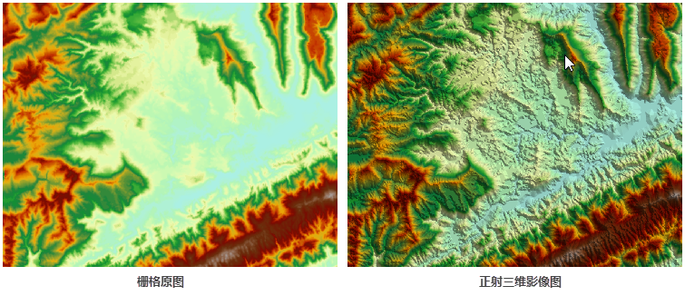
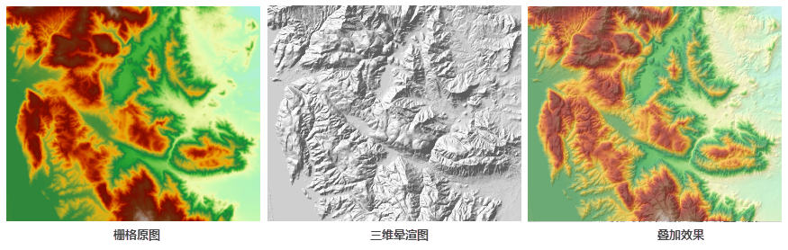
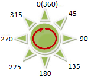
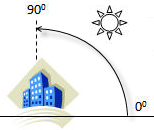
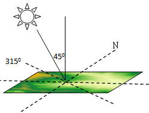

常用的三维效果图包括以下两种：

**正射三维影像**和**三维晕渲图**

### 正射三维影像

由 DEM 生成的正射三维影像，能够达到一定的三维地形视觉效果。如图1、图2所示，三维正射影像具有明显的立体效果，对于表达区域地形状况具有良好的效果，便于了解山区地形的特点。与其他专题信息叠加，能够帮助我们进行各种空间分析，如选址等。

"正射三维影像"功能，用对DEM 进行三维投影后，用周边栅格的高程变化来计算当前点的亮度，然后按照指定的颜色表和无值颜色，渲染 DEM亮度值生成正射三维影像。 

  
  
### 三维晕渲图

“三维晕渲图”功能，通过考虑栅格表面照明源的角度和阴影，生成三维晕渲效果图。三维晕渲图是通过模拟实际地表的阴影从而反映出地形起伏状况的栅格图。通过采用假想的光源照射地图，结合栅格数据得到的坡度坡向信息，获得各像元的灰度值。面向光源的斜坡的灰度值最高，背向光源的灰度值较低，即为阴影区，从而形象地表现栅格实际的地貌和地势。由于栅格数据计算得到的这种山体阴影图具有非常逼真的立体效果，因此一般又称为三维晕渲图。

三维晕渲图主要是用于显示。通过将栅格（图3）与三维晕渲图（图4）叠加，然后对栅格图层的透明度进行设置，可以轻松地创建出精美细致颇具立体感的地貌图（图5）。不同的应用场景下，为了达到最佳的制图效果，需要不断调整参数，例如栅格图层的透明度和亮度。之后可以在其上继续添加其他图层（如土地利用类型图、道路、河流图层），可进一步丰富地图信息。

  

在生成三维晕渲图时，需要指定假想光源的位置，该位置是通过光源的方位角和高度角来确定的。

* 方位角是用来确定光源的方向，是用角度来表示的。如下图，以正北方向为0度开始，沿顺时针方向测量，从0度到360度来给各方向赋角度值，因而正北方向也是360度。正东方向为90度，正南方向为180度，正西方向为270度。方位角的默认值采用315度。

  

* 高度角是光源照射时倾斜角度，范围是从0度到90度，如图所示，当光源高度角为90度时，光源正射地表。高度角的默认值采用45度。

  

当光源的方位角为315度，高度角为45度时，其与地表的相对位置如下图所示。

  
  
###  相关主题

[生成正射三维影像](OrthoImage)

[生成三维晕渲图](HillShade)
