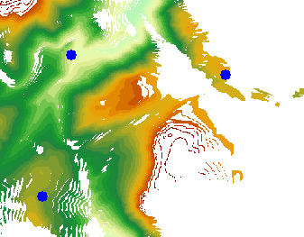

---
id: AboutSurfaceAnalyst
title: 表面分析概述
---  

SuperMap 的栅格表面分析功能，是根据栅格表面模型获得的信息或生成的表面，主要包括:      
 
    1. 提取等值线

    2. 提取等值面

    3. 通视分析

    4. 坡度和坡向

    5. 表面填挖方

###  提取等值线   

等值线是地图上表示的表面的常用方法之一。等值线是将数值相等的相邻点的连接成光滑曲线。常用的等值线有：等高线、等深线、等温线、等压线、等降水量线等等。    

等值线的分布反映了栅格表面上值的变化，等值线分布越密集的地方，表示栅格表面值的变化比较剧烈，例如，如果为等高线，则越密集，坡度越陡峭；等值线分布较稀疏，表示栅格表面值的变化较小，若为等高线，则表示坡度很平缓。通过提取等值线，可以找到高程、温度、降水等的值相同的位置，同时等值线的分布状况也可以显示出变化的陡峭和平缓区。  
* **基准值和等值距**    

基准值是生成等值线（面）时的初始起算值，以等值距为间隔向前或向后两个方向计算，因此基准值不一定是最小等值线（面）的值。基准值可以是任意数字。

等值距是相邻两条等值线之间的间隔值，它与基准值共同决定提取哪些是等值线。

由这两个参数可以来确定提取的等值线的值和个数。例如，基准值设为0，等值距设为50，则对于高程值范围在120-999的 DEM 栅格数据，提取的最小等值线为150，最大等值线为950，一共可以提取17条等值线。  
  
* **光滑系数和光滑方法**  

等值线的生成是通过对原栅格数据进行插值，然后连接等值点得到，所以得到的结果是棱角分明的折线，需要进行一定的光滑处理以模拟真实的等值线。用户可以通过使用不同的光滑方法以及设置不同的光滑系数对生成的等值线进行光滑处理。

光滑系数的取值范围为[0,5]。取值为0或1表示不进行光滑处理。光滑系数的值越大则光滑度越高。一般推荐光滑系数设为3。

SuperMap 提供两种光滑处理的方法，B 样条法和磨角法。这两种方法都是随着光滑系数的增大而使提取的等值线越光滑，当然光滑系数越大，计算所需的时间和占用的内存也就越大。

SuperMap 支持从栅格数据集进行表面分析，提取等值线。表面分析中提供了三种等值线的提取方法：提取所有等值线，提取指定等值线和点选提取等值线。  
  
* 提取所有等值线 可以通过指定参数提取表面模型中所有符合条件的等值线。一般用基准值和等值距两个参数来控制提取的等值线。 
* 提取指定等值线 可以按照用户的需要指定一定数量的特定值的等值线。可以直接输入等值线的值，也可以根据设置的范围和间隔自动生成系列高程值。 
* 点选提取等值线 通过用户在栅格表面模型上点击来交互地选择等值线，结果将输出值等于选择的点的高程的等值线，注意不只是点所在的等值线。   
  
  
###  提取等值面 
等值面是由相邻的等值线封闭组成的面。等值面的变化可以很直观的表示出相邻等值线之间的变化，诸如高程、温度、降水、污染或大气压力等用等值面来表示是非常直观、有效的。等值面分布的效果与等值线的分布相同，也是反映了栅格表面上的变化，等值面分布越密集的地方，表示栅格表面值有较大的变化，反之则表示栅格表面值变化较少；等值面越窄的地方，表示栅格表面值有较大的变化，反之则表示栅格表面值变化较少。  
SuperMap 表面分析中提供了两种等值面的提取方法：提取所有等值面和提取指定等值面。  
* 提取所有等值面 可以通过指定参数提取表面模型中所有的符合条件的等值面。一般用基准值和等值距两个参数来控制提取的等值面。基准值是作为一个生成等值面的初始起算值；等值距是两条等值线之间的间隔值，由这两个参数可以来确定提取的等值面的个数。例如，基准值设为0，等值距设为50，则对于高程值范围在120-999的 DEM 栅格数据，提取的所有等值面中的最小等值面值为150，最大值为950，一共可以提取16个等值面。等值面的生成是通过对原栅格数据进行插值，然后连接等值点得到等值线，再由相邻等值线封闭组成的，所以得到的结果是棱角分明的多边形面，需要进行一定的光滑处理以模拟真实的等值面。等值面的光滑方法和等值线的光滑方法相同。SuperMap 也支持两种光滑的方法：B 样条法和磨角法。 
* 提取指定等值面 可以按照用户的需要指定一定数量的特定值。可以直接输入特定值，也可以根据设置的范围和间隔自动生成系列高程值。   
    
  
###  通视分析
通视分析亦称为视线图分析，实质上属于对地形进行最优化处理的范畴。通视分析在航海、航空以及军事方面有重要的应用价值，比如设置雷达站、电视台的发射站、道路选择、航海导航等，在军事上如布设阵地、设置观察哨所、铺设通信线路等；有时还可能对不可见区域进行分析，如低空侦察飞机在飞行时，要尽可能避免敌方雷达的捕捉，飞机要选择雷达盲区飞行。通视分析的基本内容有两个：一个是两点或者多点之间的可视性分析；另一个是可视域分析，即对于给定的观察点，分析观察所覆盖的区域。  
可视域分析  
可视域是从一个或者多个观察的可以看见的地表范围。可视域分析是在栅格数据集上，对于给定的一个观察点，基于一定的相对高度，查找给定的范围内观察点所能通视覆盖的区域，也就是给定点的通视区域范围，分析结果是得到一个栅格数据集。在确定发射塔的位置、雷达扫描的区域、以及建立森林防火瞭望塔的时候，都会用到可视域分析。

在进行可视域分析的时候，需要明确几个重要的参数，包括观察点、附加高程、观测半径、观察角度等等。  
* **观察点**：观察点是用于可视域分析的原点，可以是一个或者多个。当拥有多个观察点时，可以确定一些视点能够看到共同可视区域。   
* **附加高程**：观察点的高度由两部分组成，一部分是观察点的表面高程，另外一部分是附加高程。因此可以通过观察点的附加高程来调整观察点的高度，例如若在地图上选择的观察点的实际地面高程为430米，附加高程值为100米，则观察点的高程为530米。  
*  **观测半径**：观测半径限制了可视域的搜索范围。如果只在一定长度范围内查找观察点的可视范围，可以指定可视半径，则可视范围在以观察点为圆心，可视半径为半径的圆形范围内查找。可视半径的默认值为0，指观测半径无穷大，即在整个地图范围内查找。  
* **观察角度**：观察角度限制了可视域的搜索方向。观察角度以度为单位，介于0到360度之间。其中默认起始角度为0度，从正北方向开始，顺时针旋转到360度。   
SuperMap 支持对单点进行可视域分析，也支持对多个观察点进行可视域分析。既可以通过鼠标点击的方式添加观察点，也可以通过导入数据集的方式添加观察点。同时还支持将在地图中选择的观察点导出为点数据集。  
  
  **多点可视域分析**
多点可视域分析是在栅格数据表面，对于给定的多个观察点，基于各自的相对高度，查找给定的范围内所有观察点所能通视的全部区域，分析结果将得到一个栅格数据集。多点可视域可以是共同可视域（所有观察点可视域的交集），或者非共同可视域（所有观察点可视域的并集）。

在多点可视域分析中还可以对一个或多个观察点单独附加高程值，附加了高程后，很有可能赋予附加高程与不考虑附加高程得到的结果截然不同，因此了解观察点高度和添加附加高程是非常重要的。

多点可视域分析可以在栅格地图上直接鼠标点选多个点构成多个观察点；也可以通过导入点数据集的方式来生成多个观察点。对于导入的点数据集即可以有高程字段，也可以统一设置附加高程值。

多个观察点可视域的分析结果如下图所示：
      
  
  **可视性分析**  
  可视性分析根据给定的观察点和目标点，在输入的栅格表面对他们之间是否可见进行分析。SuperMap 表面分析根据观察点数目的多少，分别提供了两点可视性分析和多点可视性分析。  
  * **两点可视性** 用来分析地表的任意两点之间是否可以相互通视。  
  由于数字高程模型描述的是地面点的高程而不包含地面上的物体，如森林树木和建筑物等的高度，所以，当地物高度对分析结果有不可忽略的影响时，可以加入“附加高程值”来调整观察点的高度，以得到正确的结果。若输入了附加高程，则对两点都附加该高程，很有可能赋予附加高程与不考虑附加高程得到的结果截然相反，例如不考虑附加高程则两点不可见，考虑了附加高程后两点可见，因而了解地物高度和添加附加高程在有的情况下非常重要。两点可视性分析可以在栅格地图上直接画出两点进行分析，也可以对导入的点数据集中点对象的通视情况进行分析。  
  * **多点可视性** 用来分析栅格表面的多点之间两两是否可以相互通视。  
  在多点可视性分析中我们可以对一个或多个点单独附加高程值，附加了高程后，很有可能赋予附加高程与不考虑附加高程得到的结果截然相反，因此了解地物高度和添加附加高程在有的情况下非常重要。

   多点可视性分析可以在栅格地图上直接鼠标点选多个点构成的参与分析的点；也可以通过导入点数据集的方式来生成参与分析的点。
      

三维空间分析功能是二维空间分析功能的升华，具有直观形象的特点。如下图所示，为多点可视性分析在场景中的展现效果。  
       
    
###  坡度和坡向  
坡度和坡向是两个重要的地形特征因子，在地形表面分析中起到重要作用。其中，坡度表示地球面某一位置的高度变化率的量度；而坡度变化的方向成为坡向，表示地表面某一位置斜坡方向变化的量度。  
  
**坡度分析**  
当要在一座山上建造房子，需要找到山上比较平坦的区域；如果要在山上建滑雪场，需要选择不同的坡度分别用作初级滑道、中级滑道和高级滑道，以满足不同水平的滑雪爱好者；当参与紧急事件的救援飞机着陆时，需要找到地面相对平坦的区域。此外，在耕地坡度等级中规定，25°为开荒限制坡度，不可在25°以上的荒地种植对于这些问题，都需要考虑地形的坡度。

地表面某一点的坡度是表示地表在该点的倾斜程度的量，是既有大小又有方向的矢量。在地形分析中，坡度表示经过地表某一点的切平面和水平面所形成的夹角。根据坡度图，可以了解到区域内各位置的地形的陡峭程度。在坡度图中，每个像元都有一个坡度值，值越大表示地势越陡峭，值越小表示地势越平坦。

坡度可以用度数或百分数表示，其中，度数坡度是垂直增量与水平增量之比的反正切值（arctan），百分数坡度是垂直增量与水平增量之比乘以100。在 SuperMap 中，坡度计算提供了度数、弧度和百分比三种表现形式。设坡度的垂直增量为H、水平增量为L，则角度： θ = arctan(H / L)，弧度：R = θ * π / 180，百分比：P = (H / L) * 100，如下图所示。  

   
度数坡度的分析结果的范围是0到90°，0表示该处地表为水平面，90°表示该处地表为垂直于水平面的陡峭表面。百分数坡度的分析结果的范围是0到无穷大，当结果小于1时，表示该处坡度的高程增量小于水平增量，坡度较缓；当结果等于1时，表示该处坡度的高程增量等于水平增量，且坡度值为45°；当结果大于1时，表示该处坡度的高程增量大于水平增量，坡度变陡。

栅格数据集（GRID）的像元值即为中心点的值，在计算坡度和坡向时，可以通过插值得到每个点的高程值，然后计算每个点的坡度和坡向。由于计算点的坡度和坡向没有实际意义，所以该方法计算的是栅格数据集中各像元平面的坡度平均值。
    

**坡向分析**  
坡向在植被分析、环境评价等领域有重要的意义。在生物学上，生长在朝向北的斜坡上和生长在朝向南的斜坡上的植被一般有明显的差别，这种差别的主要原因在于绿色植被生长需要阳光的充分程度不同；建立风力发电站的选址时，需要考虑把它们建在面向风的斜坡上；地质学家经常需要了解断层的主要坡向，或者褶皱露头，来分析地质变化的过程；在确定容易被积雪融水破坏的居民区的位置时，需要识别朝南的坡面，来得到最初融化的积雪的位置。

地表面某一点的坡向表示经过该点的斜坡的朝向。在地形分析中，坡向表示经过地表某一点的切平面的法线在水平面的投影与经过该点正北方向的夹角。坡向表示该点高程值改变量的最大变化方向。

坡向用度数表示，坡向分析结果的范围是0到360°。以正北方0°为开始，按顺时针移动，回到正北方以360°结束。坡度图中每个像元的值代表了其像元面的斜坡面对的方向，平坦的坡面没有方向，赋值为-1。  
      
由于坡向是圆的度量，10°坡向比30°坡向更靠近360°。因此，用坡向做数据分析之前，用户需要对坡向进行转换，即：将坡向分为东、西、南、北4个基本方向（或者东、西、南、北、东南、西南、东北、西北8个基本方向），可通过栅格重分级功能完成转换，突出需要考虑的坡向范围。  
   
  
###  表面填挖方  
  
**填挖方**  
地表经常由于沉积和侵蚀等作用引起表面物质的迁移，表现为地表某些区域的表面物质增加，而某些区域的表面物质减少。在工程中，通常将表面物质的减少称为“挖方”，将表面物质的增加称为“填方”，将一种情况变为另一种情况时需要填/挖的面积和大小。下图为填挖方的地形剖面示意图。  
   
栅格填挖方计算要求输入两个栅格数据集：填挖方前的栅格数据集和填挖方后的栅格数据集，生成的结果数据集的每个像元值为这两个输入数据集对应像元值的变化值。如果像元值为正，表示该像元处的表面物质减少；如果像元值为负，表示该像元处的表面物质增加。如下图所示，以一个4*4的栅格数据显示了填挖方的计算方法：  
   

通过该图可以看出：结果数据集 = 填挖方前栅格数据集 - 填挖方后栅格数据集。

下图所示为填挖方结果示意图，分别列出了填挖方之前的源数据集、作为参考的填挖方数据集和生成的填挖方结果数据集。源数据集和填挖方数据集中，高程值越高，栅格颜色偏向棕红色；高程值越低，栅格颜色偏向绿色。在填挖方结果数据集中，需要挖方的部分用墨绿色表示，且挖方量越大，颜色越深；需要填方的部分用棕色表示，且填方量越大，颜色越深；不需要填挖方的部分用白色表示。
     
 
 当然，填挖方是对两个输入数据集对应像元的计算，这就需要两个输入数据集有相同的坐标和投影系统，以保证同一个地点有相同的坐标，如果两个输入数据集的坐标系统不一致，则很有可能产生错误的结果。理论上，要求两个输入数据集的空间范围也是一致的，然而，对于空间范围不一致的两个输入数据集，只计算其重叠区域的表面填挖方的结果；另外，在其中一个数据集的像元为空值处，计算结果该像元值也为空值。

此外，对于空间范围不一致的两个数据集的填挖方操作的结果的数据集的范围与两个数据集的重叠区域的范围一致。
  
**面填挖方**    
当需要将一个高低起伏的区域夷为平地时，需要进行面填挖方计算。

与普通填挖方不同的是，面填挖方是栅格数据集与指定平面之间填挖方量的计算，且指定平面既可以是现有的矢量数据集，也可以是基于栅格数据集鼠标绘制的区域；而填挖方是两个栅格数据集之间填挖方量的计算。相比之下，面填挖方的适用范围更加广泛，操作更加灵活。
**反算填挖方**  
反算填挖方是指根据指定的待填挖方数据集和给定的填方或挖方的体积计算填挖后的高程。

反算填挖方用于解决这样一种实际问题：已知填挖前的栅格数据和该数据范围内要填挖的体积，来推求填方或挖方后的高程值。例如，某建筑施工地的一片区域需要填方，现得知某地可提供体积为V的土方，此时使用反算填挖方就可以计算出将这批土填到施工区域后，施工区域的高程是多少。然后可判断是否达到施工需求，是否需要继续填方。
