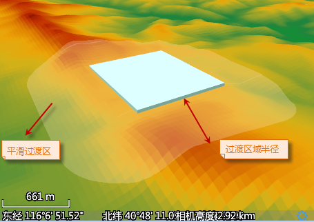

**地形模型匹配简介**

将 DEM 栅格数据（地形数据）添加到场景中，地形会高低起伏的显示出来。模型叠加上地形数据就可以构建真实的场景。由于地形的起伏，不可避免会出现一个问题：模型底部是平整的，位于同一高度，而此处的地形可能是起伏的，导致模型和地形不能够严格贴合，出现模型的一部分被掩埋或者漂浮于地形之上，不能达到理想的真实效果。如图1所示，为模型数据直接与地形叠加的显示效果。

尽管场景的贴地高度模式可以使地形与模型贴合，但是仍不能避免模型部分被掩埋的情况。地形模型匹配可以解决这类问题，它通过将模型覆盖的地形区域修整为一个平面，从而使模型底部与地面贴合。如图2所示，为进行地形模型匹配处理后的显示效果。

 
  
**地形模型匹配过程**

地形模型匹配对地形数据进行系列处理，包括填方/挖方和平滑处理。目前支持对 CAD 模型数据以及面数据（可拉伸为面对象模型）进行处理，并支持同时处理多个模型。

地形模型匹配过程如下：

  1. 程序按照模型底部的高程值，对其所覆盖的地形区域进行填方或挖方，使该范围地形高程与模型底部高程保持一致，此时会在模型覆盖的地形表面形成一个平面。
  2. 直接进行匹配的结果，会导致模型边缘处的地形突然上升或者下降，因此需要对模型与地形的接合部分进行平滑过渡处理。以模型底部平面为参考，其对应地形区域的周围会生成一个以 R 为缓冲区半径的区域（R 为过渡区域半径），这部分区域即为需要进行平滑过渡的区域。如图3所示，蓝色对象表示模型对象，透明区域为过渡区域，双箭头所示为过渡区域半径。  

  

这里涉及到地形模型匹配的两个关键参数。

   * **过渡区域半径** ：需要进行平滑处理区域的半径，过渡区域范围是以模型对应地形的边缘为起点，以过渡区域半径为缓冲半径得到的范围。
  * **平滑系数** ：是影响过渡区域缓冲效果的关键，类似于幂函数的幂次。取值在[0,3]范围内时过渡效果较为理想，既能够保持过渡区域的原始地貌特征，又能够进行一定程度的平滑，使模型与周边地形自然过渡。当平滑系数为0时表示不对模型周围的过渡区域进行平滑处理。

**确定模型底部高程**

支持两种模型数据：CAD 数据集和矢量面数据集。当对 CAD 数据集进行地形匹配时，将直接处理模型与地形的匹配；当对面数据集进行地形匹配时，实际上是将模型底部或者模型所覆盖的区域拉伸为矢量面来进行地形模型匹配。地形模型匹配时，会根据模型底部或面对象的高程对其所覆盖的地形区域进行填方或者挖方，因此模型底部或面对象的高程必须指定：

* 当进行匹配的模型为 CAD 数据集时，匹配后模型覆盖区域的高程是由模型包围盒的中心点所对应的地形位置的高程决定的，此时高程字段不可用。
* 当进行匹配的模型为矢量面数据集时，可选择一个属性字段作为面对象的高程值。当高程字段中属性值为空，应用程序会计算该面对象最小外接矩形的中心位置，取其对应的地形栅格单元格的高程值作为进行匹配的高程。

###  相关主题

 [地形模型匹配](TerrainMatch)