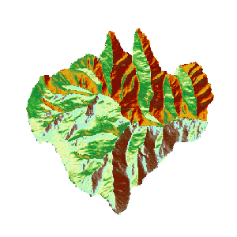

### 使用说明

坡向分析用于计算栅格数据集（通常使用 DEM
数据）中各个像元的坡度面的朝向。坡向计算的范围是0到360°，以正北方0°为开始，按顺时针移动，回到正北方以360°结束。平坦的坡面没有方向，赋值为-1。关于坡向分析的原理和计算方法，请参见**关于表面分析** 的[坡度和坡向](AoubtSurfaceAnalyst.htm#4)部分。

### 操作步骤

1. 打开“ExerciseData/RasterAnalysis”文件夹下的“Terrain”数据源，其中有分辨率为5米的 DEM 数据，我们用此数据来做示例。
2. 单击功能区 > “ **空间分析** ”选项卡 > “ **栅格分析** ”组的“ **表面分析** ”下拉按钮，在弹出的下拉菜单中选择“ **坡向分析** ”项，弹出如下图所示的“坡向分析”对话框。
3. 用户需对如下参数进行设置。 

### 源数据

  * **数据源** ：列出了当前工作空间中所有的数据源，选择需要进行坡向分析的数据集所在的数据源。
  * **数据集** ：列出了当前数据源中所有的栅格数据集（GRID）。在列表中选择需要进行坡度分析的数据集，通常我们会选择拥有高程值的 DEM 数据。这里会自动定位到工作空间管理器内选中的数据集。

### 结果数据

  * **数据源** ：列出了当前工作空间中所有的数据源，选择结果数据集所在的数据源。默认与源数据源相同。
  * **数据集** ：设置结果数据集的名称。新生成的坡向数据集是一个和源数据集等大且分辨率相同的数据集。
4. 单击“确定”按钮，执行坡向分析操作，如下图所示为坡向分析的结果。  

  

###  相关主题

 [关于表面分析](AoubtSurfaceAnalyst.htm)

