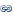

### 使用说明

用于计算 DEM 栅格数据表面的曲率，包括平均曲率、剖面曲率和平面曲率。曲率是表面的二阶导数，或者可称之为坡度的坡度。输出结果为地形栅格每个像元的表面曲率，该值通过将该像元与八个相邻像元拟合而得。结果输出为栅格数据集，可输出曲率类型为：平均曲率、剖面曲率和平面曲率，平均曲率为必须输出的结果，剖面曲率和平面曲率为可选择输出。其中，剖面曲率是指沿最大斜率方向的曲率，平面曲率是指垂直于最大斜率方向的曲率。

结果说明：

  * 新生成的三种曲率数据集范围与原数据集等大，且分辨率也与原数据集相同。
  * 新生成的三种曲率结果数据集中，曲率为正说明像元所处的表面向上凸，曲率为负说明像元所处的表面开口朝上凹入，曲率为 0 说明像元所处的表面是平坦的。
  * 输出的曲率栅格值单位是 z 单位的百分之一。某山区（平缓地貌）的全部三个输出栅格的合理期望值介于 -0.5 至 0.5 之间；如果山势较为陡峭崎岖（极端地貌），那么期望值介于 -4 至 4 之间。注意，某些栅格表面可能会超过此范围。

###  功能入口

  * 在 **空间分析** 选项卡-> **栅格分析** -> **表面分析** -> **DEM曲率计算** ；
  * **工具箱** -> **栅格分析** 工具-> **表面分析** -> **地形计算** -> **DEM曲率计算** 。(iDesktopX)

###  主要参数

  * 设置源数据，即设置 DEM 曲率计算的栅格数据集。 
    * **数据源** ：列出了当前工作空间中所有的数据源，选择要进行曲率计算的栅格数据集所在的数据源。
    * **数据集** ：列出了当前数据源中所有的栅格数据集，在列表中选择曲率计算栅格数据集。若在工作空间管理器中选中了栅格数据集，则会自动定位到该数据集。
    * **高程缩放系数** ：计算曲率时，要求地形栅格值（即高程值）的单位与 x，y 坐标的单位相同，通常需要将高程值乘以一个高程缩放系数，使得三者单位一致。例如，X、Y 方向上的单位是米，而 Z 方向的单位是英尺，由于 1 英尺等于 0.3048 米，则需要指定缩放系数为 0.3048。如果设置为 1，表示不缩放。
  * 结果数据，即DEM曲率计算后的结果栅格数据集。 
    * **数据源** ：列出了当前工作空间中所有的数据源，选择曲率计算后栅格数据集所要保存的数据源。默认与源数据源相同。
    * **平均曲率数据集** ：用于设置平均曲率栅格数据集的名称，默认为 AverageCurvature。
    * **剖面曲率数据集** ：用于设置剖面曲率栅格数据集的名称，默认为 ProfileCurvature，数据集名称为空时，表示不生成剖面曲率数据集。
    * **平面曲率数据集** ：用于设置平均曲率栅格数据集的名称，默认为 PlanCurvature，数据集名称为空时，表示不生成平面曲率数据集。

**注意** ：当剖面曲率数据集和平面曲率数据集的名称为空时，不会生成这两个栅格数据集。但是，平均曲率数据集必须生成，其名称不能为空。

  * 单击“确定”按钮，即可执行 DEM 曲率计算操作。 

###  注意事项

  1. 当高程值单位与坐标单位间的换算无法通过固定值来调节时，则需要通过其他途径对数据进行处理。最常见的情况之一是 DEM 栅格采用地理坐标系时，单位为度，而高程值单位为米，此时建议对 DEM 栅格进行投影转换，将 x、y 坐标转换为平面坐标。
  2. 如果待计算单元格为无值，则计算结果也为无值。但是，对于位于栅格数据集边缘的单元格，其 3 × 3 邻域包含了位于数据集范围之外的单元格，对于这些单元格，将使用待计算单元格的高程值来计算，因此，得出的曲率可能比实际要小。对于周围单元格中的无值，也采用相同的方式处理。
  3. 当剖面曲率数据集、平面曲率数据集的名称为空时，则表示不生成这两个栅格数据集。但是，平均曲率数据集必须生成，其名称不能为空。

###  相关主题

 [关于表面分析](AoubtSurfaceAnalyst)